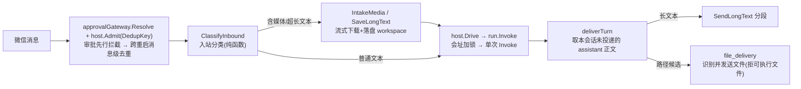

# tagent WeChat Bot — 完整示例

tagent 组合根的**真实宿主示例**：常驻微信机器人，把 `tagent.Assemble` 产出的 `*tagent.Run` 接上消息链路——
入站去重、媒体与长文本落盘、按显式会址投递、审批通道与投递回执全部跑在真消息上。

> 部署（裸机 systemd / 容器）见 [deploy/README.md](deploy/README.md)；机制原理见 [../../docs/wiki/](../../docs/wiki/)。

---

## 快速开始

```bash
./wizard.sh    # 七步向导：依赖检查 → 密钥(不回显) → 工作根 → .env → ACL 权限 → 连通性验证 → 指引
./run.sh       # 前台启动（./run.sh --help 看全部命令）
```

需要 Go ≥ 1.24、tmux、以及一把 `ZAI_API_KEY`（GLM Coding Plan）。密钥写入 `.env`（chmod 600，被本目录白名单式 `.gitignore` 天然忽略）；`run.sh` 启动时自动加载 `.env`，已导出的环境变量优先。

## 装配面（当前实现）

| 环节 | 码面 |
|---|---|
| 读配置 | `loadHostDocument(TAGENT_CONFIG)` → `api/config.DecodeStrict`：schema 之外的键**拒绝启动**，错误点名 `文件:行:字段路径`（`config.ErrUnknownConfigKey`）；schema 即 `host_runtime.go` 的 `hostDocument` 结构标签 |
| 装配 | `tagent.Assemble(ctx, decl, natives, opts...)` → `*tagent.Run`（恒挂 `WithGovernance`，配了审批网关再加 `WithPolicy`）；`decl` 由 `hostDocument.Declaration` 派生（entry agent、各 agent 的 `system_prompt.files`、声明了的 `send` 工具），模型按 `providers` 的 `api_endpoint` + `api_key_env` 现场构造 |
| 驱动 | `host.Drive` → 按会址加锁 → `run.Invoke(ctx, tagent.InvokeRequest{InvocationID, Address, Input})`；收尾走 `run.Close(ctx, agent.CloseRequest{})` |

- **已接线的键**：`entry`/`provider`/`model`/`prompt_dir`/`providers`/`agents{provider,model,system_prompt.files,tools}`/`request_timeout_seconds`/`governance{enabled,enforcement,dir,approval_ttl_minutes}`/`app.wechat{config_dir,token_file,context_token_dir,workspace_dir,approvers}`；工具面只接 `send`。
- **环境变量**（码面实际读取）：`TAGENT_CONFIG`、`TAGENT_API_ENDPOINT`（覆盖 entry endpoint）、`TAGENT_SESSION_ID`（会址前缀标签，默认 `wechat-session`）、`TAGENT_WECHAT_WORKSPACE_DIR`、`providers.*.api_key_env` 点名的每个变量；`LOG_LEVEL`/`TAGENT_USER_ID`/`TAGENT_HTTP_PORT`/`OTEL_EXPORTER_OTLP_ENDPOINT` 当前不被读取。
- **无 HTTP 服务面**：本宿主不装配 `cli.NewCLI`，故无 `/healthz`、无 `/task`；容器 healthcheck 与重启脚本若按 :8089 探活会失败。

## 待接线清单（写进 yaml 前须先接 schema）

严格解码的判据是「键只许出现在它被读取的地方」：下列声明先要在 `host_runtime.go` 的 `hostDocument` 接线并消费，再写入 yaml；`tagent.yaml` 以行首 `待接线` 注释登记同一清单。

| 键路径 | 宿主现状 |
|---|---|
| `log_level` / `trajectory_*` / `working_dir` / `mcp_servers` | 无读取点（环境变量 `LOG_LEVEL`/`TAGENT_WORKING_DIR` 同样不被读）；MCP 工具面也未接 |
| `evolution` / `reliability` / `governance.budget_*`、`max_*_risk`、`goal_required_for` | 平台面只装配治理闸：预算与 goal 未接，只消费 `enabled`/`enforcement`/`dir`/`approval_ttl_minutes` |
| `agents.*.memory` / `compress` / `meditation` / `max_*` / `temperature` / `thinking_enabled` / `reasoning_effort` / `compress_threshold` / `task_*_ttl` | 装配面不读，schema 未声明 |
| `agents.*.tools[]` 除 `{kind: tool, id: send}` | 工具面只接 `send`：file 工具、`exec`、`recall`、`spec`、`mcp_*`、`skill_*`、子 agent 委派均无实现 |

## Agent 声明（六个，`tagent.yaml`）

| Agent | 角色 | 可声明的工具面 |
|---|---|---|
| `tagent` | **entry**：接收消息、编排全局、直接回复 | `send` |
| `knowledge` | 知识获取与翻译 | — |
| `recall` | 记忆召回执行体 | — |
| `action` | 命令与文件执行 | — |
| `plan` | 工作计划管理（拆解 / 记账 / 归档审计，**不代工**） | — |
| `meditator` | 旁路冥想线（后台反思，自触发） | `send` |

## 治理审批（critical 操作人工把关）

治理闸启用且 critical 操作被拦截时，bot 会向对话推送审批请求（含 digest）。

- **消息批准**：回复 `approve <digest>` / `reject <digest>`（或「批准/拒绝 <digest>」）——仅 `app.wechat.approvers` 白名单内的用户生效（安全默认：未配置白名单时消息批准关闭）；
- **CLI 批准**：`./wechat-bot approve <digest>`（`reject <digest>` 拒绝；零服务器，直接写审批文件）；
- **直投通道**：`ApprovalChannel` 不经 agent 转述，直接送达微信（配 `app.wechat.approvers` 后启用；**直投目标=白名单首个 approver**，其余审批人仍可经回复/CLI 批准）；
- **查看待批**：`approval_list` 工具**不在本宿主工具面内**（只接 `send`），待批项经审批文件观察。

## 消息链路


```mermaid
graph LR
    WX["微信消息"] --> GATE["approvalGateway.Resolve + host.Admit(DedupKey)<br/>审批先行拦截 → 跨重启消息级去重"]
    GATE --> CLS["ClassifyInbound<br/>入站分类(纯函数)"]
    CLS -->|含媒体/超长文本| INT["IntakeMedia / SaveLongText<br/>流式下载+落盘 workspace"]
    INT --> DRIVE
    CLS -->|普通文本| DRIVE["host.Drive → run.Invoke<br/>会址加锁 → 单次 Invoke"]
    DRIVE --> OUT["deliverTurn<br/>取本会话未投递的 assistant 正文"]
    OUT -->|长文本| LONG["SendLongText 分段"]
    OUT -->|路径候选| DEL["file_delivery<br/>识别并发送文件(拒可执行文件)"]
```

入站与出站两层都依赖**窄接口**（`MediaDownloader` / `FileSender`，`*wechat.Bot` 天然满足），故可脱离真实微信登录、CDN 与 LLM 做单元测试（见 `file_intake_test.go` / `file_delivery_test.go`）。

## 目录导览

**入库的源码与配置**（clone 后即可见）：

| 路径 | 说明 |
|---|---|
| `main.go` | 宿主启动：读配置 → `assembleHost` → 微信登录 → `OnMessage` 回调 → `host.Drive`；发送通路 `hostSender` |
| `host_runtime.go` | 宿主文档 schema 与装配：`loadHostDocument`/`Declaration`/`assembleHost`/`internalInbox` |
| `file_intake.go` / `file_delivery.go` | 入站接收层 / 出站投递层（各配 `_test.go`） |
| `tagent.yaml` | 主配置（六 agent + providers + governance + `app.wechat`；未接线键以注释登记） |
| `tagent.rl.yaml` | RL 参数基线（模型/端点/超时；同严格 schema，可装载） |
| `wizard.sh` / `run.sh` / `.env.example` | 部署向导 / 运行入口 / 环境变量模板 |
| `resources/prompts/` | 系统提示词（`AGENTS.md`/`SOUL.md`/`USER.md`/`TOOLS.md`/`meditator.md`/`plan_*`） |
| `deploy/`、`Dockerfile` / `docker-compose.yml` / `entrypoint.sh` | systemd 单元模板与指南、容器形态（podman/docker 兼容） |
| `skills/README.md`、`skills/url-fetcher/` | 技能体系说明 + 唯一入库的技能源码 |

**运行时生成、不入库**（白名单式 `.gitignore` 刻意忽略，clone 后看不到属正常）：`.env`（密钥）、`.wechat-config/`（登录态 cursor 与去重 seen.json）、`.wechat-context-tokens/`、`workspace/`、`data/`（治理审批状态）、`logs/`、`incoming/`、`knowledge_base/`、`skills/` 下除 `url-fetcher` 外的技能、`.tagent-workspace/`（附件/长文本落盘）、`wechat-bot`（构建产物）。

## 三种运行形态

| 形态 | 命令 | 适用 |
|---|---|---|
| 前台 / 后台 | `./run.sh` / `./run.sh start`（`status`/`log`/`stop`/`restart`） | 本地开发调试 |
| **裸机 systemd 常驻** | `./run.sh build` → 装 `deploy/tagent-wechat.service` → `systemctl enable --now` | 远端服务器（推荐，见 [deploy/README.md](deploy/README.md)） |
| 容器 | `docker-compose up -d`（或 podman） | 已有容器编排基建 |

> `deploy/` 指南与 compose healthcheck 仍按 `:8089/healthz` 编排；本宿主当前无该端点（见「装配面」末条）。

## RL 参数基线（入口已退役）

`rl/` 包只保留 capture / export / reward：模型热换（`SwappableModel`）与 HTTP `/task` 面不在任何装配里，宿主 `main.go` 亦无 RL 分支，故 `./run.sh rl` 已退役（调用即具名拒绝，不静默退回生产配置）。
`tagent.rl.yaml` 保留为**可装载的参数基线**（`TAGENT_CONFIG=tagent.rl.yaml ./run.sh` 可读），重接线时以它为起点。

## 深入阅读

| 主题 | 位置 |
|---|---|
| 部署、数据目录备份、工作根与 ACL、故障排查 | [deploy/README.md](deploy/README.md) |
| 框架机制（记忆 / 事件 / 工具 / 插件 / prompt） | [../../docs/wiki/](../../docs/wiki/) |
| 平台子系统与启用后的行为反应 | [platform-subsystems.md](../../docs/wiki/platform/platform-subsystems.md) · [agent-behavior-matrix.md](../../docs/wiki/platform/agent-behavior-matrix.md) |
| 行为契约（SHALL 级规格） | [../../openspec/specs/](../../openspec/specs/) |
| 真实 LLM 契约守护矩阵 | [../../tests/README.md](../../tests/README.md) |
