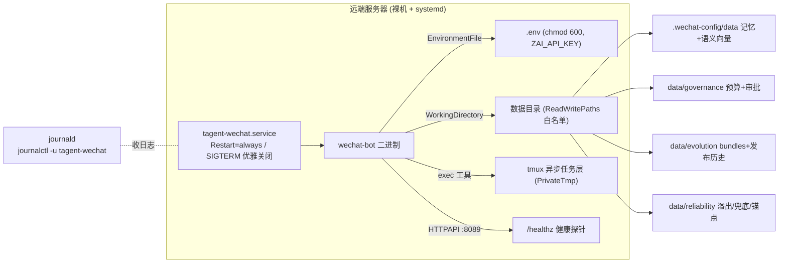

# tagent WeChat Bot · 裸机 systemd 部署指南

面向**个人助手**定位的单台远端服务器常驻部署。相比容器形态(见根目录 `Dockerfile` /
`docker-compose.yml`),裸机 systemd 无 Docker 依赖、资源开销更低、更贴近"个人助手"运维直觉;
安全加固(非 root / 只读根 + 可写白名单 / 资源上限 / 崩溃自愈)与 docker-compose **对齐**。

> 本指南配套 `deploy/tagent-wechat.service`(systemd 单元模板)。快速指引亦可执行 `./run.sh systemd`。

---

## 一、部署拓扑



---

## 二、前置依赖

| 依赖 | 必需性 | 用途 | 安装(Debian/Ubuntu) |
|------|--------|------|---------------------|
| **go ≥ 1.24** | 硬性 | 构建二进制 | `apt install golang-1.24` 或 https://go.dev/dl/ |
| **tmux** | 硬性 | exec 工具的异步任务层 | `apt install tmux` |
| **node 22 + openspec** | 软性 | plan 子 agent 的 spec 工具后端 | `apt install nodejs` + `npm i -g @fission-ai/openspec` |
| **curl** | 软性 | 健康探针 `/healthz` | `apt install curl` |
| **rustviking** | 可选 | 仅 `memory.type: file` 需要(本配置用 `localfile`,无需) | 见 rustviking 仓库 |

> `./wizard.sh` 会自动检查以上依赖(硬缺失则中止,软缺失则降级告警)。
> **CGO**:本 example 可 `CGO_ENABLED=0` 纯静态构建(与 Dockerfile 一致,**无需 gcc**);
> 若你的改动引入了需 CGO 的依赖,则改用默认 `CGO_ENABLED=1` 并 `apt install build-essential`。

---

## 三、部署步骤

约定部署路径 `/opt/tagent/wechat-bot`(如不同,步骤 4 用 `sed` 替换 unit 内路径)。

```bash
# 0) 拉取代码(含 tagent 主仓 + example;example go.mod replace 指向本地 tagent)
sudo mkdir -p /opt/tagent && sudo chown "$USER" /opt/tagent
git clone <your-tagent-repo> /opt/tagent/repo
cd /opt/tagent/repo/examples/wechat-bot
# 若部署目录就是此处,可直接用;否则拷贝 examples/wechat-bot 到 /opt/tagent/wechat-bot

# 1) 依赖检查 + 密钥引导(生成 .env,chmod 600,已被 gitignore)
./wizard.sh                       # 交互式;或 NONINTERACTIVE=1 预置 env 后跑

# 2) 构建二进制(纯静态,无需 gcc)
CGO_ENABLED=0 ./run.sh build      # 产出 ./wechat-bot

# 3) 创建专用非 root 系统用户 + HOME 目录
sudo useradd -r -s /usr/sbin/nologin tagent 2>/dev/null || true
mkdir -p .home                    # HOME 收敛到部署目录内(数据集中、便于备份)

# 4) 安装 systemd 单元(路径不同则先 sed 替换)
sudo install -m 644 deploy/tagent-wechat.service /etc/systemd/system/
# sudo sed -i "s#/opt/tagent/wechat-bot#$(pwd)#g" /etc/systemd/system/tagent-wechat.service

# 5) 目录属主交给 tagent 用户(数据目录须可写)
sudo chown -R tagent:tagent "$(pwd)"

# 6) 启动 + 开机自启
sudo systemctl daemon-reload
sudo systemctl enable --now tagent-wechat
```

**验证**:

```bash
systemctl status tagent-wechat                 # Active: active (running)
journalctl -u tagent-wechat -f                 # 实时日志(应见 governance/evolution/reliability 启用日志)
curl -fsS http://127.0.0.1:8089/healthz        # 健康探针
```

---

## 四、数据目录与持久化

`ProtectSystem=strict` 下仅 `ReadWritePaths` 白名单可写。所有状态集中于部署目录,便于备份/迁移:

| 路径 | 内容 | 子系统 | 备份优先级 |
|------|------|--------|-----------|
| `.wechat-config/data/` | 记忆事件 + 语义向量 KV(localfile) | memory / engine | ★★★ 核心 |
| `data/governance/` | 预算滑窗 epoch + `approvals/` 待批文件 | governance | ★★ |
| `data/evolution/` | 不可变 bundles + `releases.jsonl` 发布历史 | evolution | ★★ |
| `data/reliability/` | bus 溢出 / mem_spill 兜底 / 冥想锚点 | reliability | ★ 可重建 |
| `data/trajectories/` | LLM 调用轨迹 JSONL(SFT/RL 用) | trajectory | ★ 可选 |
| `openspec/changes/` | plan 子 agent 规格化产出 | plan | ★★ |
| `.home/` | HOME(node/openspec/rustviking 配置) | — | ★ |
| `workspace/` `.tagent-workspace/` | 微信附件落盘 / exec 暂存(可清理) | app / exec | ☆ 临时 |

**备份**(核心记忆 + 治理/进化状态):

```bash
sudo -u tagent tar czf tagent-backup-$(date +%F).tgz \
  .wechat-config data/governance data/evolution openspec/changes
```

---

## 五、运维

| 操作 | 命令 |
|------|------|
| 启 / 停 / 重启 | `sudo systemctl start\|stop\|restart tagent-wechat` |
| 开机自启开关 | `sudo systemctl enable\|disable tagent-wechat` |
| 实时日志 | `journalctl -u tagent-wechat -f` |
| 最近 200 行 | `journalctl -u tagent-wechat -n 200` |
| 健康检查 | `curl -fsS http://127.0.0.1:8089/healthz` |
| 临时开 debug 日志 | `sudo systemctl edit tagent-wechat` 加 `[Service]` `Environment=LOG_LEVEL=debug` |
| 启用 OTLP 追踪 | 同上加 `Environment=OTEL_EXPORTER_OTLP_ENDPOINT=http://<collector>:4317` |

**更新代码**(拉新版 → 重建 → 重启):

```bash
cd /opt/tagent/wechat-bot && git pull
sudo -u tagent CGO_ENABLED=0 ./run.sh build
sudo systemctl restart tagent-wechat          # Restart 期间 reliability 子系统恢复 spill/锚点/发布历史
```

**更新配置**:`tagent.yaml` 中 `mcp_servers` 段支持**热同步**(mtime 惰性检查,增删 MCP server 免重启);
其余段(governance/evolution/reliability/agents)改动需 `systemctl restart` 生效。

---

## 六、安全加固说明

`tagent-wechat.service` 已启用(对标 docker-compose):

- `User=tagent`(非 root) + `NoNewPrivileges`(禁提权) + `ProtectHome`(真实 /home 不可见);
- `ProtectSystem=strict` + `ReadWritePaths` 白名单(只读根,仅数据目录可写);
- `PrivateTmp`(私有 /tmp,tmux socket 隔离) + `ProtectKernel*` / `RestrictSUIDSGID`;
- 资源上限 `TasksMax=256`(防 fork 炸弹) / `MemoryMax=1G` / `LimitNOFILE=65536`;
- 密钥仅经 `EnvironmentFile=.env`(chmod 600,gitignore),**绝不硬编码或走 ~/.zshrc**;
- HTTPAPI 仅监听 `:8089`,生产建议经反代/防火墙限制来源(如需外部访问)。

文末附**可选进一步加固**(RestrictAddressFamilies / CapabilityBoundingSet / SystemCallFilter)——
因可能限制 `exec` 工具能力,默认注释,启用前务必验证业务命令。

---

## 七、故障排查

| 现象 | 排查 |
|------|------|
| 启动即退出,status 示权限错 | 数据目录属主非 tagent:`sudo chown -R tagent:tagent <部署目录>`;确认 `ReadWritePaths` 覆盖 |
| `ZAI_API_KEY 未设置` | `.env` 缺失或未被 `EnvironmentFile` 读到;重跑 `./wizard.sh`,确认 `.env` 在部署目录且 chmod 600 |
| exec 工具报 tmux 错 | tmux 未装或 `PrivateTmp` 下 socket 异常:`apt install tmux`;必要时临时关 `PrivateTmp` 验证 |
| plan 子 agent spec 工具失败 | node/openspec 未装或 `NODE_PATH` 不符:`npm i -g @fission-ai/openspec`,`which openspec` 核对 |
| 语义召回未生效(纯关键词) | `ZAI_API_KEY` 缺失/无效 → engine 优雅降级;查 `journalctl` 有无 `memory engine disabled` 告警 |
| OOM 被 kill 后重启 | `MemoryMax=1G` 触发;按机器内存上调 unit 的 `MemoryMax` 后 `daemon-reload && restart` |
| 端口冲突 | `TAGENT_HTTP_PORT` 经 `.env` 或 unit `Environment=` 改;确认反代/防火墙同步 |

---

## 八、与容器形态的关系

两种部署形态**并存**,择一即可:

- **裸机 systemd**(本指南):无 Docker 依赖,贴近个人助手,资源开销低 —— **本次远端部署推荐**;
- **Docker Compose**(根目录 `docker-compose.yml`):镜像隔离,适合已有容器编排基建的场景。

二者共用同一 `tagent.yaml`(能力配置一致)与 `.env`(密钥),安全加固级别对齐。
