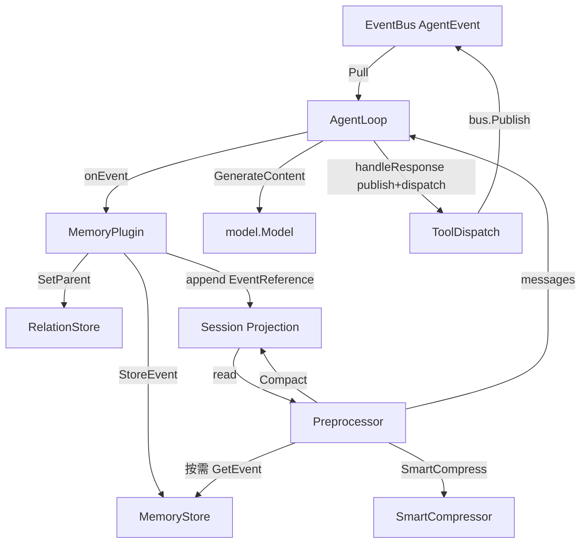

# Session-Projection Redesign: 模块映射与修订范围

> 本文档标记每个偏差项涉及的源文件、依赖关系和修改边界，便于任务拆分和并行开发。

## 一、核心模块修订边界

### 1.1 `agent/agent_loop.go`（重构重点）

| 当前代码 | 设计目标 | 修改方式 |
|----------|---------|----------|
| `AgentLoop.session *session.Session` 存 `[]event.Event` | 存 `[]memory.EventReference` | 新增投影字段或替换 Session 使用方式 |
| `Run()` Step 1 dispatch tool_use (L159-167) | dispatch 移到 `handleResponse` | 删除 Step 1 的 dispatch 循环，在 `handleResponse` 中直接调用 `dispatchToolUse` |
| `Run()` Step 2 手动 append event 到 session (L169-189) | onEvent 负责追加 EventReference | 删除手动 append，只调用 onEvent |
| `emitEvent()` 手动 append event 到 session (L391-399) | onEvent 负责追加 EventReference | 删除手动 append |
| `handleResponse()` 只 publish tool_use 不 dispatch | publish + dispatch 同步进行 | 在循环内对每个 tool_call publish 后同步 dispatch |
| `callModel()` 手动构建 request | 可继续保留或移交给框架 Flow | 第一阶段保留，第三阶段替换 |

### 1.2 `agent/preprocessor.go`

| 当前代码 | 设计目标 | 修改方式 |
|----------|---------|----------|
| `Process()` 从 `sess.Events []event.Event` 构建 messages | 从 `[]memory.EventReference` 构建 | 替换遍历逻辑：最近 N 条从 MemoryStore 拉取 FullEvent，旧引用用 EventSummary |
| `injectEventKeyPrefixesFromSession()` 匹配 `event.Event.StateDelta` | 匹配 `memory.EventReference` | 替换为从 EventReference 读取 event_key/event_type |
| 无 Compact 调用 | SmartCompress 后仍超限时调用 Compact | 在压缩循环后增加 Compact 触发点 |
| `Preprocessor` 不持有 MemoryStore | 需要 MemoryStore 按需拉取 | 构造函数注入 MemoryStore |

### 1.3 `agent/tagent_agent.go`

| 当前代码 | 设计目标 | 修改方式 |
|----------|---------|----------|
| `makeOnEventCallback()` 调用 `sessionSvc.AppendEvent` | onEvent 追加 EventReference 到 Session 投影 | 修改 onEvent 回调，直接操作 `Session.Events`（或新投影字段） |
| SessionService 返回 clone 导致 copy | 读写同一份 Session | 评估是否仍需 SessionService；如保留，需同步更新 clone 回源 |
| `DefaultMaxToolIterations = 200` | 主 agent 50 / 子 agent 10 | 修改常量；在 `NewTagentAgent` 中区分 entry/sub-agent |
| `Run()` 创建 invLoop 时使用 `ta.config.MaxToolIterations` | 子 agent 使用 10 | 使用修正后的默认值 |

### 1.4 `agent/smart_compress.go`

| 当前代码 | 设计目标 | 修改方式 |
|----------|---------|----------|
| `Compress()` 操作 `[]model.Message` | 继续操作 messages | 保持现状，职责不变 |
| 从 messages 解析 event_key 前缀 | 继续解析 | 保持现状 |
| 无 Session 操作 | 不操作 Session | 保持现状 |

### 1.5 `agent/tool_agent.go`

| 当前代码 | 设计目标 | 修改方式 |
|----------|---------|----------|
| `AgentToolWrapper.Call()` 解析 event_keys 并 fetch FullEvent | 继续该行为 | 保持现状，依赖 MemoryStore |
| 子 agent 单轮语义 | 保持 | 保持 |

### 1.6 `memory/types.go`

| 当前代码 | 设计目标 | 修改方式 |
|----------|---------|----------|
| `EventReference` 已定义 | 作为 Session 投影元素 | 无需修改，可能被更多模块引用 |
| `FullEvent` 已定义 | 作为 MemoryStore 元素 | 无需修改 |

### 1.7 `plugin/memory_plugin.go`

| 当前代码 | 设计目标 | 修改方式 |
|----------|---------|----------|
| `onEvent()` 构建 `FullEvent` 并持久化 | 继续作为五步协同第②步 | 保持 |
| 写回 `StateDelta["event_key"]` | 继续第④步 | 保持 |
| 不追加 EventReference | 需要第⑤步 | 修改 onEvent 返回 EventReference 或增加投影追加副作用 |

### 1.8 `config.go`

| 当前代码 | 设计目标 | 修改方式 |
|----------|---------|----------|
| `DefaultMaxToolIter = 200` | 主 agent 50 | 修改常量 |
| `DefaultAgentMaxToolIter = 5` | 子 agent 10 | 修改常量 |
| `applyDefaults()` 中 entry/sub-agent 默认值逻辑 | 主 50 / 子 10 | 调整 |

## 二、新增模块建议

| 模块 | 职责 | 建议位置 |
|------|------|----------|
| `agent/session_projection.go` | 定义 Session 投影操作：append EventReference、Compact、读取 | `agent/session_projection.go` |
| `agent/compact.go` | Compact 算法：按任务边界切分 EventReference，保留最近 N 任务，旧引用替换 summary | `agent/compact.go` |
| `agent/event_reference_builder.go` | 从 `event.Event` 构建 `memory.EventReference` | `agent/event_reference_builder.go` |

## 三、依赖关系图（修订后）

## 四、测试文件影响

| 测试文件 | 需更新原因 |
|----------|-----------|
| `agent/agent_loop_test.go` | Run 循环步骤改变、dispatch 时机改变 |
| `agent/agent_loop_edge_test.go` | session copy 消除、Compact 触发 |
| `agent/preprocessor_test.go` | 输入从 event.Event 变为 EventReference |
| `agent/tagent_agent_test.go` | MaxToolIterations 默认值、Run 子 agent 行为 |
| `agent/tool_agent_test.go` | 子 agent 迭代次数 |
| `agent/on_event_integration_test.go` | onEvent 五步协同断言 |
| `agent/smart_compress_test.go` | 基本不受影响 |

