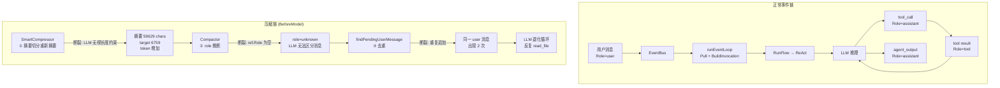
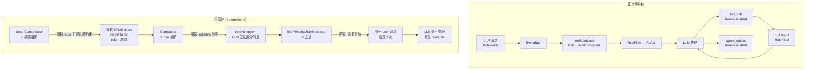

## Context

### 原型约束

原型的三个不变量：
1. inputs 是投影（有界）——压缩后 token 必须减少，不能增加
2. Compact 只修改投影——重建的消息必须保持正确的 Role
3. 工具结果回写 bus——所有消息必须可通过 Role 区分（user/assistant/tool）

### 完整事件链与断裂点

### 四个断裂点的根因

**断裂 1: 摘要膨胀** — `generateSummary` 在 `smart_compress.go:562-571` 流式接收 LLM 响应并累加 `result += content`，没有检查总长度是否超过 `targetChars`。LLM 无视 prompt 中的"目标长度"约束返回了 8.8 倍超长的内容。简单截断会丢失大量信息，更好的方案是切分原始输入重新摘要。

**断裂 2: role 丢失** — `resolveReferenceToMessage` 在 `context_manager.go:398-410` 中，当 `full.Response == nil` 时降级到 `ref.Role`。但 `BuildEventReference` 在 `projection.go:89-95` 只在 `evt.Response != nil` 时设置 `ref.Role`。无 Response 的事件（如 `InjectBusInputs` 注入的 external_input）`ref.Role` 为空，导致 `model.Role("")` = `unknown`。

**断裂 3: 用户消息重复** — `findPendingUserMessage` 在 `smart_compress.go:222-223` 找到 pending user 消息后追加到 `result` 末尾。但该消息已在 `recentSegments` 中（它是 recent 段的一部分，第 215-217 行追加），导致同一条消息出现两次。去重应基于 event key（从消息前缀 `[evt_KEY|type]` 解析），而非内容匹配。

**断裂 4: MemoryStore 返回 nil,nil** — `resolveReferenceToMessage` 的条件 `err == nil && full != nil && full.Response != nil` 中，当 `full.Response == nil` 时走到 warn 日志打印 `err`，但 `err` 是 nil（GetEvent 成功返回了无 Response 的事件），日志显示 `<nil>` 误导。

## Goals / Non-Goals

**Goals:**
- 摘要结果超过 targetChars 时切分原始输入重新摘要，保证压缩后 token 减少（不变量 ①）
- 摘要消息的 Role 固定为 system
- Compactor 重建消息时所有消息都有正确的 Role
- 不重复追加已存在的 user 消息（基于 event key 去重）

**Non-Goals:**
- 不修改 LLM 的摘要质量（只控制长度，不改善内容质量）
- 不修改 MemoryStore 的 GetEvent 返回值（保持现有接口）
- 不修改压缩的触发条件或分段逻辑

## Decisions

### Decision 1: 摘要超阈值时切分重新摘要

**选择**: `generateSummary` 收到 LLM 返回的摘要后检查长度。如果 `len(result) > targetChars * 1.5`（允许 50% 余量），执行切分重新摘要：

1. 将原始 segments 按 `len(segments)/2` 分成两个子批次
2. 对每个子批次独立调用 `generateSummary`，targetChars 减半
3. 拼接两个子摘要
4. 如果子摘要仍超限（递归到底仍超限），对最终结果硬截断到 targetChars

摘要消息的 Role 固定为 `model.RoleAssistant`（`summarizeBatches` 中改用 `model.Message{Role: model.RoleAssistant, Content: ...}` 包装，替代当前的 `model.NewSystemMessage`）。

**理由**: 简单截断会丢失大量信息。切分重新摘要让 LLM 对更小的输入生成更精简的摘要，信息保留更好。硬截断作为最终兜底，保证不变量 ①（投影有界）。

### Decision 2: EventType → Role 推断降级

**选择**: `resolveReferenceToMessage` 在 `full.Response == nil` 时，使用 `ref.EventType` 推断 Role：

| EventType | Role |
|-----------|------|
| external_input | user |
| agent_output | assistant |
| action_command | tool |
| thinking_plan | assistant |
| 其他 | user（安全降级） |

同时在 `BuildEventReference` 中，当 `evt.Response == nil` 时也做同样的推断。

**理由**: 消息的 Role 是 LLM 理解上下文的关键。缺失 Role 导致 LLM 无法区分消息类型。从 EventType 推断是确定性的，不依赖 LLM。

### Decision 3: findPendingUserMessage 基于 event key 去重

**选择**: `findPendingUserMessage` 返回的消息，在追加到 result 前从其 Content 中解析 event key（`[evt_KEY|type]` 前缀）。然后检查 recentSegments 中是否已有包含相同 event key 的 user 消息。如果已存在，不追加。

**理由**: 基于 event key 去重是确定性的——同一个事件不会被追加两次。比内容匹配更可靠（不同事件可能有相似内容）。

### Decision 4: resolveReferenceToMessage 日志修正

**选择**: 修正 warn 日志，区分"GetEvent 返回 error"和"GetEvent 成功但 Response 为 nil"两种情况。

**理由**: 当前日志 `failed to resolve event key=...: <nil>` 误导。

## Risks / Trade-offs

| 风险 | 缓解 |
|------|------|
| 切分重新摘要增加 LLM 调用次数和时间 | 递归深度限制为 2 层（最多 4 次 LLM 调用）；超限后硬截断兜底 |
| EventType→Role 推断不精确 | 推断基于确定性映射，比空 Role 更好；且仅在 Response 为 nil 时降级 |
| event key 去重需要解析前缀 | 前缀格式 `[evt_KEY|type]` 是确定的，解析成本低 |
## Context

### 原型约束

原型的三个不变量：
1. inputs 是投影（有界）——压缩后 token 必须减少，不能增加
2. Compact 只修改投影——重建的消息必须保持正确的 Role
3. 工具结果回写 bus——所有消息必须可通过 Role 区分（user/assistant/tool）

### 完整事件链与断裂点

### 四个断裂点的根因

**断裂 1: 摘要膨胀** — `summarizeBatch` 在 `smart_compress.go:562-571` 流式接收 LLM 响应并累加 `result += content`，没有检查总长度是否超过 `targetChars`。LLM 无视 prompt 中的"目标长度"约束返回了 8.8 倍超长的内容。

**断裂 2: role 丢失** — `resolveReferenceToMessage` 在 `context_manager.go:398-410` 中，当 `full.Response == nil` 时降级到 `ref.Role`。但 `BuildEventReference` 在 `projection.go:89-95` 只在 `evt.Response != nil` 时设置 `ref.Role`。无 Response 的事件（如 `InjectBusInputs` 注入的 external_input）`ref.Role` 为空，导致 `model.Role("")` = `unknown`。

**断裂 3: 用户消息重复** — `findPendingUserMessage` 在 `smart_compress.go:222-223` 找到 pending user 消息后追加到 `result` 末尾。但该消息已在 `recentSegments` 中（它是 recent 段的一部分，第 215-217 行追加），导致同一条消息出现两次。

**断裂 4: MemoryStore 返回 nil,nil** — `resolveReferenceToMessage` 的条件 `err == nil && full != nil && full.Response != nil` 中，当 `full.Response == nil` 时走到 warn 日志打印 `err`，但 `err` 是 nil（GetEvent 成功返回了无 Response 的事件），日志显示 `<nil>` 误导。

## Goals / Non-Goals

**Goals:**
- 摘要结果超过 targetChars 时强制截断
- Compactor 重建消息时所有消息都有正确的 Role
- 不重复追加已存在的 user 消息
- 压缩后 token 必须减少（不变量 1）

**Non-Goals:**
- 不修改 LLM 的摘要质量（只截断不改善内容质量）
- 不修改 MemoryStore 的 GetEvent 返回值（保持现有接口）
- 不修改压缩的触发条件或分段逻辑

## Decisions

### Decision 1: 摘要结果强制截断

**选择**: `summarizeBatch` 在流式接收完成后，如果 `len(result) > targetChars * 1.5`（允许 50% 余量），截断为 `targetChars` 并追加 `...(摘要已截断，原始长度 N 字符)`。

**理由**: LLM 可能无视长度约束。截断是工程兜底，保证压缩后 token 一定减少。50% 余量允许 LLM 有一定灵活性。

### Decision 2: EventType → Role 推断降级

**选择**: `resolveReferenceToMessage` 在 `full.Response == nil` 时，使用 `ref.EventType` 推断 Role：

| EventType | Role |
|-----------|------|
| external_input | user |
| agent_output | assistant |
| action_command | tool |
| thinking_plan | assistant |
| 其他 | user（安全降级） |

同时在 `BuildEventReference` 中，当 `evt.Response == nil` 时也做同样的推断。

**理由**: 消息的 Role 是 LLM 理解上下文的关键。缺失 Role 导致 LLM 无法区分消息类型。从 EventType 推断是确定性的，不依赖 LLM。

### Decision 3: findPendingUserMessage 去重

**选择**: `findPendingUserMessage` 返回的消息，在追加到 result 前检查其 Content 是否已存在于 recentSegments 的 user 消息中。如果已存在，不追加。

**理由**: 重复的 user 消息让 LLM 认为用户在不断重复同一个问题，触发重复响应。

### Decision 4: resolveReferenceToMessage 日志修正

**选择**: 修正 warn 日志，区分"GetEvent 返回 error"和"GetEvent 成功但 Response 为 nil"两种情况。

**理由**: 当前日志 `failed to resolve event key=...: <nil>` 误导（error 不是 nil 而是条件不满足）。

## Risks / Trade-offs

| 风险 | 缓解 |
|------|------|
| 摘要截断丢失信息 | 截断前已通过 compressEvent 保留了 key+type+summary 列表，LLM 可通过 recall 检索 |
| EventType→Role 推断不精确 | 推断基于确定性映射，比空 Role 更好；且仅在 Response 为 nil 时降级 |
| 去重检查误判 | 使用 Content 精确匹配，不会误删不同内容的 user 消息 |
