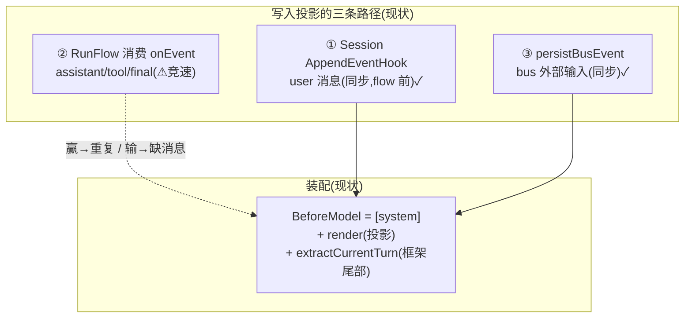

# Design: unified-event-projection

## Context

当前 LLM 输入装配的事件拓扑（实证自框架 v1.10.0 源码 + 运行日志）:

已钉死的事实（探索阶段取证）:

- 框架 session 已被 `WithSessionEventLimit(2)` 架空，**投影早已是事实上的唯一历史**。
- 框架 flow 发出工具结果事件后**会等待** runner 处理完成（`functioncall.go`: RequiresCompletion + `AddNoticeChannelAndWait`;runner 在 plugins + session 持久化**之后**才 NotifyCompletion;appender 默认 Attached)。
- user 消息经 `appendIncomingMessage → applyEventPlugins → sessionService.AppendEvent → AppendEventHook` **同步**进投影（flow 启动前）。
- bus 上的 agent_output echo 被**所有**消费方过滤（BuildInvocation/ShouldCallModel/TryPull/event_loop)——纯空转。
- 本次事故链：投影回合中已含 [10][11](onEvent 实证）→ 装配又把框架尾部的 raw 副本 [10′][11′][12] 并入 → L2 只丢重复 result 不处理孤儿 call → [12] 成未应答结尾 → 模型空响应。另有 5 个孤儿 result 源自**压缩边界切分 call/result 对**。
- `persistBusEvent` 已有 "RoleSystem→RoleUser（注入的工具结果按外部输入对待）" 的雏形——"result 是特殊 input 事件"本就是既有设计意图，未贯彻到 ReAct 路径。

## Goals / Non-Goals

**Goals:**
- G1 投影写入与 store 写入同点、同步、有序（插件管线内），时序完整性为**构造保证**而非碰巧。
- G2 装配单行化：`BeforeModel = [system] + render(投影) + 看板`；删除全部读回启发式。
- G3 配对自由渲染：历史渲染不含 `role=tool`；配对类 bug（孤儿/重复/4xx/压缩切割）从构造上消除。
- G4 事件元数据契约由框架统一注入/解析，消费端不再裸读字符串键。
- G5 每条设计决策对应**可证伪不变量**(I1-I5)，由测试锁定。

**Non-Goals:**
- 不改 bus 单消费者语义、任务层（spawn/settle/看板/origin baggage)、冥想、RL 轨迹。
- 不改压缩的调度策略（值密度/预算/回退逻辑），仅简化其边界约束。
- 不引入流式输出（仅为未来流式预留 partial 不变量）。
- 不追求框架尾部消息形成机制的进一步考证（方案后不再读尾部，动机无关）。

## Decisions

### D1 投影写入移入插件管线（核心）

`MemoryPlugin.OnEvent`（框架 `applyEventPlugins` 同步调用点）在 store 成功后**原子地**向投影 Append。选择此点的理由：

- 它是 runner 事件处理的同步阶段，且位于 `NotifyCompletion` **之前** → 对工具结果事件，框架的 completion-wait 直接覆盖投影写入。
- FIFO + 传递性覆盖 assistant 事件：assistant(K) 先于 tool result(K) 被 runner 处理；flow 等待 result(K) 的 completion ⇒ BeforeModel(K+1) 时两者都已投影。
- final(agent_output,RequiresCompletion=false）无等待，但**无下一迭代**；跨轮由"下一轮 RunFlow 必在上一轮 runner 结束之后启动"保证。
- user 消息已有同步路径（appendIncomingMessage 的 applyEventPlugins 同样经过本插件）→ 三条写入路径在此统一为一条。

per-invocation 投影绑定：主循环与 sub-agent 各有 projection;RunFlow 入口将本 ContextManager 的 projection 放入 ctx(context value)，插件从 ctx 读取；无 ctx 时跳过（runner 独立使用场景）。

**Alternatives**:① 留消费侧+加握手（把竞速合法化）——增加机制而非消除，否决；② Session AppendEventHook 扩展为全事件——session 持久化有过滤分支（suppression/streamFilter)，可能漏事件，否决；③ 新建独立 ProjectionPlugin——与 MemoryPlugin 同点但需保证"先 store 后 project"的顺序，单插件内原子最简，采纳并入 MemoryPlugin。

### D2 装配单行化，删除读回

BeforeModel 仅：`[system(from args)] + render(projection) + 任务看板`。删除 `extractCurrentTurnMessages`、`filterUser`、`df4e9b5`/`142bf5f` 两个历史启发式。`args.Request.Messages` 除 system 外**不读**（边界单向）。

**Alternatives**:哨兵标记替代字符串前缀（方案 C)——保留合并逻辑，同类 bug 换形态，否决。

### D3 时间线渲染（修订 v2：回合内原生，跨回合通知）

> 修订记录：初版 D3 把回合内同步工具交互也文本化（剥离原生 tool_calls、结果渲染为 user 文本）。实机验证暴露系统性风险：assistant 历史中任何形式的文本调用语法（箭头/全角括号/任意格式）都会被模型在理解压力下模仿——产生伪调用文本并终止回合。根因：文本化违背了模型的训练分布（function-calling 微调预期原生协议）。配对脆弱的真正根源（重复/读回）已由 D1/D2 构造性消除，文本化不再必要。

渲染规则：

| 事件类型 | 渲染 | 说明 |
|---|---|---|
| thinking_plan | role=assistant + **原生 ToolCalls**（自 FullEvent.ToolCalls 还原） | 训练分布内，content 无调用语法可模仿 |
| action_command（有 ToolID） | **role=tool + ToolID**（原生配对） | ToolID 管道已由 FullEvent.ToolID 保真 |
| action_command（无 ToolID，边缘） | role=user 输入注记 | 降级规则，非承重修复 |
| action_command（其 call 被压缩掉） | role=user 输入注记 | 渲染时降级 ⇒ 压缩任意切窗合法，无需压缩器感知配对 |
| external_input（含 task/monitor/meditation 通知） | role=user 文本 | 跨回合异步结果是通知，不是协议应答（不变） |
| agent_output / context_compress | assistant / system 文本 | 不变 |
| 任务看板 | **user 级独立虚事件**（带“系统注入观察快照、勿模仿”声明，不入历史） | 防 assistant 幻觉模仿 |

不变量 I3 翻转为：**渲染恒为合法原生序列**——每个 role=tool 消息必有前序匹配 tool_call；无法配对的结果以输入注记形态降级（内容不丢）。配套：输出侧协议卫生（sanitize，剥离模型伪造的 [evt_…] 等痕迹，存储+投递双边界）与退化空 turn 一次重试保留（模型无关的韧性层）。

**Alternatives**：① 继续文本化+换注记格式/prompt 防护——实机两次失败，任何文本调用语法都可模仿，否决；② 压缩器感知配对原子性（窗口不切对）——渲染时降级已使任意切窗合法，无需侵入压缩器，作为可选优化保留。

### D4 事件元数据契约（框架一等职责）

- 统一定义 key 常量（`event_key`/`partition_id`/`event_type`/`event_summary`/`trigger_source`/`meta_` 前缀）于 agent 包，插件/RunFlow/onEvent/task origin 全部引用同一来源。
- 框架提供解析 API（如 `agent.ParseEventMeta(evt) EventMeta`、路由助手），消费端（example）不再裸读字符串键。
- 注入点职责归一：存储标识（插件）、路由来源（RunFlow 入口一次设置）、透传元数据（onEvent 传播，键来源常量）。

### D5 删除 agent_output bus echo

所有消费方已过滤 bus agent_output;`echoFinalResponse` 删除。循环等待语义不变（Pull 阻塞）。"空 final 抑制"随 echo 一并删除（不再需要）;H1（空 agent_output 不存储/不投影）保留为存储卫生。

### D6 删除 L2 配对修复器

配对概念消失 → `message_validate.go` 删除。L1 投影幂等保留（Replace/压缩仍可能重复）。新增**渲染合法性断言**（测试态）：渲染结果无 role=tool、无空 agent_output。

### D7 压缩边界自由 + 关联标识保留

无配对后压缩可选任意连续窗口；约束改为：摘要生成（LLM/规则）必须保留关联标识文本（task id、工具名），使"通知↔调用"在压缩后仍可关联。值密度/预算调度逻辑不变。

### D8 partial 守卫（预留不变量）

管线写入路径跳过 `IsPartial` 事件（仅投影聚合事件）。当前非流式为空操作，作为不变量写入 spec 与测试。

## Risks / Trade-offs

- [模型对"文本化工具历史"的行为差异] → 渲染文本保持高信息密度（工具名/参数摘要/结果/标识）；真实 LLM e2e 对比任务完成质量；如有退化，仅调渲染模板，不动架构。
- [框架 flow 隐性依赖历史 role=tool] → 设计阶段验证项（读框架 functioncall/transfer 处理器，确认仅从 response 读 tool_calls)；目前证据（系统长期在 BeforeModel 整体替换消息）表明无依赖。
- [per-invocation ctx 绑定在多 runner 并发下错配] → ctx 为调用链本地值，天然隔离；单测覆盖主循环+sub-agent 并发。
- [渲染后 token 估算变化影响压缩阈值] → 压缩前估算逻辑不变（对渲染后消息估算）；回归测试锁定。
- [删除 echo 影响未知消费方] → 实施前最后一轮全仓 agent_output 消费审计（已知 4 处均为过滤）；e2e 观察循环唤醒行为。
- [一次到位的大改动风险] → 不变量 I1-I5 先写测试（先红后绿）；按 tasks 分阶段落地，每阶段全量回归 + e2e。

## Migration Plan

1. 先落地不变量测试（I1-I5)，在当前代码上确认预期失败项（红）。
2. D1（写入统一）→ D2（装配单行）→ D3（渲染规则）→ D4（元数据契约）→ D5/D6（删除）→ D7（压缩）→ D8（不变量）。
3. 每阶段：`go build/vet` + 全量单测 + 真实 LLM e2e（含 async 投递、配对渲染断言、repair 计数==0 断言）。
4. 回滚：单变更 revert 即可；无持久化格式迁移（MemoryStore 数据模型不变，仅渲染规则变化）。

## Open Questions

- reasoning_content(hy3 thinking）在 FullEvent/渲染中的保真策略（保留 or 摘要），实施 D3 时定。
- 通知类渲染的具体文本模板（类别前缀与标识格式），实施 D3 时与 e2e 断言一并定稿。
- sub-agent 投影经 ctx 绑定后，其 RunFlow 完成即弃——确认无跨调用复用即可（现有实现已如此）。
