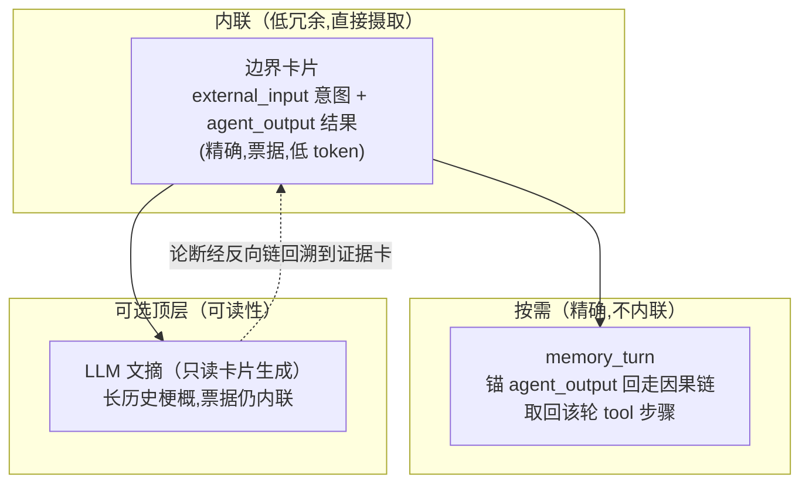

# compress-digest-reconnect — 技术设计

## Context

骨架压缩（`task-skeleton-compression`）按 LSM 思路管理上下文：段按 `agent_output` 切分任务回合，段龄纯函数定级 L0-L3，L1 丢 tool、L2 仅骨架、L3 LLM 摘要归档。但生产实证（wechat-bot 2026-08-01）压缩**从未触发**：`under budget (37k <= 102400), 425 refs=425 messages`，refs 持续增长、无滚动摘要形成。本 change 让管线真正活过来，并补齐"执行过程召回"。

已核实的关键事实：

| 事实 | 影响 |
|------|------|
| 触发门在 `ContextCompressor.Compress`（`usedTokens > threshold`），token 单维 | 占位符把 token 压低 → 永不触发 |
| `compressSkeleton` 内部有段数门槛（`completeCount <= keepRecent` 才短路），但到不了它 | 段数逻辑已存在，只是被外层 token 门挡死 |
| `recentFullCount` 默认 = keepRecent×4，最近完整回合取全文，更老用 EventSummary | 占位符渲染是性能优化，非压缩 |
| `summary_model` 已在 tagent.yaml 配置；L3 摘要有 `segmentContentHash` 归档缓存 | LLM 摘要已接线，只缺触发 |
| 因果链：`MemoryPlugin` 把每个事件 parent 设为会话前一事件；`GetParent`（recall_trace）反向遍历已存在 | recall_turn 可直接复用反向链，无需建正向 |
| `compressLegacy` 是 `skeleton_segmentation:false` 的回退路径 | 不是死代码，保留 |

## Goals / Non-Goals

**Goals:**
- 让骨架压缩真正触发：token 阈值之外，加"完整任务段超龄"维度。
- LLM 摘要真实运行并对齐"卡片为基座、文摘为可选叠加层"（票据保留、素材律）。
- `memory_turn` 链召回：模型能拿回任意轮次被 L1 丢弃的执行过程。
- 死代码清理（保留 compressLegacy 回退路径）。
- 与现有测试全绿；新逻辑配测试。

**Non-Goals:**
- 不改段边界（agent_output）、L0-L3 定级纯函数、tool>assistant 丢弃序。
- 不引入正向因果链遍历（GetChildren 暴露为工具）——反向链已够用。
- 不用 LLM 摘要**替换**卡片（卡片=票据基座，不动）。
- 不碰压缩之外的记忆机制（TTL/压实/墓碑）。

## Decisions

### D0：摄取模型三层结构（贯穿所有决策）

- **基座（卡片）**：外部输入意图 + agent 输出结果——高价值"what/result"内联，票据直达原文。不动。
- **按需（recall_turn）**：低频"how"（tool 步骤）不内联，靠链召回。这是效率设计的核心——骨架只留边界就是为了让"how"不占窗。
- **叠加（LLM 文摘）**：长历史时一段梗概更好读；只读卡片生成（守素材律），票据仍内联。

### D1：触发器多维化（P0，本 change 的心脏）

**问题**：`ContextCompressor.Compress` 只在 `usedTokens > threshold` 时调 `SmartCompressor.Compress`；占位符让 usedTokens 永远低于阈值。

**方案**：把触发条件从 `usedTokens > threshold` 扩展为 `usedTokens > threshold || completeTurns > keepRecent`。

- `completeTurns` = refs 中 `agent_output` 事件数（段边界计数）。**零额外成本**：复用第 229 行已有的 ref 遍历循环顺带统计，不新增分段/扫描。
- `completeTurns > keepRecent` 意味着存在超出 L0 保留窗（最近 keepRecent 段）的老完整回合——**有料可压**。此时调 `SmartCompressor.Compress`，由其按段龄 L1/L2/L3 处理并 `buildRetainedRefs` 形成滚动摘要。
- `compressSkeleton` 内部的 `beforeTokens <= maxTokens && completeCount <= keepRecent` 短路**保留**——它处理"仅 1-2 个回合"的常态，避免无谓压缩。

**为什么不是"永远调用 SmartCompressor"**：`SmartCompressor.Compress` 每轮做分段 + 4n 成本预估，超预算才值得；触发门用廉价的段边界计数先挡掉"无料可压"的轮次，避免每轮 O(n) 分段开销（否则对话全程 O(n²)）。

**稳态效果**：压缩连续运行后，老回合被 L1 丢弃、L3 折叠进滚动摘要——refs 不再 1:1 无界增长。注意（code review 修正）：稳态**收敛到 ~3×keepRecent** 个 retained agent_output（L0/L1/L2 段都保留边界事件），所以长会话里 completeTurns 恒 > keepRecent，触发**持续**——这是设计意图（LSM 式连续维护滚动摘要），不是 bug；真正的成本缓解是投影有界 + 轮内幂等 no-op，而非 `compressSkeleton` 内部短路（稳态下 completeCount=3k > k，短路条件不满足）。

### D2：LLM 摘要接线对齐（卡片为基、文摘为叠加）

**机制澄清（实现核实）**：骨架管线（`compressSkeleton`）是**纯工程、零 LLM**——L3 = 整段离场→`buildRetainedRefs` 折叠成滚动摘要卡片，**不做 LLM 段摘要**（LLM 段摘要 + `segmentContentHash` 归档缓存是 `compressLegacy` 独有）。骨架管线的 LLM 文摘是 **`condenseCardLines`**（`curateCards` 内）：卡片超 `cardMaxChars` 时用 summaryModel 浓缩较旧一半卡片、保留最新卡片原文——这正是 D0 所说的“只读卡片生成的可选叠加层”。

- **condenseCardLines**（骨架管线的文摘）：只读卡片生成浓缩摘要，保留最新卡片原文与票据；无模型则沉底计数。已有测试（`TestCurateCards_MultiLineCondensation` 带模型 / `TestCurateCards_SinkWithoutModel` 无模型）。
- **票据保留**：浓缩卡片保留 `[evt_key]` 票据——LLM 生成的叙述是“可读叠加层”，卡片仍是召回锚点，零幻觉契约不破。
- **接线核对**：触发器修复后，压缩真实运行→滚动摘要卡片形成→卡片超限时 condenseCardLines 真实调用 summaryModel（此前因压缩从未触发，condenseCardLines 也从未运行）。
- **legacy L3 段摘要**：`compressLegacy` 的 LLM 段摘要 + 归档缓存保持原样（`skeleton_segmentation:false` 回退时可用），本 change 不动。

**为什么不是“卡片改摘要”**：卡片 `[evt_key]` 是召回票据本体，是零幻觉承诺的载体；condenseCardLines 只在卡片之上浓缩更紧凑的梗概，绝不替换基座。

### D3：memory_turn 链召回工具

**问题**：骨架丢弃 tool 事件后，模型想找回"这轮具体怎么做的"（执行过程），但被丢弃事件的 key 不在卡片里。

**方案**：新增 `memory_turn`（plain tool，与 recall_trace 同族）：
- 输入：一个 event key（通常取自 agent_output 卡片）。
- 行为：沿 `GetParent` 逐跳回走，直到遇到 `external_input`（含）为止；返回该区间的事件（含被丢弃的 thinking_plan / action_command），按时间排序。
- 边界：用事件类型 `external_input` 作停止条件，天然圈定"当前轮次"，无需正向遍历。

**卡片可追溯提示**：`extractCardLine` 给卡片行追加"含 N 步工具调用，可用 memory_turn 追溯"的提示（N=该轮中间事件数），让模型知道何时值得召回、用什么 key（agent_output 卡片的 key）。

**为什么锚 agent_output 而非 user input**：骨架把两端都留成卡片；反向链（GetParent，已存在）从 agent_output 回走即可圈定整轮，**无需新建正向遍历工具**。`external_input` 类型即停止信号。

### D4：死代码清理（保留 compressLegacy）

- `compressLegacy`：**保留**——`skeleton_segmentation: false` 的有意回退路径，非死代码。
- 对压缩路径做一次死代码 pass：未引用的 helper / 过期分支 / 占位符路径里不再可达的代码，逐个核实后删除（遵循本仓库"删除死代码留存"纪律）。
- 顺带：纯工具调用 thinking_plan 的空 EventSummary 是占位符噪声来源——**评估**是否为 assistant 纯工具调用消息生成"调用工具: X"式摘要（复用 `formatToolCallSummary`），消除占位符。此项为可选增强，独立可裁。

### D5：测试设计

| 测试 | 断言 |
|---|---|
| **触发器-段数触发** | completeTurns > keepRecent 且 under token → SmartCompressor 被调用（此前不被调用） |
| **触发器-无料短路** | completeTurns ≤ keepRecent 且 under token → 不调用，返回原样 |
| **触发器-token 触发** | over threshold → 仍触发（回归） |
| **memory_turn** | 给定 agent_output key → 返回 [external_input, ..., agent_output] 整轮事件含被丢弃 tool；在 external_input 处停止 |
| **L3 摘要+归档缓存** | 触发后 L3 段生成摘要并入滚动摘要；同内容 hash 复用摘要（素材律），不重复调模型 |
| **condenseCards** | 卡片超限 → 浓缩旧卡且保留新卡票据 |
| **端到端压缩状态机** | 多回合后：refs 不再 1:1 无界增长；滚动摘要含边界卡片；memory_turn 可召回被丢弃 tool 事件 |
| **fail-before/pass-after** | 每个关键测试用回退法验证真能抓 bug |

### D6：与既有能力的关系

- `task-skeleton-compression`：触发器多维化 + LLM 摘要接线在此能力下做 MODIFIED。
- `recall-protocol`：`memory_turn` 作为新召回工具在此能力下做 MODIFIED（与 recall_trace 同族，边界=external_input）。
- 不动的既有能力：`deterministic-compress-level`（定级纯函数）、`value-driven-compression`（价值密度）。

## Risks / Trade-offs

- **[压缩首次真实运行的形态风险]**：滚动摘要/卡片首次形成，需观察其是否符合"what/result 内联 + how 可召回"的预期——上线后看真实形态再微调（如卡片密度、提示文案）。
- **[LLM 摘要的成本]**：触发后引入模型调用。缓解：`segmentContentHash` 归档缓存（同内容复用）；段摘要只发生在 L3（最老段），频率低。
- **[触发过于频繁]**：`completeTurns > keepRecent` 几乎总是真。这是设计意图（连续维护滚动摘要），但 SmartCompressor 每轮运行有成本。缓解：段边界计数廉价；compressSkeleton 内部短路；如需可后续加"每 K 轮一次"节流。
- **[recall_turn 遍历成本]**：长回合链较长。缓解：external_input 边界天然停止；链长在单轮内有限。
- **[占位符噪声残留]**：老 tool 事件在触发前仍短暂以占位符存在，直到 L1 丢弃——属正常过渡，不影响正确性。

## Migration Plan

1. 纯触发器与工具新增 + 接线核对，存储格式零改动——可直接回滚。
2. 上线观察点：压缩日志从"under budget, 1:1"变为出现 SmartCompress 触发与滚动摘要形成；refs 停止无界增长；memory_turn 可用。
3. `compressLegacy` 保留为回退——若新触发器异常，可 `skeleton_segmentation: false` 回退（但注意 legacy 同样受 token 门影响）。

## Open Questions

- `memory_turn` 的返回是否需要截断（长回合 tool 步骤多时）？倾向：与 recall 既有返回一致的轻量结构，必要时按 existing maxInline 截断。
- 卡片"含 N 步"的 N 如何廉价获得（需段信息）？倾向：在压缩时随卡片生成一并写入（此时段信息在手），而非渲染期现算。
- 纯工具调用 thinking_plan 的"调用工具: X"式摘要（D4 可选增强）是否纳入本 change？倾向：纳入，消除占位符噪声，与触发器修复互补。
