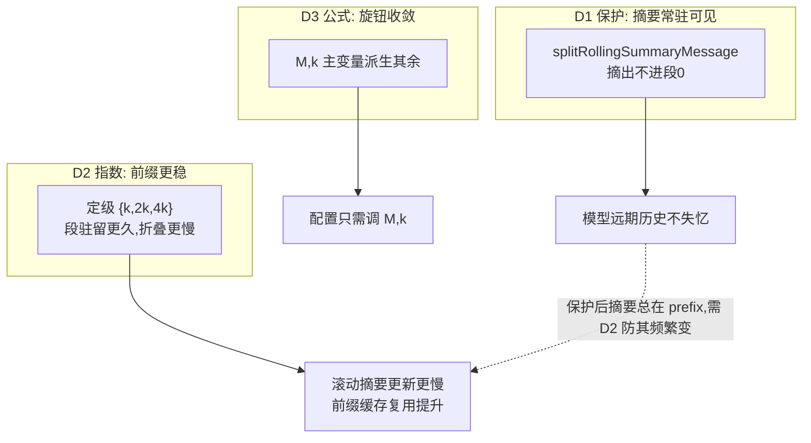

# rolling-summary-anchor — 技术设计

## Context

压缩激活后（compress-digest-reconnect），生产实证发现滚动摘要在 K≥7 从模型上下文消失：滚动摘要 ref prepend 到投影最前 → 渲染成第一条消息 → 落进段0（与第一回合同段）→ 段0 段龄最高升 L3 → `applySegmentLevel` L3 返回 nil，摘要消息随段0 被丢出模型上下文。ref 一直在投影里（buildRetainedRefs 每轮重建），但消息被丢——模型远期历史失忆。

当前生产配置（wechat-bot tagent.yaml + 代码默认）：

| 参数 | 值 | 来源 |
|---|---|---|
| `keep_recent_tasks` (k) | 2 | yaml（主变量） |
| `max_tokens` (M) | 128000 | yaml（主变量） |
| `compress_threshold` | 0.8 | yaml |
| token 阈值 | 102400 (=0.8×M) | 派生 |
| `recent_full_count` | 8 (=k×4) | 派生 |
| `card_max_chars` | 6000 | 默认 |
| `compact_keys_listed` | 32 | 默认 |
| 定级边界 | 线性 {k,2k,3k} = {2,4,6} | 代码 |

会话 token 量（5–20k）远低于 M=128000，预算升级（total>maxTokens）永不触发，分级纯由段龄决定。

## Goals / Non-Goals

**Goals:**
- 滚动摘要消息**永远可见**（不被 L3 吞），K≥7 长会话模型对远期历史不失忆。
- 定级改**指数衰减**，降低段折叠频率 → 前缀缓存更稳定。
- 配置参数**公式化**：max_tokens 与 keep_recent_tasks 为主变量，其余派生。

**Non-Goals:**
- 不改卡片生成的纯工程本质（extractCardLine 零 LLM）、condenseCardLines 可选浓缩、素材律、memory_turn/recall 语义。
- 不动 legacy 压缩路径（compressLegacy）。
- 不做 condenseCardLines 的 LLM 延迟优化（独立问题，另开 change）。

## Decisions

### D1：滚动摘要消息豁免 L3（核心修复）

**问题**：滚动摘要消息被 `SegmentMessages` 并入段0，段0 升 L3 时 `applySegmentLevel` 返回 nil，摘要消息被丢出模型上下文。

**方案**：类比 `SplitSystemMessage`，在 `compressSkeleton` 开头把**领先的 `context_compress` 滚动摘要消息摘出**，压缩后无条件回填到 result 最前（紧随系统消息）：

```go
// splitRollingSummaryMessage extracts a leading context_compress message so it
// is never compacted away by L3 (analogous to SplitSystemMessage).
func splitRollingSummaryMessage(messages []model.Message) (*model.Message, []model.Message) {
    if len(messages) == 0 { return nil, nil }
    if MessageEventType(&messages[0]) == tagentevent.TypeContextCompress {
        return &messages[0], messages[1:]
    }
    return nil, messages
}
```

`compressSkeleton` 流程改为：
```
systemMsg, rest = SplitSystemMessage(messages)
rollingMsg, rest = splitRollingSummaryMessage(rest)   // 摘出，不参与分段/定级
segments = SegmentMessages(rest)                       // 滚动摘要不进段0
... 定级 + applySegmentLevel ...
result = [systemMsg?, rollingMsg?, ...compressedSegments]   // 无条件回填
```

**为什么这样最干净**：与系统消息同构（都是"常驻骨架、不参与压缩"）；滚动摘要被排除在分段之外，天然不会被任何级别丢弃；`buildRetainedRefs` 不受影响（它操作 refs，负 key 摘要 ref 仍被吸收重建，投影照常携带）。**纯结构改动，零 LLM、零延迟风险。**

识别方式：`MessageEventType(&messages[0]) == tagentevent.TypeContextCompress`（resolveRef 渲染滚动摘要时带 `[evt_-xxx|context_compress]` 前缀）。伪造无害——真实摘要 ref 带负 key 且在投影里，模仿文本解析不出。

### D2：L1/L2/L3 定级改指数衰减（缓存复用）

**问题**：线性定级 `{k, 2k, 3k}` 使段每 k 轮就换一次级别（内容重渲染）+ 每 3k 轮折叠进滚动摘要（摘要文本更新）→ 前缀（滚动摘要在最开头）频繁失效，LLM 前缀缓存命中率低。

**方案**：`deterministicLevel` 段龄阈值从线性 `{k, 2k, 3k}` 改**指数 `{k, 2k, 4k}`**（边界 = k×2^level）：

```go
age := totalSegs - 1 - segIdx
switch {
case age < keepRecent:   return 0  // age < k·2^0
case age < keepRecent*2: return 1  // age < k·2^1
case age < keepRecent*4: return 2  // age < k·2^2
default:                return 3  // age >= k·2^2
}
```

k=2 时：L0 龄0-1 / L1 龄2-3 / L2 龄4-7 / L3 龄≥8（原为 L2 龄4-5 / L3 龄≥6）。

**缓存收益**：
- 段在每个级别**驻留更久**（L2 段跨度从 k 翻倍到 2k）→ 重渲染频率减半。
- 段被折叠进滚动摘要的阈值从 3k 推迟到 4k → **滚动摘要文本更新频率降低** → 前缀缓存更稳定。
- 段在 timeline 驻留更久（retained 段从 6 增到 8），但 M=128000 预算充裕；预算升级仍在超限时兜底。

**与 D1 的协同**：D1 让滚动摘要"永远可见"（修复失忆），D2 让它"变化更慢"（缓存稳定）。两者缺一不可——只保护不指数化，滚动摘要仍每轮折叠时失效前缀；只指数化不保护，滚动摘要仍被 L3 吞。

### D3：配置参数公式化（减少独立旋钮）

**原则**：`max_tokens`（M）与 `keep_recent_tasks`（k）为**主变量**，其余尽量由简单公式派生；保留各参数为**可覆盖旋钮**，但未显式设置时用公式默认值。

| 参数 | 现状 | 派生公式 | 说明 |
|---|---|---|---|
| token 阈值 | 102400 | `compress_threshold × M` | 已有派生 |
| `recent_full_count` | 8 | `k × DefaultRefsPerTurn`(=4k) | 已有派生 |
| 定级边界 | 线性 {2,4,6} | `{k, 2k, 4k}`（指数，D2） | 由 k 推出 |
| `card_max_chars` | 固定 6000 | `M / 20`（≈预算 5%，128000→6400） | 卡片段随预算伸缩 |
| `compact_keys_listed` | 固定 32 | `card_max_chars / 200`（≈平均每卡 200 字符） | 由卡片预算推出 |

**效果**：用户只需关心 M 与 k 两个直觉旋钮（预算多大、保留几轮），其余自动合理。显式设置仍优先（向后兼容）。

### D4：三者如何协同



### D5：缓存复用分析（诚实边界）

前缀缓存复用取决于**最早变化点**。滚动摘要在 [1]，它一变，其后全部失效。本 change 的缓存收益来自 D2**降低变化频率**（折叠更慢 → 摘要更新更慢），而非消除变化——摘要计数仍会在每次折叠时 +N。

**这是诚实的部分收益**：指数化把"每 3k 轮失效一次"降为"每 4k 轮失效一次"，并把段重渲染频率减半。更激进的"摘要批量更新/延迟重整"（每 N 次折叠才重整卡片）能进一步稳定前缀，但属更大改动，记为未来方向，不在本 change。

### D6：测试设计

| 测试 | 断言 |
|---|---|
| **D1 K≥7 摘要可见** | 滚动摘要 + 8 回合（段0 升 L3），`result.Messages` 仍含 context_compress 摘要消息（在系统消息后） |
| **D1 摘要不进段0** | 分段结果中段0 不含 context_compress；摘要消息 token 不被计入压缩决策的丢弃候选 |
| **D1 ref 仍被重建** | `RetainedRefs` 仍含滚动摘要 ref（保护与投影携带兼容） |
| **D2 指数边界** | keepRecent=2 时 age=5→L2（原 L3）、age=6→L2、age=7→L2、age=8→L3 |
| **D2 fail-before** | 同输入在线性 {k,2k,3k} 下 age=6→L3，指数下 age=6→L2 |
| **D3 公式默认** | 未设置时 card_max_chars=M/20、compact_keys_listed 随之；显式设置优先 |
| **回归** | 既有压缩测试全绿 |

## Risks / Trade-offs

- **[滚动摘要常驻占 token]**：有界（card_max_chars 封顶 ~6000 字符），是固定的历史感知成本；换来远期不失忆，值得。
- **[指数定级增大 retained 段]**：段驻留更久（retained 从 6 增到 8 段），上下文略增；M=128000 预算充裕，且预算升级兜底。
- **[缓存收益是部分的]**：摘要计数仍随折叠变化（见 D5），缓存复用提升但非完美；批量更新是未来方向。
- **[公式默认值变化]**：card_max_chars 从 6000 → M/20（128000→6400），行为微调；显式设置者可锁定原值。
- **[legacy 路径]**：compressLegacy 不受 D1/D2 影响（它是回退路径），保持原样。

## Migration Plan

1. 纯结构 + 定级 + 公式默认值改动，存储格式零改动，可直接回滚。
2. 上线观察点：K≥7 长会话的 BeforeLLM 上下文 [1] 持续为 context_compress 摘要；SmartCompress 分级出现 L2 龄4-7、L3 龄≥8；前缀缓存命中（若 provider 暴露 cache 指标）。
3. 回退：D1/D2 改动独立可回退；`skeleton_segmentation:false` 可回 legacy。

## Open Questions

- 指数底数固定 2，还是暴露为高级旋钮？倾向：固定 2（"指数计算"语义最简），不外露。
- card_max_chars 的 `M/20` 系数是否合适（CJK 内容 1 token≈1 字符，5% 预算≈6400 字符）？倾向：先 M/20，上线后按真实卡片段占用微调。
- 是否本 change 顺带把"摘要批量更新"（每 N 折叠才重整卡片）也做了以进一步稳定前缀？倾向：**不做**，保持 change 聚焦，记为未来方向。
