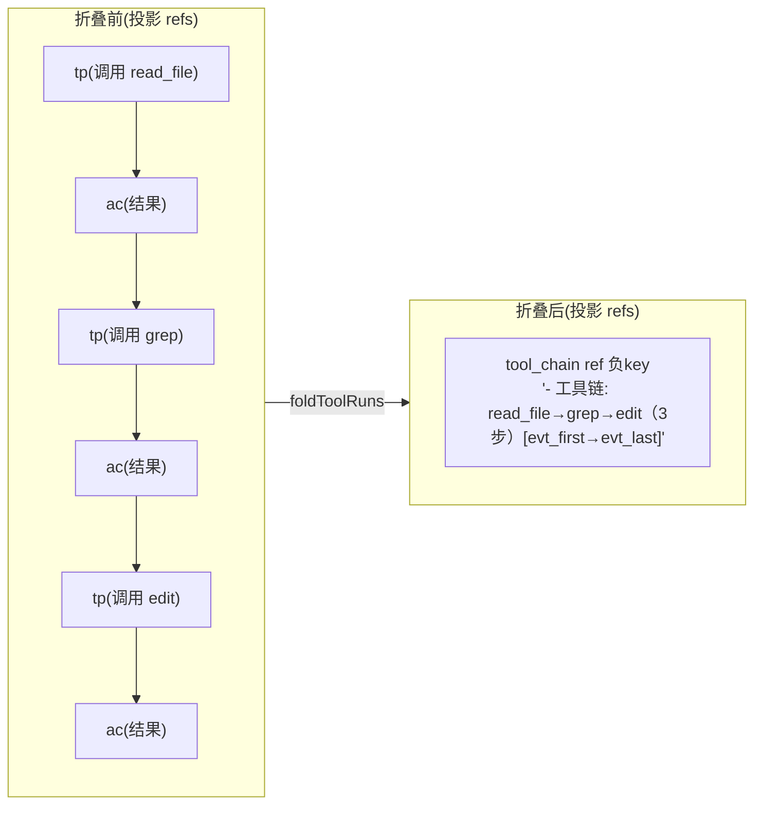

# tool-chain-consolidation — 技术设计

## Context

生产实证（wechat-bot 2026-08-02 20:58）：长研究任务的进行中段在上下文累积 ~130 条工具调用消息（65 thinking_plan 零信息占位符 + 63 action_command），占 169 条上下文的 82%。compress-digest-reconnect（触发器）与 rolling-summary-anchor（摘要常驻）已生效，但**进行中段无保真度管理**的盲区仍在。

已核实的关键事实：

| 事实 | 影响 |
|------|------|
| `GenerateEventSummary` 对 special 类型（external_input/agent_output/thinking_plan）直接取 `msg.Content` | 纯工具调用 thinking_plan（content=""）→ 摘要为空 |
| 老化（full=false）走 `resolveRef` 空摘要兜底 → `(历史事件摘要为空…)` | 零信息占位符（~65 条 × ~50 字符） |
| 进行中段恒 L0（`deterministicLevel` 对 `!IsComplete` 返回 0） | 工具调用历史无界累积、永不压缩 |
| `FullEvent.ToolCalls` 存工具调用 | 存储时可提取工具名（D1 素材） |
| 工具事件本体永在 MemoryStore | 合并只动投影/渲染，recall 无损（I4） |

## Goals / Non-Goals

**Goals:**
- 消灭空摘要占位符（断裂①）：纯工具调用 thinking_plan 存储时带 `调用 <工具名>` 摘要。
- 进行中段工具调用历史**有界化**（断裂②）：老化的完整工具对合并为一行工具链，进行中段大小与循环长度解耦。
- 统一"龄→层→表示"：工具调用的"how"在老化后以**工具链行**呈现（骨架层表示），活跃前沿保持原生。
- 五项不变量作为规格契约：I1 有界、I2 稠密、I3 锚定、I4 无损、I5 原生前沿。

**Non-Goals:**
- 不改已完成回合的 L0-L3 分级、滚动摘要常驻（rolling-summary-anchor）、memory_turn/recall 召回语义、卡片生成纯工程本质。
- 不动 native protocol form 的近期配对合法性（活跃前沿原样）。
- 不做 condenseCardLines 的 LLM 延迟优化（独立问题）。

## Decisions

### D1：纯工具调用 thinking_plan 的工具调用摘要（根治空摘要）

**问题**：`GenerateEventSummary` 对 special 类型直接取 `msg.Content`，纯工具调用 thinking_plan（`Content==""`、`ToolCalls!=[]`）摘要为空 → 老化后占位符。

**方案**：`GenerateEventSummary` 对 thinking_plan 且 `Content==""` 且 `len(ToolCalls)>0` 时，用 ToolCalls 生成 `调用 <工具名>`（多个调用顿号连接，工程提取、零 LLM）：

```go
if eventType == TypeThinkingPlan && msg.Content == "" && len(msg.ToolCalls) > 0 {
    return formatToolNames(msg.ToolCalls) // e.g. "调用 read_file、grep"
}
```

**效果**：老化渲染从 `(历史事件摘要为空…)` 变为 `调用 read_file`——空摘要占位符源头消灭，且为 D2 合并提供工具名素材（无需回取全文）。

### D2：老化工具运行折叠为工具链合成引用（核心）

**问题**：进行中段（及老化段）的连续工具调用运行（thinking_plan + action_command）逐条占位，无界累积。

**方案**：新增"工具链折叠"——把**连续的老化完整工具对**折叠成一个 `tool_chain` 合成引用（类比滚动摘要 ref 的负 key 合成机制）：



- **触发对象**：连续 ≥2 条的老化工具事件（`thinking_plan`/`action_command`，中间不被 `external_input`/`agent_output` 打断）。工具名取自 ref.EventSummary（D1 已填 `调用 X`，无需回取全文）。
- **合成引用**：`EventReference{EventKey: -minTs(run), EventType: TypeToolChain, EventSummary: "- 工具链: name1→name2→…（N步）[evt_first→evt_last]"}`——负 key、类型 `tool_chain`（新类型，区别于 `context_compress` 以免被 buildRetainedRefs 误吸收进滚动摘要计数）。
- **替换**：原工具事件 refs 从投影移除，由该合成引用替代——**无双重表示**（不在投影又在滚动摘要）。
- **票据**：`[evt_first→evt_last]` 是关键区间票据，`memory_turn(evt_last)` 沿因果链回走可取回被合并的完整工具链（I4）。

**折叠位置**：`ContextCompressor.Compress` 在 resolveRef 之前、对投影 refs 执行 `foldToolRuns`（结构层操作）。折叠后 resolveRef 把 tool_chain ref 渲染成 user 侧一行 `- 工具链: …`，SmartCompressor 正常分段（该消息含于段内，作为该回合"how"的骨架表示，L0/L1/L2 各档均保留——`IsSkeletonMessage` 对非 tool 类型保守为真）。

### D3：活跃前沿保护（不破坏原生配对）

折叠只针对**已老化的完整工具对**（full=false 区间内、call+result 都已落地）。以下情况**不折叠、保持原生**：

- 最近 `recentFullCount` 条（full=true）的消息——近期工具调用保持原生配对。
- 当前进行中的未完成调用（无 result 的 tool_call）——`applySegmentLevel` 与渲染层配对合法性本就依赖它，绝不合并。
- 边界事件（external_input/agent_output）——折叠遇边界即断，不跨回合。

配对合法性：`foldToolRuns` 把完整对**一起移除**（call 与 result 同时消失），不 dangling；活跃前沿的未完成调用原样保留。

### D4：渲染与投影处理

- **resolveRef**：`TypeToolChain` 渲染为 user 侧消息 `- 工具链: …`（观察输入，非 system/assistant，与滚动摘要同 rationale）。
- **buildRetainedRefs**：`TypeToolChain` ref 一律**保留**（不进 priorCount、不进 compressedKeys、不折叠）——它已是该工具运行的紧凑表示，与滚动摘要各司其职（滚动摘要=远期历史整体，tool_chain=某回合的 how）。

### D5：五项不变量（规格契约）

| 不变量 | 本 change 的保障 |
|---|---|
| I1 有界 | 进行中段工具历史折叠为 O(工具链行数) 而非 O(工具调用数)，与循环长度解耦 |
| I2 稠密 | 空摘要占位符消除（D1）；工具运行合并为单行（D2），无零信息位置 |
| I3 锚定 | 滚动摘要常驻不变（rolling-summary-anchor，不受影响） |
| I4 无损 | 工具事件本体永在 MemoryStore；工具链行带票据，memory_turn 可取回完整链 |
| I5 原生前沿 | 活跃前沿与近期配对保持原生；折叠只动已老化完整对 |

### D6：测试设计

| 测试 | 断言 |
|---|---|
| **D1 工具调用摘要** | 纯工具调用 thinking_plan（content=""）→ EventSummary="调用 read_file"；有 content 时不受影响 |
| **D2 工具链折叠** | 老化连续 ≥2 工具事件 → 折叠为一个 tool_chain ref（负 key），EventSummary 含工具名序列与票据 |
| **D2 不跨边界** | 工具运行遇 external_input/agent_output 即断，分别折叠 |
| **D3 活跃前沿保护** | full=true 的近期工具对不折叠；未完成调用不折叠；配对合法性不破 |
| **D2 渲染** | tool_chain ref 渲染为 user 侧一行 `- 工具链: …` |
| **D2 投影保留** | buildRetainedRefs 保留 tool_chain ref（不进滚动摘要计数） |
| **D4 票据召回** | memory_turn(evt_last) 可取回被合并的完整工具链 |
| **不变量回归** | 长进行中段上下文大小有界（I1）、无 `(历史事件摘要为空…)` 占位符（I2） |

## Risks / Trade-offs

- **[进行中段渲染形态改变]**：长研究任务的工具历史以工具链行呈现（非逐条）——这是目标（密度提升），但模型看到的"how"粒度变粗；memory_turn 可取回细粒度（I4 兜底）。
- **[折叠时机]**：折叠每轮重算（`foldToolRuns` 对投影 refs 操作）——合成 ref 由 buildRetainedRefs 保留后，下轮投影已含它，不重复折叠（幂等）。
- **[工具名摘要依赖 D1]**：D2 的工具名取自 D1 的 `调用 X` 摘要；若 D1 未覆盖某类调用（如无 name），退化为通用 `调用工具`。
- **[与 L1/L2 的交互]**：tool_chain 消息作为骨架表示在各档保留；需测试确认不被 applySegmentLevel 误丢。

## Migration Plan

1. D1 纯增量（摘要生成），D2 新增加折叠与类型，存储格式零改动，可回滚。
2. 上线观察点：长进行中段的上下文不再出现 `(历史事件摘要为空…)`；出现 `- 工具链: …` 行；进行中段消息数有界。
3. 回退：D1/D2 独立可回滚；`tool_chain` 类型未启用时按既有逻辑渲染。

## Open Questions

- `tool_chain` 是否单设类型，还是复用 `context_compress`（需在 buildRetainedRefs 里区分不计入 priorCount）？倾向：**单设 `tool_chain` 类型**（语义清晰、不污染滚动摘要计数）。
- 工具链行是否附带**最后一个工具结果的简述**（如 `→ 成功`），还是仅工具名序列？倾向：先仅工具名序列（最简），结果经 memory_turn 取。
- 折叠的"run"最小长度：≥2（一对）还是 ≥3？倾向：≥2（即便单对也值得合并，因为老化后 action_command 也是占位的）。
