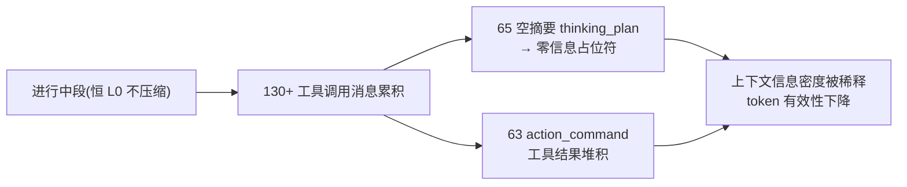

# tool-chain-consolidation

## Why

生产实证（wechat-bot 2026-08-02 20:58 日志）：一个长研究任务的进行中段（当前 ReAct 循环，~60 步工具调用）在模型上下文里累积了 **130+ 条工具调用消息**（169 条上下文里 thinking_plan=65 + action_command=63），其中 **~65 条 thinking_plan 是零信息占位符** `(历史事件摘要为空，可用 recall 检索)`。compress-digest-reconnect（压缩激活）与 rolling-summary-anchor（摘要常驻）都已生效——滚动摘要在 [1]、已完成回合正常折叠——但**进行中段这一盲区仍在**：

两个叠加的根因：

1. **断裂①（空摘要占位符）**：纯工具调用的 thinking_plan（content 为空、只有 ToolCalls）在 `GenerateEventSummary` 里对 special 类型直接取 `msg.Content` → 摘要为空；老化超出 recentFullCount 后 `resolveRef` 走空摘要兜底 → 填占位符。**~65 条、每条 ~50 字符的零信息噪声**。
2. **断裂②（进行中段无保真度管理）**：进行中段恒 L0（永不压缩），一个超长 ReAct 循环的工具调用历史无界累积——压缩模型只处理"已完成回合"，对"进行中段"内部的工具调用历史没有任何合并/衰减机制。

用户核心诉求（"整个上下文管理建模统一"）：**龄 → 层 → 表示**应是唯一规则，进行中段不豁免，工具调用老化后进入"合并表示"，消灭零信息占位符。

## What Changes

1. **根治空摘要（断裂①）**：`GenerateEventSummary` 对"content 为空但有 ToolCalls"的 thinking_plan，在**存储时**用 ToolCalls 生成 `调用 <工具名>` 摘要（工程提取、零 LLM）——空摘要占位符的源头被消灭，且为合并提供素材。
2. **工具链合并（断裂②，核心）**：新增渲染/压缩期的"工具链合并"——把**连续的老化工具调用运行**（thinking_plan + action_command 序列）合并成**一行工具链**（`- 工具链: read_file → grep → edit_file（N步）[evt_first→evt_last]`），统一应用于**所有段包括进行中段**。进行中段由此收敛为"工具链行 ×K + 近期原生对 + 活跃前沿"，大小与循环长度解耦。
3. **活跃前沿保护**：近期与当前未完成调用保持原生协议形态（tool_call 配对合法），合并只针对已老化（full=false）的完整工具对。
4. **五项不变量契约**：有界（I1）、稠密无零信息位置（I2）、摘要锚定（I3）、recall 无损（I4）、原生前沿（I5）——作为本能力的规格契约。

不改：已完成回合的 L0-L3 分级、滚动摘要常驻（rolling-summary-anchor）、memory_turn/recall 召回语义、卡片生成的纯工程本质。

## Capabilities

### Modified Capabilities

- `task-skeleton-compression`：新增"工具链合并"表示（进行中段与老化段的工具调用历史合并为工具链行）；空摘要 thinking_plan 的工具调用摘要生成；活跃前沿保护。
- `recall-protocol`：工具链行携带 `[evt_first→evt_last]` 票据，经 memory_turn 可取回被合并的完整工具链。

## Impact

- **行为**：进行中段不再无限膨胀——长研究任务（60+ 工具调用）的上下文从 ~130 条工具消息收敛为"几行工具链 + 近期原生对"；65 条零信息占位符消失。
- **token 有效性**：信息密度显著回升（合并摊薄 + 占位符消除）。
- **风险面**：合并改变进行中段的渲染形态（工具调用历史以工具链行呈现）；需保证活跃前沿的原生配对不被误合并；工具链行的票据须可经 memory_turn 取回完整链。
- **测试**：摘要生成、工具链合并（含进行中段）、活跃前沿保护、票据可召回。
