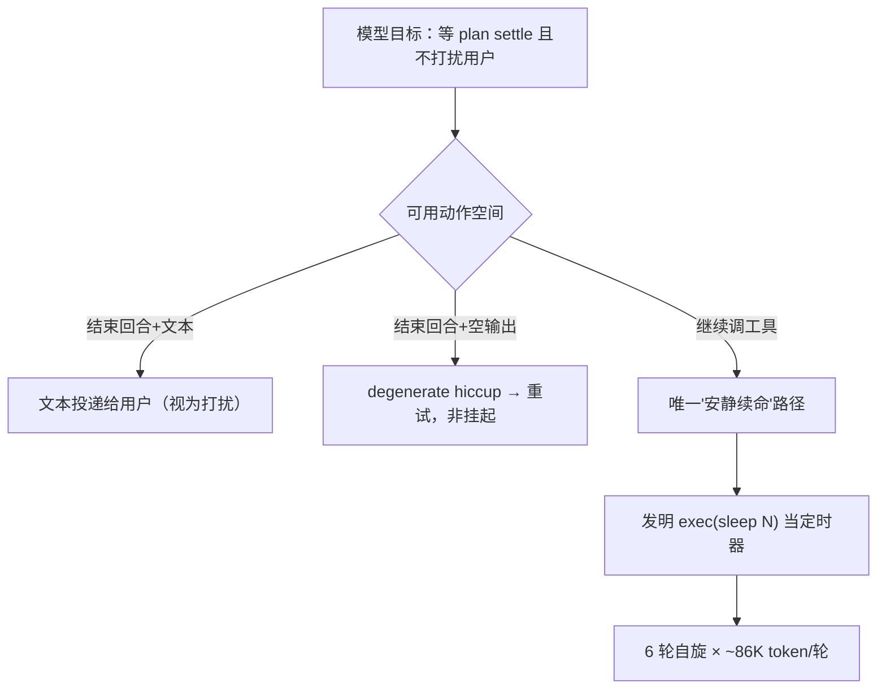

# Design: context-efficiency-and-trajectory

## Context

实机因果链（2026-08-23 wechat-bot 日志复盘）：



两个病灶：

- **行为**：exec ack 的轮询暗示（加法产物）+ AGENTS.md 只教 busy 场景（"立即转去推进其他 track"）→ idle 盲区被 sleep 填充。注意：子 agent ack 的"完成后其结果会作为 task_settled 回写"语义正确且事发时就在场——模型缺的不是"回写"知识，而是"我可以就此结束回合"的许可。
- **结构**：双压缩管线、11 个旋钮（9 个从未被真实调过）、stub 占保护位、文档描述已删除之物、零实现规格、空目录。AI 辅助迭代使加法成本趋零，判断力成本不变——不加约束则熵单调递增。

**减法判定标准**（本变更的方法论核心）：删除候选物后**行为信息是否变少**——不变=冗余，删；变少=缺失，补（且只补最小量）。

## Goals / Non-Goals

**Goals:**

- G1 消灭自旋等待（删诱因 + 补 idle 规则，不加拦截代码）
- G2 settle 通知单行轨迹形态（信息无损，删派生公式）
- G3 结构熵净减：代码路径、配置面、规格数量、文档失真四维均为负增量
- G4 活跃前沿 append-only 保持（组装点瘦身，渲染层零特判）

**Non-Goals:**

- 不新增 wait/suspend 工具、不新增 sleep 拦截（观察后备）
- 不修改 turn 原语、degenerate 重试、投递路由
- 不实现 value-driven 压缩（撤回规格）
- 不做渲染层跨事件合并

## Decisions

### D1 行为修正取最小集：删一句、补一条、加一行

| 动作 | 类型 | 依据 |
|------|------|------|
| 删 exec ack"可用任务工具查询状态/结果" | 减法 | 事故直接诱因；删后剩余语义（"回写结果"）完整 |
| 子 agent ack 不动 | 不动 | 事发时语义已正确 |
| AGENTS.md busy 规则**替换**为 busy/idle 双场景 | 替换（净零行） | 原规则的不完整是推手；补的是缺失信息（一句话），非追加新规则 |
| 看板尾部一行固定指引 | 加（copy 级） | 唯一净增量；固定文本不构成路径/概念/旋钮 |
| 规格加一条 SHALL NOT 防轮询 | 加（护栏级） | 防止轮询文案被未来再次加上——事故就是这么来的 |

**v1→v2 砍除记录**（本设计第一版含以下加法，均砍）：sleep 拦截代码+边界矩阵测试+ADDED requirement（降级为观察后备）；`settle_inline_chars` 配置旋钮与四层接线（改编译期常量）；"0=回退旧格式"逃生门（旧格式是排版事故非契约）；框架层三处新教学文案（只保留看板一行）。

### D2 settle 紧凑单行：组装点瘦身 + 编译期常量

格式（一通知一行，换行转义 `␤`）：

```
[task settled] <✓|✗|∞|⚠> <desc 截断 60 字符> (id=<8位短id>) → 结果: <内联截断 | 转储路径+尾部预览>
```

- **内联上限为编译期命名常量（600 字符）**，无配置、无回退门。依据：唯一真实用户从未表达过对该值的调参需求；可调性需求出现之日再加旋钮不迟
- **删除** `maxOutputChars = MaxTokens/2*4` 派生公式（无人决策过 256K；命名常量取代公式事故）
- 超限结果走既有 tool-output 转储管线 + `settleInlineTail` 尾部预览；信息无损字段：task_id/desc/状态/错误/结果或路径
- 组装点瘦身（非渲染层）：规避 settle 类型字符串嗅探红线、append-only 天然保持、recall/投影/轨迹同享单一形态
- 与既有规格收敛：旧实现内联 ~256K 与"事件仅放摘要"要求相悖，本决策使实现回到规格

### D3 legacy 压缩管线删除及其级联面

`compressLegacy`（skeleton_segmentation:false 回退）整体删除，级联清理：

| 级联物 | 处置 |
|---|---|
| `WithSkeletonSegmentation` 选项 + 配置旋钮 | 删 |
| legacy L3 LLM 段摘要 + `segmentContentHash` 归档缓存 | 删（骨架管线自身零 LLM，condenseCardLines 卡片浓缩保留） |
| `archive_cache_cap` / `max_summary_input_chars` 旋钮 | 删（legacy 专属） |
| `context_compress_summary` 固化物产生源 | 随 legacy 消失（存量数据读路径已容错，TTL 自然清退） |
| task-skeleton-compression 规格 legacy 条款 | delta 移除 |

已删配置键经非严格 YAML 解析自然忽略；已在用 `skeleton_segmentation: false` 的部署（无）会静默落到骨架管线——行为变化记录于变更说明。回归面：compress 包全部测试 + context_simulation 全生命周期仿真。

### D4 stub 删除与名单修正

- `tool/speak/`、`tool/draw/` 两包 + 4 个 prompt 文件 + `builtinAgentNames` 两个保护位 + 保护测试用例 → 删
- 顺带修正 `tool-lifecycle-management` 规格中的 **read/write 幽灵名**（`builtinAgentNames` 从无 read/write——规格描述不存在之物）
- 减法原则应用："未来会接语音模型"是愿景；愿景以 git 历史/issue 形式存在，不以主干代码形式存在

### D5 旋钮节食：11→4（+summary_model/provider）

| 处置 | 旋钮 | 依据 |
|---|---|---|
| 删（legacy 级联） | skeleton_segmentation / archive_cache_cap / max_summary_input_chars | D3 |
| 定常化 | max_tool_result_chars / max_exec_state_chars / chunk_summary_len / max_notice_chars | 唯一真实用户从未调过（配置中仅以注释存在）；值转为包级命名常量 |
| 保留 | card_max_chars / compact_keys_listed / recent_full_count / summary_max_tokens + summary_model/provider | 有真实调参场景（卡片预算/冻结窗口/摘要输出下限均有 bug-fix 或调优历史） |

### D6 规格与文档清偿

- **撤回 value-driven-compression**：规格完整、代码零实现——I6 型漂移存量。撤回理由：留着即温床（下一轮迭代者会以为它存在）；git 历史可找回；未来若做语义压缩按新认知重立规格优于复用旧稿
- **文档失真清单**（已核实项）：wiki agent-architecture.md:216/239 引用已删除的 task_alias/compress_alias 兼容桥；空目录 specs/ttl-cursor-scan/；specs 中 read/write 幽灵名。实施时以"描述不存在之物"为判据全文扫描补充
- **docs/.dev 移出**：100+ 篇 2026-04/05 过程日志，历史价值已由 git log 承载

### D7 执行顺序：风险递增

失真清理（零风险）→ copy 层行为修正 → settle 单行 → stub 删除 → 旋钮定常化 → legacy 管线删除（最大回归面）→ 规格撤收。每步独立可验证、可单独 revert。

## Risks / Trade-offs

- [删轮询句后模型仍自旋（教学失效）] → 观察后备路径：实机日志确认后独立立项（届时再考虑拦截），不在本变更预防性建设
- [AGENTS.md 替换后新规则表述不当] → 真实 LLM 契约测试覆盖 idle 场景；文案以"结束回合=合法挂起"一句话为限
- [legacy 删除遗漏级联引用] → 全量测试 + context_simulation 回归；`go build ./...` + grep 残留符号
- [定常化旋钮未来需要调参] → 常量已是命名值，加回旋钮是一行 diff；预防性配置面的维护税是持续的
- [存量 legacy 固化物（context_compress_summary）] → 读路径已容错 + TTL 豁免仅影响其生命周期，无迁移必要
- [撤回 value-driven 规格 vs 未来想做] → git 历史可找回；重立规格的成本 < 维持漂移存量的成本

## Migration Plan

单 change 内按 D7 顺序分步提交，每步可独立 revert。已删配置键：非严格 YAML 解析自然忽略，README/wiki 变更说明记录。回滚策略：revert 对应 commit 即可，无数据迁移。

## Open Questions

- 内联常量 600 字符的校准 → 实机观测 settle 通知平均长度与 read_file 频率后再定（改常量是一行）
- speak/draw 是否值得开 issue 留痕（愿景记录）→ 建议开 issue 而非留代码
