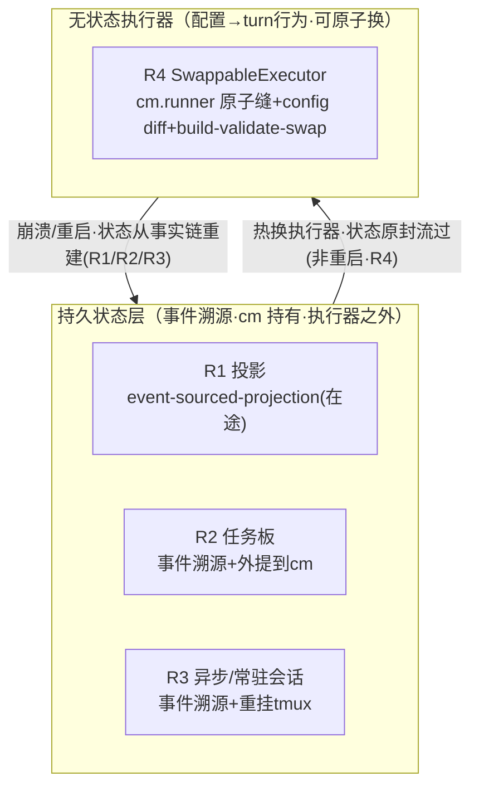

## Context

R1-R4 的统一架构不是设计发明，是**对已验证事实的抽象**。本会话（2026-09-11/12）的验证链：

**tagent 已有的形状（因地制宜的根据）**：
- 「事实链只在 KV 里」（memory-architecture.md:1069）+「同点投影」（:1060）——状态已是事实链旁路产物（R1 的地基已存在）。
- **状态/执行器天然分离**：投影由 cm（长生命周期）持有、在 runner 之外；`cm.runner.Run` 逐 turn 调用（context_manager.go:726）——执行器天然是 per-turn 换入边界。
- **原子换雏形**：`SwappableModel`（swappable_model.go:19-39，RWMutex 换内芯、「without recreating the LLMAgent or Runner」「in-flight 用旧」）；MCP registry（registry.go:38-39，稳定 meta-tool+热同步间接缝、「never change tool declaration set」）；prompt.Source（mtime 内容热载）；incremental A（ApplyOrgParams，lifecycle.go:18-22 org 数值热更）。

**逐 R 缺口（均已 file:line 实证）**：
- R1：折叠产物（综述/tool_chain 负 key 合成 ref）不落事实链（:983）+ path-dependent/LLM 不可重算 → 重启丢上下文。
- R2：任务板 in-memory「never persisted」（tool/action/task_board.go:21）+ TaskSpec 的 Relaunch/ResumeFn/Alive 是闭包不可序列化 + **TaskManager 困在 ActionTool（∈cfg.Tools→fwAgent，即执行器内部）**。
- R3：resident_recovery 生产死代码（named 会话 `n-*` 被 ListSessions 的 tagent prefix 过滤、WithTmuxPrefix 生产从不调用 → ReattachResidentSessions 枚举恒空）+ ResidentMeta 缺 command/origin/task_id + monitor 层 IsPaneDead/ProcessExists err→assume-dead 屠杀路径 + has-session 三态不可辨（dead/unknown 同 exit 1，实测 tmux 3.6a）。
- R4：cm.runner 普通字段（:47）不可原子换；fwAgent 局部变量未持有（:386）；`llmagent.WithTools(cfg.Tools)`（:359）构造期烘死、无 SetTools mutator；incremental B（「snapshot-level rebuild」）仅注释引用未建（context_manager.go:120、lifecycle.go:21）。

**业界对标（不照搬）**：Cordis fiber/effect/inject/recompose（deepseek-harness 实读：goal.spec.ts:215-232「survive service reload」印证持久态跨服务热换存活；preset/index.ts:440「recompose 仅限无产出」反衬 tagent 事件溯源史的优势）；RHI/Reef/Teamwork 要求运行时可热换+版本化+可回滚。**因地制宜结论**：tagent 不需要插件框架——状态/执行器分离 + 逐 turn runner + SwappableModel 已给足材料，R4 = 一个原子换缝。

## 统一原则

> **持久事件溯源状态（held by cm/TagentAgent，执行器之外）⊥ 可热换无状态执行器（fwAgent+runner，配置可重导出，turn 边界原子换）。**

**关键耦合（R4 的硬前置）**：执行器要可无损换，所有持久状态必须在执行器**之外**。现状反例：TaskManager 在 ActionTool 里（执行器内）→ 换执行器=丢任务板。**故 R2/R3 不只是「重启接续」，更是「把状态搬出执行器使 R4 可换」**。

## Goals / Non-Goals

**Goals：** 固化统一架构不变量与逐 R 设计方向；三阶段依赖排序；每阶段派生子变更执行；预留确认项显式化。

**Non-Goals：** 本变更不改运行时代码；不搬 Cordis 插件框架；不承诺 R2/R3/R4 的细粒度方案（由子变更承载、届时再 fresh-eyes）。

## Decisions

### D1：设计轴 = 状态/执行器分离，四需求是一条线上的四段

R1/R2/R3 = 把各状态层**事件溯源**并**外置**（使执行器无状态）；R4 = 原子热换那个无状态执行器。**备选否决**：四需求各自为政（resident-state-recompute 的教训——统一到错误原则上同样翻车；这次的统一轴是从已验证事实抽象的）。

### D2：R1（在途）= 模式立范者

`event-sourced-projection`：折叠=事实链 compaction 事件、投影=事实链纯回放（运行期 Add 增量、重启 snapshot+tail 全量，同一 fold 不变量两入口）。**R2/R3 沿用其一般模式**：状态=事实链旁路产物、重建=事件回放进空态、状态外置 cm——**snapshot+tail 是 R1 特例**（R1 因折叠压缩才有 compaction/snapshot；R2 任务板无压缩语义、纯全量回放即可，勿预设须有 snapshot 事件，fresh-eyes 二轮 🟡5）。命名沿用（RebuildTaskBoardFromWAL / ReattachResidentSessions 与 RebuildProjectionFromWAL 同构）。

### D3：R2 = 任务板事件溯源 + 声明式 TaskSpec + 外提

- 任务生命周期事件（task_created/task_settled 等**已是事件**）→ 任务板=事实链旁路产物，重建=回放。
- TaskSpec 从闭包（Relaunch/ResumeFn/Alive）改为**声明式数据**（command/origin/task_id/状态），闭包逻辑由工厂从声明重建。
- **TaskManager 外提**：从 ActionTool（执行器内）→ cm 持有（执行器外），ActionTool 注入引用——R4 前提。
- **预留确认项**：声明式 TaskSpec 的字段完备性；在途异步任务跨重启的 resume 语义（tmux 存活时的 re-attach vs 已死的 relaunch）。

### D4：R3 = 常驻会话态事件溯源 + 修复死代码 + 重挂

- ResidentMeta 补全（command/origin/task_id/三态）→ 事实链事件溯源。
- 修 resident_recovery 枚举死代码：named 会话 `n-*` 与 ListSessions 的 prefix 过滤**不相交**（tmux_executor.go:351 vs :479/:58）——统一命名或过滤策略。
- 会话存活探测改 list-sessions（has-session 三态不可辨：dead/unknown 同 exit 1）+ monitor 层 fail-dead（err→assume-dead 屠杀）加闸。
- 重挂存活 tmux（会话本体外部存活，只需重建跟踪态）。
- **预留确认项**：三态探测的 CLI 面（tmux 3.6a 实测约束）；屠杀保护与 liveness 的权衡。

### D5：R4 = SwappableExecutor（SwappableModel 上提一层）

- `cm.runner` → RWMutex/atomic 守护的可换引用（SwappableModel 同款、上提到执行器层）；事件循环每 turn RLock 载入、配置变更 Lock 换入；in-flight turn 用旧、下一 turn 用新。
- **config diff 二分**：行为变更（model/MCP/prompt 内容/阈值/策略）走既有细粒度热同步（零执行器重建）；结构变更（built-in tools/subagents/prompt wiring）才重建 fwAgent+runner（llmagent.New/runner.NewRunner 皆廉价构造）+ 原子换。
- **build-validate-then-swap**：新执行器构建/校验成功才换，失败旧的原样保留（可逆；保留上一份配置供回滚）。
- **事件溯源史红利**：中途换工具集安全（历史 tool_call/tool_result 是不可变事实、照常渲染；新工具集只对后续 turn 生效）——解除 Cordis「必须无产出才能换」约束。in-flight tool 调用用「in-flight 用旧」语义。
- **分增量**：A=行为热同步既有面固化（SwappableModel/MCP/prompt/A 收敛为统一触发与观测）；B=结构换缝（runner 原子缝+config diff+rebuild+swap+turn 边界协调）；C=可逆治理+版本化回滚（对齐 Reef 灰度/回滚，接 evolution 体系）。
- **预留确认项**：provider 对「历史引用已移除工具」的容忍度（大概率无碍，需实测各 provider）；config diff 分类完备性（哪些配置项属结构）；turn 边界换入与事件循环的并发协调细节。

### D6：治理 = 承接 evolution-roadmap 形态

阶段派生独立子变更（propose→fresh-eyes→apply→门禁→archive）；每阶段准出门禁：fresh-eyes 前置（本会话两次实证其拦下承重错误）+ fail-before 回归 + 三道门禁（build/vet/全量 short + 相关包 race）。与 2026-09-06-tagent-evolution-roadmap 的 P0-P4 **互补不互代**（那是演进/评估/治理轨道，这是连续性轨道）。

## Risks / Trade-offs

- **路线图漂移风险**（evolution-roadmap 曾出现 execution-dag 与阶段视图并行）→ 本图仅三阶段、每阶段一个清晰交付物；LEDGER 记录裁决。
- **R4-B 是真难点**（结构换缝+turn 边界并发+in-flight 语义），放最后、独立 fresh-eyes。
- **R2/R3 外提动作面**（TaskManager 从 ActionTool 迁出、ResidentMeta 补全）须防行为回归——门禁+契约测试。
- **统一轴被未来变更侵蚀**（状态又悄悄长回执行器里）→ specs/resident-continuity 不变量 + 评审检查点。

## Migration Plan

1. R1 落地（在途变更 fresh-eyes→实现→门禁）——立范。
2. 派生 R2 子变更（task-board-event-sourcing，含外提）；派生 R3 子变更（resident-session-continuity，含死代码修复）。二者 R1 后可并行。
3. 派生 R4 子变更（swappable-executor，A→B→C）。
4. 每阶段完成后本图 tasks 勾选 + LEDGER 回写；全部完成后本伞形变更归档。

## Open Questions

（并入各 D 的「预留确认项」，执行到对应阶段时核对形成决议或显式降级。）
