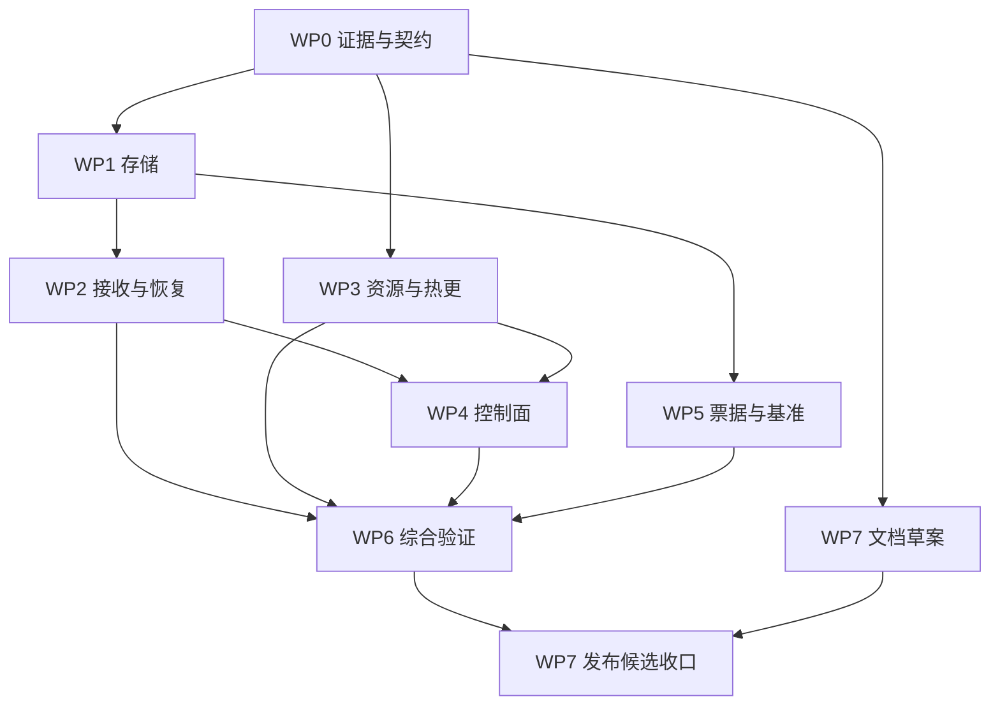

# 常驻实现收口设计

## Context

本设计承接 `proposal.md`，事实与本轮验证记录集中于 `assessment.md`（F01–F11）。目标是补齐现有能力的生产边界，不重做 Agent 架构。三份历史报告不能直接充当当前 backlog：认证、strict YAML、恢复 fallback、资源回收、race 接线已发生变化。

本轮产出规划；后续 apply 才实施。独立全树审计未完成，独立代码审查仍是实施阶段的准出条件。

## Goals / Non-Goals

**Goals**
- 所有“成功”区分：已接收、已耐久、已投影、已处理、已投递；各自有可测试证据。
- 让后端、重启、热更、正常/异常路径共享同一契约；不以日志的成功字样替代实际消费者状态。
- 将既有测试扩展为错误注入、独立进程、多 agent、流式生命周期和长期运行证据。
- 以八个可独立回归的工作包收口，避免同一次提交横跨全部子系统。

**Non-Goals**
- 不默认开启 governance/evolution/meditation/reliability，不默认永久保留原文。
- 不重写上游 ReAct、引入消息中间件/新数据库/ANN，不自建防攻击 shell 解析器。
- 不承诺任意工具外部副作用 exactly-once；不承诺整机重启后 tmux 进程存活。
- 不在本轮发布、部署、修改真实数据、升级上游、调用付费模型；不自动执行 git 回滚。

## Decisions

### D0 先固定证据与唯一契约

- 修复 `scripts/race_check.sh`：首先保存 go test 状态，编译失败/超时/测试失败永远非零；只允许对精确登记的上游 race 签名作豁免，混合出现普通失败不得豁免。输出完整原始失败证据。
- 将冲突主规格用完整 Requirement delta 替换：StopLoop 的可重启条款移除并新增终结态条款；无 anchor 走有界恢复；ring 保存配置而非存活 runner。不追加相反条文制造双义。
- 承接上一归档变更未勾选的多 agent 混合热更、恢复失败矩阵与部署说明，纳入 WP2/WP3/WP7；不把原文件勾选补齐来假称完成。
- 本变更是单个父级工作计划，WP 是内部实施批次，不创建一套新的发布审批平台。若维护者后续拆成子 change，按既有 roadmap-governance 显式登记依赖与归档状态。
- 替代方案：先重跑更多测试但不检查测试工具，无法排除假绿；先对旧报告逐项施工会重复完成项。

### D1 事件提交边界，而非每次 KVPut 都同步（F01/F02/F04）

1. `KVStore` 六方法接口保持；LocalFileKV 的直接 KVPut 仍可异步，注释明确只有 Sync 成功构成屏障。增加可选 `Sync() error`/耐久能力接口，由 FileSegmentStore 在一次事件的 evt、idx、必需 meta 写完后调用；localfile 且 fsync=true 的 StoreEvent 成功必须已完成屏障。fsync=false 返回仅 flush 级保证并在诊断标明。
2. 所有 kv 写、阈值/周期 flush、目录 Sync 错误可传播/可观测；目录 Sync 不支持时标记 degraded capability，不宣称 power-loss durable。定时失败保留待写数据并保存 last_error，后续提交不能冒充正常。
3. FileSegmentStore 同一事件提交序列化：检查身份、写数据/索引/元数据、屏障、更新缓存与计数；失败不发布投影。跨文件系统/远端 KV 不新增全局事务承诺。未成功的部分写入可能留下孤儿，由确定性的修复/重试路径处理，不能把“未提交”解释成“保证不存在”。
4. 公共 StoreEvent 对已提交重复键返回 typed duplicate；内部恢复重放先核对同 key 内容与身份，同内容可补齐索引/meta 并重新屏障，异内容拒绝。typed missing 与存储 I/O 区分，禁止把任意 KVGet 错误当键不存在。
5. 统一内存/file 后端：无分区 QueryEvents 返回空，重复 key 拒绝，存入和返回的 FullEvent 对 map/slice 深拷贝；测试/调试遍历使用显式 AllEvents，不放宽生产查询。
6. 启动枚举分区后，从去重且排除墓碑的事件重建逻辑 live count；成功新增才 +1，TTL/容量首次墓碑才 -1，物理清理不重复减。枚举失败显示 unknown 且暂停容量淘汰，不把未知当 0。原文 TTL 默认保持，固化物豁免按 EventTypeSpec 单点派生。
7. 启动不启动扫描器，直至 tombstone 恢复、计数重建、回调接线全部完成；避免构造期后台访问半初始化状态。

替代方案：每个 KVPut fsync 增加一次事件多次屏障成本；只改宣传不能覆盖错误传播缺口；换数据库会扩大迁移面。

### D2 有界可靠接收：明确语义并保留单消费者（F05）

- 新增返回结果入口 `PublishContext` / `InjectMessageContext`，接收上下文与稳定 request ID，返回 receipt（ID、volatile/durable、accepted）或错误。旧 void 入口兼容调用新实现，失败日志与诊断计数；HTTP/宿主必须使用可判定结果入口。
- 无 spill 配置：保持 channel 256 的轻量模式，超时返回明确背压错误；accepted=volatile，不声称跨崩溃不丢。
- 有可靠配置：使用既有文件存储改造的 `inbox-v1/`，所有输入先持久化，不再只保存溢出部分。上限 2560 个未确认输入；进程内发布锁为接收分配顺序，文件内容和目录屏障成功后才返回 durable；channel 只作唤醒信号，不承担顺序真源。初始化/满额/写失败返回错误，不自动退回 volatile。
- 一个 HTTP 批次是一个接收 envelope，包含原序 messages；整个 envelope 写入成功才返回 202。消费可合并模型调用，但必须保留每条 source ID/来源，不能把消息边界或幂等身份丢掉。
- claim 不删文件；为每个输入记录固定 EventKey 后再尝试事实入库。重试使用同一身份，经 D1 内部重放核对，投影 Append 幂等；不产生同输入的多条伪新事实。
- **确认点不是 Pull，也不只是 StoreEvent**：turn 结束且处理结果 receipt 已作为不可投影的事实记录持久化后，才 ack 删除 inbox 项。崩溃在 StoreEvent 后、模型处理前仍要重试；崩溃在处理后、receipt 前允许至少一次重新执行。明确工具副作用不保证 exactly-once，业务工具自己用请求 ID 幂等。
- 恢复时先恢复事实链/任务，再用 receipt 重建已处理 ID，未完成 claim 回 pending；ack 删除失败可重复 ack，不重复处理已确认项。不能正常读取的项转 quarantine 保留原件、非成功终态并告警，不静默销毁。
- inbox 是未完成交付的临时真源，历史与处理 receipt 进入 FullEvent 后由事实链负责；向量、receipt 查找索引均为可重建派生物。新增 receipt 类型在 EventTypeSpec 注册，不进入 LLM 时间线。receipt 在仍有对应未确认 inbox 项时不得被 TTL/容量清除；启动只为 outstanding IDs 建去重索引，不能把全部历史 receipt 常驻内存。ack 删除及目录同步完成后解除保留约束，按事件类型默认 30 天保留；超过保留期的客户端重提交不承诺幂等，响应与文档明确此窗口。
- 关闭顺序：停止接收/生产者 → 等待或取消 turn → 未完成 claim 留盘 → 停消费者 → 关闭 store。状态机用统一锁保护 Start/Stop/Close，不改 StopLoop 终结态。

替代方案：仅给 Publish 加锁不能修复回收后丢失和低负载 volatile 窗口；仅 StoreEvent 后 ack 不能保证尚未执行的输入被重试；引入外部队列不符合当前规模。

### D3 恢复结果必须到达实际消费者（F03）

- 增加 `RecoveryResult`：mode（empty/snapshot/fallback）、status（full/partial/failed）、scanned/projected/truncated、missing_keys、pages_failed、batch_errors、payload_errors、duration。原 void 入口保留包装，结果存为本 agent 只读诊断快照。
- 存储读接口继续返回现有类型，但遇 I/O 返回非 nil error；合法 missing 可跳过。上层批量水合必须按请求 key 对账，数量相同也校验身份集合；不能只数 error。
- 无锚回放分页扫描，过滤非投影事件后用容量 500 的滚动集合保留最新有效事件，再按 EventKey 排序；空间受护栏限制，扫描工作量仍 O(历史)，本期不引入独立 checkpoint。truncated 统计被排除的有效投影事件，不含 task/receipt 等元记录。
- snapshot 不可读/payload 损坏：status=failed，不无标记地退成空历史；不改写原始文件。可用部分 refs 形成 partial，显式给宿主处理；空链只有扫描成功才能为 full/empty。
- 构造后 diagnostics 立即可读；首次模型请求前追加一次简短运行态恢复提示（不入事实历史、不改变已有历史前缀），告知 partial/failed 与可 recall 范围。用户可从 diagnostics 同样看见，日志不是唯一消费者。
- TTL 已失效或容量删除产生诚实 miss，不重建假原文、不自动改 TTL。跨 mem_spill 的旧 key 最终一致边界继续显式说明；不宣称该路径逐字节。

替代方案：在恢复函数额外打印日志不能弥补底层吞错；静默重新总结丢失事实破坏唯一真源。

### D4 持久资源有 owner，执行代只借用（F06/F07）

- 将全局裸 map 改为可注入 `RuntimeResources` registry：默认一个进程 registry，按 canonical absolute path + 后端 + 生命周期/fsync/engine 指纹管理记录及租约；同物理路径配置不一致即拒绝，不创建两套 writer。空 path 的内存实例独享。
- 每次 New 获根租约，子 agent/验证执行壳借用；最后根租约释放后关闭并从 registry 移除。Close 幂等，构建失败逆序释放自己取得的租约；borrowed 不关闭 owned 资源。跨进程同目录需单 writer 锁，拒绝并发启动，不默认允许滚动双写。
- 常驻资源表以 agent name 索引 store/session/projection/task；热更逐 agent 查自己的资源，不统一 entryMemStore。新增加 agent 分配新身份资源，移除 agent 等其在飞任务/turn 结束后退役。
- 结构构建先全部准备，成功后才发表新的拓扑代；数值参数应用到这一代的真实对象。回执从实际 getter 取 effective 与 desired 比较，包含 generation/held/rejected；字段删除恢复解析默认，显式 0 与未设置分开表达。
- memory 指纹始终与 **effective** 比，拒绝一次不能推进 effective；同一未生效 memory 配置再次编辑仍拒绝热迁移。回滚使用上一成功配置重新构建，同时恢复数值参数，不持有旧 runner 当回滚依据。
- model 租约覆盖返回 channel 的全生命周期：转发所有响应直到关闭或 context 取消，error/nil-stream 立即释放；未消费且未取消由既有调用超时限制。释放后才 Close 退役 owner；Close 不持 registry 全局锁，避免阻塞所有借用。A→B→A 时不得关闭重新在用对象。
- 分区 ID 布局不变；同一实际 store 中两个不同 agent 名哈希碰撞在构造/热更前拒绝并指明名字与 pid。既有混合数据只报冲突，不自动重写 key 或猜测归属。

替代方案：每个 New 都独立打开同路径会产生多 writer；全局永不释放会复用死资源；只给 map 加锁不能解决 ownership；仅按 GenerateContent 函数退出计数不能覆盖异步流。

### D5 认证之外的控制面边界（F09）

- 保留全端点 Bearer 认证及无 token loopback 规则，不给 healthz 免鉴权。提供单一宿主构造助手同时完成认证、监听验证与 server timeouts；底层 handler 仍可嵌入，但文档明确宿主责任。
- 默认限制：body 1 MiB，messages 32，单条 content 256 KiB；host 可显式配置正上限，0 采用默认、负值拒绝。完整验证后才调用 endpoint 更新或接收，超限 413，非法格式/role 400；允许 user/system 以保持现有 RL 用途，拒绝伪造 assistant/tool 输入。
- endpoint callback 新增可返回 error 版本；未配置动态更新能力而传 URL 返回明确拒绝。URL 限 http/https、无 userinfo/fragment；启用后必须提供精确 host allowlist（允许训练代理动态端口，允许显式配置私网/loopback），重定向同受策略控制。旧 callback 标记 trusted-admin 兼容，不被默认宿主选择。日志只记脱敏 host/port，不记完整 query/凭证。
- endpoint 更新成功与本批接收串行化，避免同一 handler 内并发更新交叉；它仍是全局管理能力，不承诺按 task 多租户模型隔离。接收失败保留真实 endpoint 状态并返回错误，不能谎称整项成功。
- feedback 通知队列默认 1024；溢出只丢最旧通知、不丢已提交事实，累计 dropped_count，下一次 wait 返回 partial=true 与补查事实链提示。long-poll 同时等 notify/timeout/request.Context.Done；取消即退出，不留等待者。
- server ReadHeaderTimeout=5s、ReadTimeout=30s、WriteTimeout=35s、IdleTimeout=60s；shutdown 取消 poll 并等待受控退出。
- 部署复用非 root、只读根、可写目录白名单、凭据权限及网络出口配置；working_dir 仅目录基准不是沙箱。真实 OS 越界验证只在隔离测试环境，不操作维护者机器权限。

替代方案：更复杂的命令子串规则不形成安全边界；仅认证不能限制授权客户端失控；自动禁止所有动态 endpoint 会破坏 RL 用途。

### D6 保留确定性压缩并补票据守卫（F08）

- 对旧半区解析 inputKeys、首尾 keys 与高亮 keys。浓缩结果的 key 必须是 inputKeys 子集且包含所有必需 key；缺失/未知/不可解析 key 一律判失败，不接纳模型文本。
- 失败直接复用原卡片的确定性下沉分支；下沉后的 earlier 计数明确表示导航减少，不等同原文删除。不得为保全部 key 无限扩卡片预算，亦不得声称所有已下沉票据仍显示。
- 只在既有 token 阈值触发整理，不增加轮数触发；under-budget 请求保持前缀字节，MCP 声明仍恒定。保留单条超大卡片的截断标记与可解析必需 key；预算实在不足时返回明确 budget-unrepresentable 状态，不悄悄破坏 key。
- 性能先测 1k/10k/100k 事件、1/10/100 并发探测任务：记录 p50/p95、allocs、RSS、fork/s、扫描条数、输入 token 估算误差。中英/代码/JSON 数据集使用已固定版本的离线 tokenizer 输出作为 fixture；不为本期新增运行时 tokenizer。
- 只有真实瓶颈超验收预算才立独立优化 change：按本文阈值复现、profile 定位、同语义对照；本期不自动上 ANN/BM25 或替换 RustViking CLI。记录每个后端支持规模，而不是虚构通用吞吐目标。

### D7 验证分层与阶段依赖

| 包 | 预计工程量（非承诺） | 准入 | 准出证据 |
|---|---|---|---|
| WP0 | 1–2 人日 | 基线复核 | 工具负例 + delta 语义对账 |
| WP1 | 4–6 人日 | WP0 | 屏障故障注入、后端一致性、独立进程读回 |
| WP2 | 5–8 人日 | WP1 | claim/ack 每个崩溃窗口、全序/背压、恢复完整性 |
| WP3 | 4–7 人日 | WP0 | 多根租约、3 agent 混合热更、流式 Close |
| WP4 | 2–4 人日 | WP2/WP3 | httptest 与隔离部署矩阵，零越权副作用 |
| WP5 | 2–4 人日 | WP1 | 卡片故障模型 + 离线基准和容量边界 |
| WP6 | 3–5 人日 + 72h 观察 | WP1–WP5 | 子进程 E2E、故障/长跑报告、独立审查 |
| WP7 | 1–2 人日 | 草案 WP0；收口 WP6 | 中英文口径、迁移、发布 checklist |

总估算 22–38 人日，串行维护者约 5–8 周，另计外部实测/审批等待；只用于安排容量。WP1 与 WP3 同碰组合根时顺序合入，不能并行改同一接线点。

验证门：
- 每包先 fail-before 再修复，再跑全部受影响单元/集成/工作流测试；以 diff 映射测试，不只跑新增用例。
- 每阶段双模块 build/vet/short；涉及并发包直接 `go test -race`，本地 wrapper 通过也不能覆盖底层失败。
- 既有 upstream race 豁免登记测试名/签名/依赖版本/重验条件，不吞普通失败。上游升级需真实插件管线 I2 测试。
- 独立子进程 write→kill→reopen→render→recall；在文件/目录屏障与 claim/ack 间用受控注入杀子进程，不杀真实 agent。进程 kill 不称掉电实证。
- 快速 CI：确定性 30 轮重启、强制产生至少一次 compaction、每个 accepted ID 对账、终态/Origin/投递断言。长跑：72h 独立进程，周期重启/磁盘拒写/模型与 MCP mock 故障/慢消费者/并发发布/热更，未完成输入不丢、确认输入不重复投影、所有错误可见。
- 长跑资源准出：有界负载预热后每小时 GC 后 heap 与 goroutine 不呈持续线性增长；末 6h 对比首稳态 6h heap 增长≤10%、goroutine≤基线+10；保留事件量变化另计，不能用增长的事实数据误判泄漏。任一阈值超限必须定因，不调阈值掩盖失败。
- 性能回归：相同机器/数据集/配置，固定场景 p95 与 allocs 较该阶段前基线退化>20%须解释并重新批准；耐久模式开销单列，不混用 fsync=false 结果。
- 真实 LLM 契约和 30 天受控部署另行授权、单独记录，不是本轮已执行，也不能用 mock 证明模型质量或收益。
- 准出证据绑定最终源码 commit 与配置指纹。WP7 若删除兼容标识须重跑对应编译/引用测试；若任何核心行为再改，受影响集成与长期证据失效，回到 WP6，不带旧结果发布。大文件的额外重构仅登记候选，owner 职责提炼在 WP3 内完成。

### 不变量与运行时五轴走查

| 不变量/轴 | 本设计约束 |
|---|---|
| 真源 | 历史只在 FullEvent；inbox 只负责未完成接收；资源 registry/向量/计数/receipt 索引可重建 |
| 执行权 | 评估只建议；回滚由宿主/人主动触发；stale 默认观测，不自动杀 service |
| 默认态 | 保留 TTL 与可选子系统默认关闭；安全上界默认有限；可靠模式启用后不暗降 |
| 前缀缓存 | 不变更历史渲染的无关字节；恢复提示/看板在尾部，不修改工具声明 |
| 通路到被看见 | receipt→HTTP、recovery→diagnostics/模型、effective→宿主回执、evaluation→digest/status |
| 不可见边界 | 无 output 消费者、无 token、无模型、缺 anchor/TTL 过期、队列满均有明确退化结果 |
| 高频成本 | 一事件一次屏障；文件 inbox 只在可靠模式；不每次 LLM 做全库重建；索引是性能层 |
| 重启恢复 | 无游离投影 checkpoint；pending/claimed 重放，已处理 receipt 去重，租约不能复用 dead store |
| 构造时序 | 先校验/获取租约/恢复 tombstone+计数+投影+任务，再接消费绑定，最后启动生产者 |

## Risks / Trade-offs

- 耐久与 inbox 增加 I/O → 分模式 benchmark；默认轻量模式不变，不能用 silent fallback 换吞吐。
- 可靠模式 at-least-once 可能重复执行工具 → 文档明确外部副作用边界，工具接收稳定 request ID；危险操作继续走已有批准机制。
- 新的失败可见性使历史“成功”变失败 → 这是语义收紧；同步宿主状态码/运维探针，不将认证失败误作进程死亡。
- 租约改造影响所有 Close 顺序 → 先补 reopen/多根/中途构建失败测试，避免把共享会话 Close 混入执行代回收。
- 旧规范本身自相矛盾 → 冻结到 D0 已选语义；发现与四个上位哲学不变量冲突时停止该任务并请求裁决，不能为符合本方案破坏真源或执行权。
- 独立审查缺失 → 不标最终发布就绪；在实施的实际变更范围上完成独立审查。

## Migration Plan

1. 先落 WP0，保留历史报告原文；所有工件先校验，不在提案阶段同步主 spec。
2. WP1 兼容现有 KV JSON/WAL 与 EventKey，不自动重写存量；新增错误类型/能力状态。行为收紧涉及调用方的测试与迁移说明同批交付。
3. WP2 对配置可靠模式的旧 `.spill`：升级前停止接收并排空，备份；检测未排空旧格式则拒绝启动并给迁移指引。新 `inbox-v1` 不由旧二进制读取。回滚必须先排空新 inbox 或保留由新版本继续消费，禁止旧版静默忽略未完成消息。
4. WP3 同路径先 canonical 化；配置冲突列明差异，人工选择一致配置。存量分区碰撞只读诊断，不自动 key 迁移。
5. WP4 host 与 Python/运维入口同时迁移 receipt/错误字段；202 仍表示接收而非完成，新增字段可由旧客户端忽略。HTTP 接口限制和 endpoint allowlist 先在隔离环境验收。
6. WP6 达门后准备发布候选；归档按 OpenSpec 正常流程同步 delta，禁止 skip-specs/no-validate。部署、打 tag、上游提单不隐含在 apply 权限内。

## Open Questions

无阻塞本地实现的未决技术选择。以下是后续外部验收所需输入，缺省均为不执行：生产目标与维护窗口、真实模型配额、72h/30 天实验机器、对外发布版本。性能数据尚缺，不以此先行引入新依赖。
