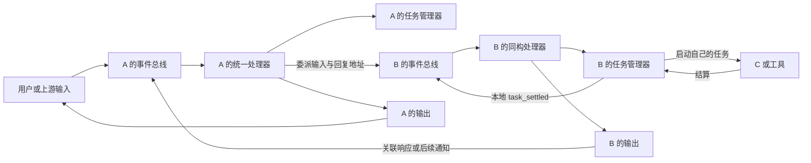

# 设计：同构 tagent 的事件协作与编排热更新（轮六十九同步重写）

> **权威与现状（2026-09-26）**：现行设计＝2026-09-25 哲学纠偏框架＋2026-09-26 S3/S3m-c 用户裁决及其落地。推进依据三件套：本文件（How＋全局不变量）＋tasks.md（核心思想卡／判例卡 J1–J14／Order-A 程序）＋evidence.md（§0 现状／§1 轮次索引／§3 撤回台账）。**S 阶段（7.1–7.3 经 S1→S2m→S3m→S4→S3m-c）已实施收口**；余下按 Order-A（P0 设计定稿→P1 核心簇→P2 生命周期→P3 验收）推进。历史声明以撤回台账为准，不覆盖本设计。入口与子 agent 都是完整 tagent，不采用"子 agent 只是无状态执行定义／集中任务服务"的方案。

## 核心思想（一切决策据此解释；与 tasks 核心思想卡互为镜像）

**一句话**：消灭第二套机制——**一个 turn 原语（`processTurn`）、一条事件管线（publish→pull）、一份已提交应用记录、一个任务域**；entry 与被调方的一切差别都退化为「输出交给谁」。

- **名称是化石**：change 名中的 durable 只指输入事实链持久协议（inbox claim/prepared-fact/receipt/ack），且按解释 A 专属外部 claim 批——派生子调用永不入信封；不存在、不复活 workflow 引擎。
- **哲学总纲（用户裁决，最高序）**：tagent 事件驱动；一次输入事件产生的任务与 agent output 的**输出目的地在输入时确认**；实例＝**一个个独立 agent loop**；输入输出**管线框架协调**；每路输出**要么内部要么外部**。
- **生命周期模型**：结构执行配置按 turn/调用**钉发起代**（lease 继承）；五数值热参在**消费边界现读**（numeric-only 不加代）；回滚＝以旧完整配置**发布新代**；任务/看板/TTL 归**所属 agent**；删路由≠退役（draining 保末值、只耗自身义务）。
- **验证哲学**：先红后绿、真实退出码、行为证据压倒静态推读、撤回文化、tasks 单为唯一静态权威。

## Context：这次必须纠正的理解（2026-09-25，保留）

用户明确：子 agent 与入口 agent 架构一致，各有事件总线，也能像入口一样管理自己的任务。输入都走所属 agent 的事件管线，协作差别主要是输出交给谁。所谓"无状态调用"不应成为另一套架构，后续可由 session 自然表达。

由此推导的原则是**同构、自治、递归组合和消息边界解耦**，不是把一切对象变成纯函数：
- "入口／子"是一次连接关系，不是两种 agent 类型；B 作为 A 的子 agent 时，仍可以管理自己的任务、接收自己的结算并委派 C。
- "输入输出无隐式状态依赖"指调用方不必先改写被调方 activeBus、lastSession 或共享 pending 字段才能通信；不意味着 tagent 内部没有记忆、投影、任务或状态，也不承诺相同输入永远得到相同输出。
- session 表达同一个 tagent 内的交互历史与上下文作用域；输出接收方表达路由。两者与 agent 的主子角色正交。当前只打通已有请求关联和上下文隔离，不把完整 session 子系统作为前置工作。
- 个人实验项目允许调整接口、构造顺序、文件边界与任务切分；不为旧签名造兼容迷宫，但不能用这种自由削掉完整子 agent 的能力或悄悄丢失持久数据。

当前代码已有同构基础：`NewTagentAgent` 为每个实例创建 bus、projection、TaskManager，并将本地 task_settled 发布到本地 bus。脱节在接线：`session.go::Run` 建私有 CM 后直接 RunFlow，绕开 owner 的事件消费路径，且该 CM 未接本 agent 的 taskController；热更又通过构造完整重复 shell 提取执行配置。应统一事件通路、补本地任务接线并消除重复 shell，而不是把真实子 agent 降格。（**两处脱节已由 S 阶段修复**：Run 经共享壳消费自身 bus；invCM 接本 agent taskController。）RV1–RV7 仍是回归输入，不作为新的架构类型。

## Goals / Non-Goals（保留）

**目标**：一种 tagent 架构、一条角色无关的事件处理管线、每 agent 自有任务域、明确输入／输出关联；在此前提下完成真实 YAML 热更、在途结构绑定、两轴回滚与资源安全收敛。

**保留的项目原则**：事件事实与有界投影分离、存储后才投影、召回票据、动态委派由模型决定、异步结果不失联、任务／记忆状态不随执行器换代、资源实际停止后才退出、包依赖单向。

**非目标**：不新增 Graph DSL、通用 actor 框架、全局消息 broker、集中任务管理器、第二接收／恢复协议或持久编排现场；不在本轮实现 session CRUD/持久化/多租户路由，不热迁存储身份，不承诺外部副作用 exactly-once。可以调整本次相关接口，不借此重写无关 memory/工具域。

**未采纳的上一轮讨论建议**："冻结所有在途热参""prompt 内容全部随 turn 冻结""仅修改文件才能回滚""所有任务先进入全局服务"没有得到用户确认，不写成合同。保留现行五热参边界、prompt 热读及显式完整配置回滚，若要改变须单独讨论语义。

## 核心模型（保留）

| 维度 | 含义 | 禁止的混淆 |
|---|---|---|
| tagent 身份／owner | 完整事件总线、上下文能力、自己的 TaskManager、工具及状态责任 | 子角色不能变成缺 bus/任务能力的函数；不同 agent 的 TaskManager 不合成一个全局表 |
| 输入／输出关系 | 本次输入的来源、关联标识、输出接收方与结果流 | 不存在全实例可变的"最后一个父 agent"；调用返回不等于 agent 关闭 |
| 执行配置版本 | 本次处理及继承委派使用的模型、声明与目标 | 版本不拥有第二套 agent 状态，也不代替事件输入 |
| 请求上下文／未来 session | 哪段交互历史和投影应参与本次处理 | 新上下文和复用上下文仍用同一 tagent 管线，不能据此再造主／子两套 runtime |



图表示跨 turn 的消息协作。turn 内 ReAct 仍复用框架；同步委派的关联结果可以作为当前 tool result 回到等待的调用点，不再额外重复入父 bus。父 turn 已结束后的输出按通知类输入进入父 bus，不能伪造成旧 tool_call 的第二个结果。（**M2 落地后**：B 侧"同构处理器"＝per-invocation 调用环，输入经 B 的调用作用域 bus 由共享壳 `runAgentLoop` 消费。）

## 全局不变量（轮六十九提升；原载 S3m-c 节，现为设计级，一切决策与实施不得违反）

- **I-1 目的地输入时确认**：一次输入事件进入某 loop 起，其衍生任务 settle 与 agent output 的目的地均已确定（invID→bus 绑定表），运行期只查绑定、不猜。
- **I-2 独立 loop 同构**：entry 与每次被调都是同构 agent loop——同一壳（`runAgentLoop`）、同一 turn 原语（`processTurn`）、同一 retry budget；唯一差别＝输出接收者。
- **I-3 管线框架协调**：事件传递一律经 EventBus（publish→pull），禁止旁路队列／定制唤醒／直调快路径。
- **I-4 内/外二择**：每路输出要么内部（本调用的返回通道）要么外部（绑定接收者），无第三态。

配套生命周期不变量（与判例卡 J6/J8/J9/J10 对应）：**pin/fresh 分裂**（结构 pin 发起代、五热参边界现读、numeric-only 不加代）；**回滚＝旧完整配置发布新代**（无专用重建分支、在途不迁移）；**所属域**（任务/看板/TTL 归所属 agent，父不读子私有面）；**draining 语义**（删路由≠退役、保末值、终态任务不算义务）；**投递对账判据**（route publish 后递减 pending；`awaiting`＝绑定∧pending>0 才阻塞；须枚举未绑定/裸构造边界；通道关闭≠生产者停止，停止凭证＝producer-done fork）。

> 编号说明：下文 S3 选型节的选型门不变量原记 I1–I5，为避免与本节撞号，**更名为 V1–V5**（仅更名，语义未动）。

## Decisions

### D1：所有实际 agent 都是完整 tagent，去掉的是重复热更 shell（待 P1/2.3 落地去壳半）

1. 入口、子层、孙层使用相同构造与事件处理能力。每个实际 agent 有自己的 bus、任务域、上下文和资源身份；它可以直接接宿主，也可以接另一个 tagent，能力不因角色而变化。
2. 将 `buildAgentDFS` 中"准备完整新 agent"与"为已存在 agent 装配下一份执行配置／工具"分开。热新增 B 必须构造完整 B；仅修改已有 B 的模型／工具不能再构造一个同名完整 B 来抽取配置。
3. config-driven `buildModeExecutorShell` 及仅为壳存在的恢复跳过／强制重挂分支不作为终态。不能以去壳为由删除 B 自己的 TaskManager、bus 或合法维护组件。
4. 执行描述沿用现有配置字段和单一转换；SummaryModel/Effort、Compress、治理／输出包装、workspace 派生参数完整传递。可变 compressor 是上下文状态，不共享为静态配置。
5. 准备与激活分离适用于所有 tagent。实际新 agent 在资源／恢复准备完毕后才开始接收和消费；已存在 agent 换执行器不重复恢复，不替换自己的任务板。

**工厂**：接口形状可调整并一次迁移仓内调用者。agent 工厂应服务"完整 tagent 的配置／能力装配"，工具工厂服务工具；避免用返回完整临时 agent 的方式隐式制造第二 owner。保留自定义工具能力与明确生命周期，不为旧签名自动造通用插件框架，也不能用普通工具测替代完整 agent 工厂测。**（轮九十一落地，用户裁准）**：`ToolAgentFactory` 的合同＝**返回 `*TagentConfig` 声明**，构造归组织唯一的 `wireAgent` 路径、face/`runCfg` 归唯一的 `stageOrgGenerations` 发布路径——工厂产物自此与 config-driven agent 同代推进、同规则退役；并行双注册面被否（本节「不为旧签名…」+D9）。

### D2：输入统一进所属 agent 的事件管线，Run 只是边界适配（✅ S 阶段已落地，含 S3m-c 单管线）

- 用户、父 agent、A2A 和本地任务结算都进入接收者自己的事件入口；经统一接纳、排队／批次、事实提交、投影、模型／工具执行和输出阶段。区别在输入来源及交付方式，不在 `isSubAgent` 分支。
- `StartLoop/Inject/Run` 复用同一实现：共享壳 `runAgentLoop`（entry 包装＝`runEventLoop`）；`Run(ctx, inv)` 负责转换输入、绑定关联（bindSettleBus）、发布初始事件进自身 bus，不自行创建绕过本 agent bus/TaskManager 的专用执行链（S3m-c.2 后**无直调快路径**）。
- 内部每个 turn 仍完成一次完整 RunFlow；不得通过首个 assistant 消息、500ms drain 或文本猜测关闭整个 agent（终止＝投递对账，见全局不变量）。
- 保留请求级局部 CM／projection 隔离，但由共同处理器管理并接所属 agent 的服务，不是轻量子 agent runtime。不能为统一把不同请求的可变上下文无条件混为一份。
- 调用方输入不修改被调方 `activeBus/lastSessionID/pendingExternalEvents` 作为隐式传参（✅ 已消除）。外部上下文、metadata、目标和关联信息随输入交接，回调读取本次处理上下文。
- 批次只能合并交付关系、上下文作用域和执行绑定相容的输入。不同父请求／不同继承代不能被一次 Pull 或 BeforeModel TryPull 混进同一个回复；拆批保留原顺序、claim、selected/received 和 completion 资格，不能重写 durable 协议。
- 同一上下文中的模型处理可保持顺序；不同请求已有的并发隔离不因合管线被取消。异步任务独立推进，不能让同步等待持有 B 的消费锁，阻断 B 自己的 task_settled。

**2026-09-25 实施前裁决（用户选定解释 A）**：「Run 命中同一接纳/提交/投影点」＝ 两条路复用**非持久处理核心**（批次消息装配→投影绑定→`RunFlow` 执行），**durable 提交/回执/ack（`submitDurableBatch`/`finishDurableBatch`）专属外部 claim 输入**，**派生子调用（经 `RuntimeState["external_context"]` 传入、无 durable 信封）不进入持久提交流程**。共享点是消息装配与投影/执行阶段，不是持久信封协议；不得为统一把瞬态内部委派造 claim/envelope。`Run(ctx,inv)` 仍满足框架 `agent.Agent` 契约（返回可 drain 的 event channel）。

### D3：每个 agent 管理自己发起的任务（✅ 归属与越窗闭环已落地；TTL 消费边界归 6.4）

- TaskManager 的"单例"限定在一个 tagent 的生命周期，不是全组织只有一个，也不是每个 turn 新建一个。taskController、看板、TTL、record sink、OnSettle 始终接该 agent 自己的 manager。
- A 委派 B 时，A 可以有一条"等待 B 回复"的委派任务；B 发起 C／exec 时，B 有另一条自己的内部任务。两者不是同一 task 的重复登记，C 的原始结算先进入 B 的任务域和 bus，由 B 自己处理（✅ 越窗 settle 按 invID 路由回属主调用环）。
- B 的执行上下文必须覆盖传入的父 task spawner 为 B 自己的 spawner（✅ D3.3）；继承调用版本／来源不等于继承父任务管理器。不能因私有 CM 无 taskController 静默退化成同步工具。
- OnSettle／OnSpawn／TTL／恢复按所属 agent 工作，来源信息只负责关联；父层不直接读取子层私有看板或操纵其任务，跨层取消通过相应委派句柄，不据全局同名 key 批量取消。
- A 的等待结束／超时／取消不自动 Close B，也不取消 B 无关任务（✅ D-c/S4 已测锁定）。显式取消当前委派的传播范围必须可验证。B 仍有自己的任务、输入或输出责任时继续持有必要资源。
- 保留任务状态、TTL、dense/ACK 与拒绝／dedup 合同；这次补归属和通路，不另造任务状态机或自动升级整个任务持久协议。

**D3-驻留实例（2026-09-25 用户裁决「B：真常驻」＋配置加载预处理）**：被调方是**唯一常驻 owner 实例**——`build_agent.go` 已把子 agent 实例化为完整 `TagentAgent`（自带 bus/taskManager），其生命周期纳入既有编排热更新子系统（orgCoordinator／代／drain-then-retire）统一治理，配置加载／热更时**预处理**逐一定性：

| 编排变更 | owner 实例处置 | 复用机制 |
|---|---|---|
| 新增 agent | 新建常驻实例（身份/存储/runner 载体；执行消费者按 M2 为 per-invocation 调用环） | build_agent 实例化 + orgCoordinator 发布 |
| 同名且有效字段变 | **修改**：整代换入新 runner，在途引用跑完旧代 | SwapExecutor／turn 级租约（drain-free） |
| 同名但持久路径变（memory/governance 等被指纹排除） | 明确拒绝热迁、要求重启（沿用排除集） | 指纹 subset 不匹配 → fail-closed |
| 移除 agent | 终结：停止注入→排空在途→关总线消费者→回收资源 | owner 排空后真实退役（4.3） |

推论（**已由轮四十九「已采纳 S3」修订**）：本条早先「请求级上下文挂 resident owner 总线／并发隔离不靠私有总线」的推论属 **M1 形态，已排除**。M2 下：owner **实例**仍常驻并纳入 orgCoordinator 治理（上表有效——但子 agent 实例**不** `StartLoop` 起进程级常驻消费者）；**委派执行**走 per-invocation 调用环。详见「已采纳 S3」节。

### D4：输出接收方显式且作用域明确（✅ S 阶段范围内已落地；session 接缝留后续）

每份可交付输入至少在内部表示来源、请求关联、接收者及输出目标；优先复用现有 request/invocation/task ID 与 Origin/Metadata 中的纯数据（✅ invocation_id 绑定表为 I-1 载体，控制字段不透传模型）。类型可以调整，但不新增 YAML"入口/子模式"开关，不持久化 channel、闭包或 lease 指针。

| 输出形态 | 交付与生命周期 |
|---|---|
| 当前关联响应流 | 交给这次等待者；转发和 turn 完成后关闭该流，不关闭 tagent |
| 委派越窗 ACK | 由对应父层任务跟踪后续响应，后台保持实际执行引用 |
| B 自己后台任务引发的后续输出 | 先 task_settled→B 的调用环续写；再按原关联关系向 A 发送后续通知，不强绑已经关闭的响应 channel |
| 直接宿主交互 | 输出由对应宿主接收，同一内部处理器无需知道自己是不是入口 |
| 接收者不可达／交付失败 | 明确报告并沿现有结果／溢出／恢复边界保留材料；禁止改投最近父对象、最近 chat 或重新跑业务来补一次发送（✅ d9：环注销后晚到 settle 回落 bus 安全丢弃） |

相关路由责任在已接受工作仍可能产生输出时保留，由工作收敛驱动回收；即时响应与后续通知是不同消息，不能对同一个 tool_call 重复结算。跨进程无法恢复的内存等待者不假称可恢复；可恢复的纯数据目标走原恢复材料，未知目标明确扣留／报错，不默认投给 entry。

### D5：session 是后续的正交维度，本轮不新增另一种无状态 agent（保留）

- session 只回答本次输入应关联哪段历史／投影和后续任务结果；新 session 代表新的上下文，已有 session 代表继续交互，两者仍经过相同 tagent 的 bus 和任务能力。
- "一份新输入""一次响应流""一个 agent""一个 session"互不等同。新请求 ID 不能直接当成销毁 agent 的信号，第一条回复也不能当成关闭该历史的信号。
- 本轮只统一现有请求关联及局部上下文交接，为将来 session 提供单一接缝；不新增 SessionManager、会话持久表、session TTL 或全套 CRUD，不强迫用户配置 session 才能用子 agent。
- 默认连续交互与已有调用隔离分别明确，不把无状态强解释成纯函数，也不把主子同构解释成所有请求共享一份可变 CM（✅ Run 侧去共享写已落）。已有保护输入／投影不串的测试保留；只绑定临时对象形状的旧断言显式迁移。

### D6：事件管线中的版本继承与新 turn 取版（保留；跨发布矩阵验收归 3.4/P3）

| 输入 | 版本来源 |
|---|---|
| 独立外部输入或独立管理重投 | 开始处理时取得 effective，排队不预绑版本 |
| G1 执行中派生的 A→B 输入（即使排队） | 发送前派生 G1 租约，入队与消费交接保持；不能因到 B.bus 就变 G2 |
| 同一处理 turn 内的传输重试／多级委派 | 同一 lease，按正在执行的 agent 选择该版自己的声明与目标 |
| task_settled 引发的新本地 turn | 所属 agent 的当前有效面；不因 Origin 的旧 generation 标签恢复旧执行 |
| 已移除但仍有已接受任务的 agent 收尾 | 使用唯一应用记录为该 agent 保留的最后有效排空面，仅消费被验证属于它的内部收尾；不开放新的普通路由 |

进程内继承 lease 是输入控制附属物，与可持久化 payload 分离。队列拒绝、取消前消费、discard、成功交接、实际停止各有唯一释放责任；重启不恢复指针，只按原输入／任务资格门决定是否以当前面重新开始。独立新输入和带继承输入不得混批（J14）。

binding 内按 agent 身份定位执行描述，合法目标仍从该 agent 的 Tools 解析，不扫描祖先直接工具表或全局任意同名目标。恢复／重入使用原任务所属 agent 的面；TaskManager 不解释组织版本。同步工具响应回当前调用，后台／后续输出进入接收方新 turn，此边界也与主子角色无关。

### D7：热更只换执行配置，一次候选事务覆盖全部实际 agent（待 P1 落地）

- 保留既有协调器，不新增 Graph／actor 发布框架。reload 与 rollback 只是完整配置来源不同，复用 prepare/commit/discard。
- 候选解析域＝在线完整 agent＋候选私有新增完整 agent。准备 owner 和工具绑定使用同一域，缺失明确失败，禁回落 entry store；本地／remote／工厂类别同源，remote 不创建本地 owner。
- 实际 acquire／登记／工具构造后立即进入有序责任表，早于下一可失败操作。map 去重但不推断清理顺序；父子交接只转移一次责任，失败不提前撤 writer 登记。
- 新增 B 准备完整事件／任务／恢复能力，提交后激活；修改 B 不复制它的 bus/TaskManager。共享资源可由 RuntimeResources 复用，但业务状态域不因共享实现而合并。
- 当前不可变应用记录关联完整配置、执行视图、有效／排空 agent、热参和成功诊断。新工作获取与提交共用短闸门；writer 只串行长准备，不阻塞业务读取，不将 I/O／Close／模型执行放进提交锁。
- 业务懒检查只单飞调度，发布前继续旧 effective；同步管理入口等待结果。关闭后才完成的候选丢弃。成功发布后的独立新 turn 使用新面；仅源码相邻调用 Add/setter/Swap 不能称原子。
- 五热参仍从所属 agent 的统一有效源在安全消费边界读取，取消重复 shell 快照和逐私有 CM 广播（→6.4 push 反转为 pull）；task TTL 到本 agent 的 TaskManager，不到祖先的 manager。numeric-only 不增加结构 generation，回滚恢复完整配置并发布新代。

### D8：同构 agent 的资源保有、排空与关闭（待 P2 落地）

- 一个版本为其本地可调用闭包保有必要 agent 使用权，包含尚未实际调用但旧版合法允许稍后调用的 B。版本引用和 agent 资源责任分开：版本不直接关闭借用 store。**（轮九十精确化，用户裁准）**：使用权**沿代持有**——一个 binding 为其面内声明的每个子 owner 的**同代 binding** 记持有（`heldBy`，独立计数，不入 refs、不入义务轴）；被声明代在任一声明方存活期间不得回收（回收判据＝retired ∧ refs==0 ∧ heldBy==0），声明方被回收时释放其全部持有。持有沿调用图单向流动（无计数环），不入义务计数故不伤 4.3 空闲退役锚。配套主干（3.2）：每个可达 owner 的执行视图随发布推进（未变父也换 face，实例与 store 身份不动）；wrapper 调用期按发起代解析被声明代 face（不捕获实例、不按陈旧 `ta.config` 先造后补）；过渡壳（整实例承载）消亡。
- 删除新路由不等于停止 agent 自己的工作。待退役条件包含旧版使用权、本 agent 输入队列、实际 turn、自己发起的任务、结果回流／交付及恢复核对；不能只等父委派返回。
- 被移除 agent 有后台任务时保留内部排空面与自身 bus 消费能力，任务完成的本地回流仍可处理。该面仍在同一应用记录且限定已有义务，外部不能伪造 Source/Metadata 越过删除／关闭门重新发起业务。
- 无关旧代独立回收，终态历史记录／回滚配置不永久保有实例。资源数量允许与完整活跃 agent 数及真实义务相关，不以减少 TaskManager 数为理由合并 agent 任务域。
- Close 停新入口／发布、通知停止、有界等待；超时仍由同一尾部等待真实停止，之后恰一次释放组件、store lease 和登记，无需下个用户请求。共享 MCP/recorder 在所有借用者退出后关闭，不能子 Close 报错后仍强关。
- 不混淆"等待返回""当前回复结束""agent 工作收敛""资源退出成功"；backend/锁退出失败继续原 poisoned 规则，不自动解封。仅执行暂未停则安全持有，不永久丢掉最终释放责任。

### D9：原协议、接口调整与规格迁移（保留）

- 事件提交→投影、内部 wf 被动排除、TTL/retention、原 inbox/prepare/completion/receipt/WAL 和任务恢复资格保留；不因同构化重复存储输入或重跑已有 completion。存储身份／读命名空间保持，entry 名与存储迁移仍按现有拒绝门。
- 接口可以重整，仓内调用一次迁移到统一路径；不为旧构造签名保留永久双实现。事件／任务持久格式若确需改变，先写清迁移和失败保护，不自动处理旧数据。
- 旧 `subagent-turn-execution` 中"必须绕过循环直调一次 RunFlow"和 `framework-flow-adapter` 的私有子模式由 MODIFIED delta 显式替代；保留完整 turn、无内容探测早停、上下文隔离及正确响应的行为保证。
- `task-registry-and-board` 的"org 级单例"文字明确修订为"每个 tagent 的生命周期内唯一"，跨执行版本共享，不跨 agent 合并。它不是新全局服务的依据。
- 当前已钉 producer-done fork `v1.11.2-tagent.1`；能力成果保留，不重新发布 tag。数据／远端／生产实验和独立计划文件不由当前授权。

## 验收与实施顺序（轮六十九重排：与 tasks Order-A 同步）

S 阶段（6.7＋7.1→7.2→7.3）已完成；**P0** 核心簇（2.3+3.2+6.4+2.4）理想形态设计定稿（纯工件，落本文件「核心簇」节）→ **P1** 2.3→3.2→6.4→2.4（3.3 工厂门在接口定型前并行窗口）→ **P2** 4.3→4.2→4.1 → **P3** 3.4→5.1→5.2→5.3→5.4 完整验收。相互依赖的内部迁移允许联合完成，不允许仅接主路径就勾选。

贯穿主子同构测试已建立（d8 越窗/containment、d11 并发 e2e、d12 宿主形、d13/d14 收敛契约/多级越窗），作为后续相关任务的常驻回归；不能只数构造器创建了几个 manager。热更与 RV1–RV7 回归保留并放入上述管线；屏障区分 ACK、turn 完成、producer 停止和 agent 退出。性能分别度量配置、构造、提交、获取、回收，证明减少的是每次热更的重复 agent。最后 root 含 tests 的 build/vet/short、wechat-bot 独立同三门及受影响包零豁免 race；strict 只验证工件。

---

## 已采纳（2026-09-26 用户裁决）：S3 被调方执行模型 —— 采纳 M2、排除 M1；D-a 两段式（✅ 已实施，S3m 链收口）

> 裁决：用户选 **M2（逐调用同构事件环）**、排除 M1；**D-a＝两段式 ACK→补最终**。关键推论：两段式使「向阻塞中的调用方通道多路复用输出」最险环节消解——A 侧用现成 async-task 语义，无需共享 owner 单 outputCh 多路分发。**落地状态**：S2m/S3m-a/D-b/S3m-b/S4/S3m-c.1/.2/.3 全部实施收口（evidence §5.8–5.23），M2 序列图所描述的环由 `runAgentLoop`＋绑定表实现。

### 问题（一句话）
B-2 后 `Run` 用私有 `invCM` 跑一轮即 `Close`；被调方 B 若在自己的回合结束后仍有 task（C）晚到 settle，无处承接、无法续写、无法向发起方 A 回送——即「主子同构＋越窗」缺口。同时并发多路委派到同一 B 不得串投影／接收者。

### 选型门不变量（候选方案逐条必须满足，否则直接排除；原 I1–I5，轮六十九更名 V1–V5 避免与全局不变量撞号，语义未动）
| # | 不变量 | 来源 |
|---|---|---|
| V1 | 并发调用不共享一份可变 CM／投影；输入／投影不串 | 线 120（冻结）、`external_context_isolation` 等既有测 |
| V2 | 在途调用钉定其发起代，不因新代改路由 | D5/D6、`d42` 已建 |
| V3 | durable 提交／claim 对 owner 自身 turn 保真；瞬态子事件保持惰性 | D6/D7、B-2 评审确认 |
| V4 | 每 agent 有**自己的**事件总线＋任务域，直接接宿主与被调复用同一能力 | 用户哲学原述 |
| V5 | 关闭/取消一路委派不得 Close B、不取消 B 无关任务 | S4（✅ 已测锁定） |

### M1：单常驻 owner 共享消费者 + 集中多路复用 —— **裁决：排除**
若各调用共享 B 的 owner CM／投影 → 违反 V1；若为保隔离而每调用另建投影，则「单 owner 单消费者」退化成 M2 的下发器，M1 存在意义消失。且单常驻消费者正是 goroutine 泄漏／`StopLoop` 终态与 3.4 退役语义耦合点。

### M2：逐调用同构事件环 ✅ 采纳（已实施）
`Run`＝为这一次调用运行一个有界事件环——每调用一个 `invCM`（隔离投影）＋一条调用作用域 bus；输入经 bus 由共享壳消费；B 在自己 manager 里发起的 task 由 D3 归属打上 `invocation_id`，晚到 `task_settled` 按其路由回该调用 bus；环持续消费自身 bus（初答轮＋续写轮，同一 `processTurn`），输出恒发往该调用的通道；终止＝投递对账静默 ∧ 无更多注入，以调用方 ctx 为硬上限。与用户哲学逐条对齐（V4 字面命中）；无需进程级常驻消费者 → 与 3.4 退役解耦；实例级常驻（build_agent 完整 TagentAgent＋orgCoordinator 治理）保留不变。

### 采纳后的子决策状态（全部已定案）
- **D-a 越窗返回协议：✅ 两段式 ACK→补最终**。
- **D-b 环终止判据：✅ 投递对账**（轮五十三定案；轮五十五可靠投递；轮六十四 c.1 收敛为绑定表＋`awaiting`，旁路队列删除）——不可用 `inFlight==0`（终态置位 happen-before 投递，轮五十二实证）。
- **D-c 取消/超时（S4）：✅** 只终结该调用环与通道，不 Close B、不级联；晚到通知安全丢弃（d9）。
- **D-d 与 durable/热更接缝：✅ 按用户原则裁决**——越窗续写轮不是新输入，是同一调用管线的延续，输出目的地输入时已绑定，**不新增 durable 信封**（维持解释 A）。

## S3m-c 管线收敛（✅ 已实施收口；不变量已提升至「全局不变量」节）

用户总纲四条款固化为全局不变量 **I-1~I-4**（见顶部）；本节为其实施载体与清理台账。理想形态：委派输入与晚到 settle **同一管线同一环**（初始事件 publish 进 invBus 由壳首迭代消费；首答与续写＝同环迭代）；绑定表 `invID→invBus` 于 Run 入口注册（I-1 载体；bus 指针不进事件/Origin）；`deliverTaskSettled`＝查绑定→publish 到该 bus，无绑定（entry owner）→persistentBus——同一决策函数；壳持有调用身份（构造参数），settle 事件 Metadata 携带的 invocation_id 降级为 provenance/诊断；调用方侧 `AgentToolWrapper` 读返回通道＝外部接收者机制，与 I-3 无涉（红线：不改）。

**清理清单（已全部执行）**：

| 现机制 | 处置 | 理由 |
|---|---|---|
| `settleSinkRegistry` 的 events 队列 + notify + `wait`/`drain`/`tryFinish` 取件 | **删 ✅** | 重造 EventBus 队列（I-3）；取件职责归壳 `Pull`/`TryPull` |
| `runInvocationTail` 定制环 | **删 ✅** | 被共享壳替代（I-2） |
| `Run` 直调 `processTurn` 首答快路径 | **改 ✅c.2** | 初始事件入 invBus 同环消费（I-3）；壳持 firstCtx 贯穿身份 |
| `registerSettleSink/unregisterSettleSink` | 语义改 ✅ | → `bind/unbindSettleBus(invID, invBus)` |
| `deliverTaskSettled` | 语义改 ✅ | route→按绑定 publish（publish 先于 pending 递减） |
| d6 `TryFinishAtomic` | **删 ✅** | 测的是被删机制 |
| d6 `Routing`/`Decision`/`RoutesToSink` | 迁 ✅ | 断言从 sink 队列→绑定 bus 收件 |
| d7 `ReliableAppendNeverStrands` | **删 ✅** | 测的是重造能力；「无接收者不丢」由 d6 `FallsBackToBus`＋绑定投递测承担 |
| d7 其余四测 / d10 两测 | 迁 ✅ | 对账与并发隔离语义保留，取件断言改 bus |
| d8/d9/d11 | 不动 ✅ | 红线＝全程绿（行为保持） |
| d12 | 测修 ✅c.3 | 测试自身缺陷（从未 `InjectMessage`），生产行为零变更 |

**冲突裁决（与既有计划冲突处，按用户表述为准）**：① 原计划「首答直调＋tail 只管续写」两段式 → 改为**单环同管线**；② 原计划保留 append 队列双轨 → **删**（重造能力）；③ 原计划事件提取 id 供续写 → 改**壳持有身份**（不猜）。

**讨论项裁决/说明**：
- **(a) 注入目的地 —— ✅ 保持现状＝按设计正确**（2026-09-26 用户）：tagent 的子 agent 不直接暴露用户调用；用户输入唯一入口＝entry 管线。
- **(b) 首答 retry budget —— ✅ 统一＝`persistentTurnRetryBudget`**（2026-09-26 用户）：壳零配置分支（I-2 最彻底）、B 内部自愈（≤~700ms）远廉于 A 重发整轮委派；`loopMockModel` 耗尽挂起系 mock 缺陷非语义不可行，相关单响应测试已补第二响应。

## 核心簇（2.3+3.2+6.4+2.4）理想形态 —— P0 定稿（2026-09-26 轮七十；纯工件）

> 验收基准＝全局不变量 I-1~I-4＋生命周期不变量＋判例卡 J6/J7/J8/J9。P1 按 §8 切片实施，每片先红后绿。**读码实证打底**（非想象）：`orgGeneration{seq,fingerprint,cfg}`＋coordinator{revision/applySig/两时间/prev ring-2} 已在（org_hotreload.go:31/50）；`execBinding.face` 逐代已在且随 refs 释放（exec_lease.go:89）；push 热路径生产调用**唯一**＝`cm.ApplyOrgHotParams→ContextCompressor.ApplyHotParams→SmartCompressor.ApplyParams`；`liveCMs` 有生命周期账消费者（`owner_obligation.go:54` Invocations 轴）——**删其配置订阅用途，集合本身保留**。

### 1. 唯一已提交应用记录：`appliedRecord`

`swap/recordHotApply/recordRollback` 在**同一提交闸门**内发布不可变记录（对 `orgGeneration` 的扩展，非新类型并行）：

```go
type appliedAgent struct {
    Name  string
    Face  ContextManagerConfig // isolatedCopy，无别名（2.1 合同）
    Hot   OrgHotParams         // 五热参完整组（含默认值，非零值守卫语义）
    State appliedState         // Effective | Draining（routable 判定同源）
}
type appliedRecord struct {     // 发布后零写入
    Seq, Revision int64
    Fingerprint   string
    Cfg           *Config
    Applied       []appliedAgent // 按 name 序（确定性）；含 Draining 条目（携最后有效值，J8）
    Diag          appliedDiag    // 两时间/applySig/逐 agent 回执快照（5.1 读它）
}
```

- **读侧唯一**：`coordinator.currentRecord()`（atomic.Pointer 无锁读）＝执行视图／热参／TTL／诊断／回滚源的**全部**读点；writer prepare 锁不阻塞读（读闸门与提交短闸门分离）。
- **不可变＋半提交不可见**：候选期一切读仍见旧记录（屏障测锁）；draining owner 的条目保留最后有效 Hot/Face，仅 State 变（J8——不可被重参数化）。

### 2. owner 只读函数面（记录投影）

`TagentAgent` 增三个小函数（**读记录，不持第二权威值**）：
- `hotNums() OrgHotParams`——按自身 Name 查 currentRecord 的 Hot；条目缺失（standalone／裸构造）回退**构造快照静态源**；
- `taskTTLs() (terminal, default time.Duration)`——同源；
- `execFace(name)`（组合根/解析器用）——查 Face。

实现形态：owner 持 `recordView atomic.Pointer[appliedRecord]`，**仅提交点轮转**（单一写者）。`ta.hotSnapshot` 过渡两步走：S-C 片降级为「提交点单写者轮转的投影缓存」（消费方不变），S-E 片删除字段、`hotNums()` 直读 recordView。**边界枚举（c.1 教训）**：裸构造 ta（测试字面量）必须有无 nil 的静态源路径——`NewTagentAgent` 恒装源（记录绑定或静态），不存在无源状态。

### 3. compressor 公共契约：push→pull

- `ContextCompressor`（CM 级包装）增 `WithHotSource(func() HotNums{ThresholdPct, MaxTokens, KeepRecent})`：源在场时 `BudgetLine()/Threshold()/Compress` **每次现读源**并同代重算 `triggerBudget = maxTokens×threshold`（公式单点保留，无撕裂窗口）；`maxTokens` 原子字段退役为源拉取的缓存。
- **push 入口退出热路径**：`ContextCompressor.ApplyHotParams/UpdateKeepRecent` 删除（其生产唯一调用方即被删的 `cm.ApplyOrgHotParams`）；`SmartCompressor.ApplyParams` 降为构造/测试内部件。
- **standalone 同源**：静态源 `staticHotNums(initialHotParams(cfg))`——同一构造、同一契约，无第二可独立修改权威值。竞态面收敛：paramMu 只护内部缓存重算，源读取 atomic。

### 4. taskManager／ActionTool TTL 同源

`TaskManager` 增 TTL 源注入；`reconcileTTL/remainingLifetime` **spawn 时现读源**；`SetTerminalTTL/SetDefaultTTL` 退出热路径；显式 `Spec.TTL`／续命／寿命锚点合同不变（J7：读**所属 agent** 的源，不到祖先 manager）。ActionTool 默认 spawner TTL 消费点同源改读。

### 5. 清理清单（P1 逐项执行）

| 现机制 | 处置 | 理由 |
|---|---|---|
| `ApplyOrgHotParams` 四路扇出（resident setter／TTL push／快照轮转／liveCMs 广播） | **删**；提交点改为「换 runner＋publishBinding(face)＋swap(record)＋rotate recordView」 | I-3 同源；消配置订阅 |
| `liveCMs` 集合 | **保留**（仅生命周期账：owner_obligation Invocations 轴），注释改「lifecycle accounting only」 | 三轴义务判据真源 |
| `hotOverlayConfig` 播种（`newContextManagerFromConfig` owner 分支） | **删**——私有 CM 压缩器直接绑 owner 源（构造值仅静态回退） | 消第二播种源 |
| `ta.hotSnapshot` 独立权威 | S-C 单写者化→S-E 删 | 唯一记录 |
| `cm.ApplyOrgHotParams`／`ContextCompressor.ApplyHotParams/UpdateKeepRecent` | 删（热路径） | push 模型终止 |
| `TaskManager.Set*TTL` | 退出热路径 | 同上 |
| 2.3 侧壳残留：`buildModeExecutorShell` 对已存在 agent 的构建、rollback `rebuilt` 空缓存／提前 Add／手工枚举 Close | 删 | 去壳＋单一事务 |
| 回归测迁移：`m3_hot_consumption`／`m34_subcall_hotthread`／`m3_race_regression`／`org_hot_params` | 改**源旋转语义**（旋转 recordView 替代 push；期望值断言不变，触发方式变；显式判读非静默改测） | J11 |

### 6. pin/fresh 语义表（J6 操作化）

| 参数类 | 取值时机 | 载体 |
|---|---|---|
| 结构执行配置（model/tools/prompt wiring/声明） | turn/调用开始**钉发起代** | `execBinding.face`（随代 refs 释放） |
| 五热参 | **消费边界现读**（每次压缩／spawn TTL／预算线） | recordView 投影源 |
| prompt 文本 | turn 内热读（现行合同不变） | 文件 |
| OutputLimitTool 封顶 | 构造期派生，**不随 numeric-only 变** | 构造 |
| 回滚 | 旧完整配置→**发布新代**；在途调用保持其代不迁移 | 同一事务 |

### 7. 事务与候选域（2.3，与记录同一提交点）

- **构造拆分**：`buildAgentDFS` 提取「装配执行描述」纯函数（模型/prompt/ToolRef/装饰器转换→返回描述）；冷启/候选/回滚共用；对**已存在** agent 换代零 `NewTagentAgent`（壳消亡）；热新增仍完整构造（J2）。
- **身份域**：候选解析域＝在线 owner 快照＋本候选新增者；跨 top／菱形只建一次；miss 显式拒绝，**不回落 entry/in-memory store**。
- **事务**：reload/rollback 只是配置输入不同，同一 prepare/commit/discard；每次 acquire/登记/工具构造后即时入**有序责任表**；成功显式转移、失败逆序回收；**commit＝单闸门内原子完成**（换 runner＋face 发布＋record swap＋recordView 轮转），半提交不可见由屏障测锁。
- **回滚（2.4）**：prev(ring-2) 完整配置作为事务输入；删 `rebuilt` 空缓存/提前 Add/手工枚举 Close；相同完整内容 no-op。

### 8. P1 切片计划（每片先红后绿；红线＝贯穿门 d8/d9/d11/d12/d13/d14＋全 `agent -race`＋root）

| 片 | 内容（依赖） | 红锚（先钉红） |
|---|---|---|
| S-A 构造拆分（2.3a）**✅ 轮七十一** | 装配描述纯函数；已存在 agent 换代零 NewTagentAgent | 四锚已绿：entry-only 变→构造 0；已变子 agent→恰 1 过渡壳（终态 0 属 S-D）；热增→恰 1（J2）；entry-only 回滚→0 |
| S-B 域＋事务（2.3b，可与 S-A 联合）**✅ 轮七十二（责任表半）** | ~~候选身份域~~（已由既有 candCache+屏障测覆盖）＋prepare/commit/discard＋有序责任表 | 三旧锚已消解（见 evidence §5.28 前置核销）；新锚已绿：失败清理＝**获取逆序**（差集推断与 map 序已废除） |
| S-C 记录（2.3c，依赖 S-B）**✅ 轮七十四** | appliedRecord＋读闸门＋recordView 轮转（hotSnapshot 单写者化） | 热增→numeric-only 后真实新调用读旧值；半提交不可见 |
| S-D 执行视图（3.2，依赖 S-C） | face 读记录＋使用权/依赖保有 | G1 未调 B 被 G2 删后 G1 再调 B 失败 |
| S-E 热参 pull（6.4，依赖 S-C；**🔄 轮七十六首增量绿**：`HotNumbers`/`WithHotSource`/`liveNums` 拉取契约＋per-call 同代下行＋常驻/私有 CM 接线，S-C 锚2 已迁为源旋转语义；**🔄 轮七十七 recordView 无锁化绿**（design §2 收尾项）。**余**：删 push 入口、TTL 半、`hotSnapshot` 删＋恒装静态源、5 测族迁移） | WithHotSource／taskTTLs 源＋删四路 push＋清理清单＋测迁移 | J6 六场景：在途**下次压缩**取新值且**无 push**；draining 保末值；OutputCap 不随 numeric-only 变；结构字段（SummaryModel/Effort）不漏 |
| S-F 回滚（2.4，依赖 S-B/C）**✅ 轮九十二** | 两入口共用 `buildCandidateOwners`（唯一提交点 commit／abandon 逆序回退），专用重建分支删除 | 四场景全绿；末段失败修前实测红（未发布 owner＋租约泄漏在在线清册），修后 `-count=3` 稳 |

3.3 工厂能力门在 S-B 接口定型**前**并行完成（列表＋特征测先立）。

### 9. 边界与上报条件

- compressor 公共契约变更＝仓内一次迁移，不留双实现；若实施中发现 `SmartCompressor.ApplyParams` 另有仓内生产依赖（当前实证：无，唯 ContextCompressor），按同源适配并记录。
- `liveCMs` 若在 S-E 前发现另据配置订阅的消费者（当前实证：无），停该分支上报。
- 与全局不变量或判例卡冲突的任何中间形态（如「先冻结后拉取」的混合），停下上报，不忠实执行冲突设计。
