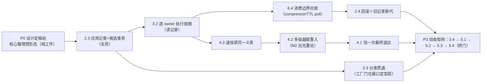

# 实施任务：同构 tagent 的事件协作与编排热更新（轮六十九防跑偏重写）

> **权威与记忆偏差防护（2026-09-25 固化，2026-09-26 重申）**：本任务单是本 change 推进的**唯一静态依据**。多轮对话的压缩摘要、历史轮叙述、助手回忆均不得覆盖本单；任何与对话记忆冲突处，以本单＋design.md 为准，**先改单、再实施**。每轮 `/opsx:apply` 开工前必读「核心思想卡」与「判例卡」，再读当日条目；实施中的语义决定当日回写本单或 design，不留在对话里。
>
> 状态口径（2026-09-26 轮六十九实测）：**34 项＝21 项 [x]＋13 项 [ ]**（`openspec instructions apply`）。S 阶段（6.7＋7.1/7.2/7.3，经 S1→S2m→S3m→S4→S3m-c）已收口；**全 `agent -race` 整包绿（82.1s）为现行回归基线**。历史「31/31」等口径作废（evidence §3 撤回台账）。本重写为纯工件，未动源码。

## 核心思想卡（去伪存真，2026-09-26 固化；一切条目据此解释）

**一句话**：本变更要的不是更强的引擎，而是**消灭第二套机制**——一个 turn 原语（`processTurn`）、一条事件管线（publish→pull）、一份已提交应用记录、一个任务域；entry 与被调方的**一切差别都退化为「输出交给谁」**。

1. **名称是化石**：change 名中的 durable 只指**输入事实链持久协议**（inbox claim/prepared-fact/receipt/ack），且按解释 A **专属外部 claim 批**——派生子调用永不入信封；不存在、不复活 workflow 引擎。
2. **哲学总纲（用户裁决，最高序）**：tagent 事件驱动；一次输入事件产生的任务与 agent output 的**输出目的地在输入时确认**；实例＝**一个个独立 agent loop**；输入输出**管线框架协调**；每路输出**要么内部要么外部**。
3. **架构不变量 I-1~I-4**（design「S3m-c」）：目的地输入时绑定（invID→bus 绑定表，运行期只查不猜）；entry 与被调同构 loop（同壳 `runAgentLoop`、同原语、同 retry budget）；事件传递一律经 EventBus（禁旁路队列/定制唤醒/直调快路径）；输出内/外二择。
4. **生命周期模型**：结构执行配置按 turn/调用**钉发起代**（lease 继承，D5/D6）；五数值热参在**消费边界现读**（numeric-only 不加代）；回滚＝以旧完整配置**发布新代**；任务/看板/TTL 归**所属 agent**，父不读子私有面；删路由≠退役（draining 保末值、只耗自身义务）。
5. **验证哲学**：先红后绿、真实退出码、行为证据压倒静态推读（「只看代码不看行为是陷阱」）、撤回文化、本单为唯一静态权威。

## 判例卡（易混点→正确判断；条目以 J# 引用，违反即停）

| J# | 易混（错读） | 正确判断 | 锚 |
|---|---|---|---|
| J1 | 同构＝共享消费者/一份 CM/一条 outputCh | 同构＝**原语与壳相同**；bus/CM/projection/接收者**逐调用私有** | design 线120；M2 裁决（轮49） |
| J2 | 统一事件入口＝所有事件走同一条总线 | 统一的是**管线纪律**；各 loop 自有 bus，绑定表按 invID 路由到属主 bus | S3m-c；d13 |
| J3 | InjectMessage 发 persistentBus 是漏洞，应发给被调方 | **按设计正确**：用户输入唯一入口＝entry 管线；子 agent 不直接暴露用户调用 | 用户裁决（轮62） |
| J4 | 续写轮是新输入，应入 durable 信封 | 续写＝**同环下一迭代**，目的地输入时已绑定，**无信封**；事件内 invocation_id 仅 provenance，身份由**壳持有**（不猜） | D-d 裁决；冲突裁决③ |
| J5 | budget 统一＝两形行为完全同一 | budget/原语统一；**终止语义**按形不同（entry：ctx/turnStop；invocation：投递对账静默）＝设计允许的接收者差异，**非** isSubAgent 执行分支 | 轮63/64 |
| J6 | 在途钉代→热参也钉旧值；或热参该随代冻结 | **pin/fresh 分裂**：结构 pin 发起代；五热参**边界现读**（在途下次压缩取新值、新调用构造即有效）；numeric-only **不**加代；**不得**做成「全参数随 turn 冻结」（未采纳清单） | 6.4 合同；m34 |
| J7 | task TTL/spawner 从发起链路（父）的 manager 取 | 读**所属 agent 自己**的源；委派继承版本/来源≠继承父任务管理器 | D3.3；d3_spawner_ownership |
| J8 | 配置删了名字＝实例该关；移除后参数回默认 | draining owner **保最后有效值**、自耗自身 settle、新路由被 `closingIn` 拒、不被重参数化；终态任务**不算义务**（数据≠持有理由） | §4.3；routable 过滤 |
| J9 | 回滚＝恢复旧可变状态／专用重建分支 | 回滚＝旧完整配置走**同一发布事务出新代**；在途调用保持其代不迁移 | D7；2.4 合同 |
| J10 | 事件通道关闭＝生产者停止；inflight==0＝可安全退出 | 关闭/退出判据＝**投递对账**（route publish 后递减 pending）＋`awaiting`（绑定∧pending>0），且必须枚举**未绑定/裸构造**边界；生产者停止凭证＝producer-done fork | U-2；轮52/64 |
| J11 | race 门一次绿＝干净；HEAD 能编译＝补丁完整 | 概率门不作数（须结构性断言）；完整补丁＝跟踪改动＋必要未跟踪文件清单 | evidence §0 门禁口径③④ |
| J12 | strict 通过／文档写全／evidence 历史绿＝现状完成 | 以本单勾选状态＋evidence §0 为唯一现状口径 | 撤回台账；勾选规则 |
| J13 | 子调用无状态／该造轻量第二执行链 | `Run`＝**边界适配**（输入转换＋关联等待＋转发）复用唯一管线；「无状态」由未来 session 维度自然解决，本轮只留请求级隔离接缝 | proposal；D5 |
| J14 | 「一次输入一轮结果」与越窗续写矛盾 | containment（无后台 spawn→首答即静默关通道＝旧行为）＋两段式 D-a（ACK 首答→补最终）；**独立新输入与继承输入不得混批** | d8；D6 |

（门禁口径八条见 evidence §0，与本卡同为每轮开工自查。）

## 术语与事实卡（压缩后重建语境用）

| 术语 | 本单内的确定含义 |
|---|---|
| tagent／owner | 一个**完整** agent 实例：自有 EventBus、projection、自己的 TaskManager、store 身份与维护组件。主／子只是连接关系，不是两种类型 |
| G1/G2／generation | 一次成功发布的执行配置版本。语义锚点＝「成功发布后**开始**的新调用用新代」；不是「保存文件后下一个 turn 必生效」 |
| 唯一已提交应用记录 | `orgCoordinator.current` 承载的完整应用事实（完整配置、执行视图、有效/排空 owner、五热参、诊断）；一切消费（执行视图/热参/诊断/回滚）读它，非各 CM 私有副本 |
| 壳（executor shell） | 仅为给**已存在** agent 提取执行配置而再造的同名完整 TagentAgent（含第二份 TaskManager/bus/cleaner）。这是 2.3 要删除的重复对象；**不是**真实子 agent |
| 执行视图／使用权 | execBinding 内按 agent 身份的执行描述；binding 为其本地可调用闭包（含尚未调用的合法子 agent）持有的 owner 使用权 |
| 排空面 | 被移除 agent 保留的最后有效内部面，仅服务其自身已接受任务的收尾，不开放新普通路由 |
| 五热参 | compress_threshold / max_tokens / keep_recent_tasks / task_terminal_ttl / task_default_ttl。合同＝从所属 agent 的统一有效源在**消费边界**读取 |
| 投递对账／awaiting | 越窗终止判据：per-invocation `pending`＝已 spawn−已投递（route publish 后递减）；壳仅当「绑定∧pending>0」阻塞等待，否则 drain 即退 |
| 两段式（D-a） | 委派＝ACK 首答→越窗补最终；首答与续写＝同一环的两次迭代 |
| producer-done | fork tag `v1.11.2-tagent.1` 提供的停止凭证：取消／ACK／任务终态／流关闭 **均≠** 生产者停止 |
| 回滚 | 运行时显式回滚上一份完整配置（结构＋五热参，ring-2 数据），以新代发布 |
| RV1–RV7 | 上轮审阅七缺陷：候选资源域错位／依赖保有缺口／回滚双事务／多级重入误拒／热参消费错位／remote 误入本地域／迟后退出缺失（evidence §4.3） |
| 贯穿门 | 7.2 建立的主子同构测试族（d8/d11/d12/d14），后续相关任务的常驻回归 |

## 防跑偏总则（每轮开工自查，违反任一条即停）

1. **同构**：不得引入 isSubAgent 分支、子调用专用 runtime、全组织单 TaskManager、把 B 的任务记到 A 的 manager。（J1/J5/J7）
2. **去壳≠去能力**：删除对象仅限「为已存在 agent 再造的同名完整壳」与「子调用直调旁路」；热新增真实 agent 必须完整构造（bus／任务域／恢复能力齐备）。
3. **验收以真实链为准**：模型请求里的声明、真实工具返回、真实子调用预算／TTL、资源尾部为准。getter 回声、两层测试拼接、inline 返回代替 ACK 链、远端＋本地测试相加，均不算证据。（J11/J12）
4. **未采纳语义不得混入**：冻结全部在途热参／prompt 内容、仅文件回滚、集中式任务服务、子 agent 降为纯定义、全参数随 turn 冻结。（J6/J9）
5. **先红后绿**：每项先建真实失败测再修；纯结构重构须声明替代验收（绿前绿后＋全量红线）并留档；race 零豁免；所有命令记录真实退出码，不用管道尾状态。
6. **语义边界**：发布后新 turn 生效（非保存即生效）；prompt 文件热读与五热参维持现行合同；不保证远端内部同代、外部副作用 exactly-once。
7. **停止条件**：发现与项目哲学／主规格冲突、工厂合同无法保持、需扩大持久协议或触生产数据→停止单项，写明事实与最小方案上报；不得吞错、缩测试过滤、加万能 manager 或把缺陷改写成预期。
8. **勾选规则**：任务全部验收腿通过且证据落 evidence 才可勾选；部分完成保持 [ ] 并注明保留／缺口；禁止因上下文压缩丢失而重新声明完成。

## 执行顺序与依赖（轮六十九重排：核心簇程序，Order-A）

S 阶段已完成（6.7＋7.1→7.2→7.3，贯穿门 d8/d11/d12/d14 常驻回归）。余 13 项按「先补齐思想载体（应用记录），再补生命周期义务，最后矩阵验收」推进：

| 阶段 | 任务 | 准出 |
|---|---|---|
| P0 设计定稿（✅ 轮七十，纯工件） | 核心簇理想形态入 design「核心簇…P0 定稿」节 | 已定稿：appliedRecord 形状／owner 只读函数面（hotNums/taskTTLs/execFace＝记录投影）／pin-fresh 表／清理清单（含 liveCMs **保留为生命周期账**的读码实证）／compressor `WithHotSource` pull 契约／standalone 静态源同源／**P1 切片 S-A~S-F（红锚逐片）** |
| P1 核心簇 | 切片 **S-A ✅ 轮七十一** → **S-B ✅ 轮七十二（有序责任表半；三旧锚已消解如实核销）** → **S-C ✅ 轮七十四（appliedRecord 记录面收尾；数值-only 提交闸门接入，root 挂起门修复）** → **S-E 热参 pull(6.4) ✅ 轮八十真收口** → **S-D 执行视图(3.2) ✅ 轮九十（持有扩展经用户批准；主干＋过渡壳消亡＋2.3 联合勾）** → S-F 回滚(2.4) 待启；3.3 工厂门半开（§5.45，②公开合同待裁） | 唯一已提交应用记录成立：单事务、无壳、执行视图/热参/回滚/诊断同源；2.3/3.2 均已勾 |
| P2 生命周期义务 | 4.3 → 4.2 → 4.1 | 义务/重入/恰一次退出全部读同一记录与真实尾部 |
| P3 验收矩阵 | 3.4 → 5.1 → 5.2 → 5.3 → 5.4 | 跨发布矩阵、互证、复杂度对照、完整补丁终门 |

> 备选 Order-B（若用户改令 6.4 先行）：仅调 P1 内切片序（6.4 消费者侧提前、源暂挂现有 hotSnapshot 单一提交点），判例与不变量不变；2.3 落地时仅 re-point 源头。
> 已勾项（0.x/1.x/2.1/2.2/3.1/4.4/6.1–6.3/6.5–6.7/7.x）作为持续回归门；不重做已完成的 fork 发布或原型撤回。

## 0. 工件与历史边界（保留）

- [x] 0.1 目标已收敛为现有 YAML 编排热更新；独立 Graph DSL 不恢复。保留合同：主线永不回到 DSL／第二编排表示。
- [x] 0.2 原 durable 原型与当前工作树的过度完成声明均已撤销。保留合同：不继承原型或局部绿测为整链证据。
- [x] 0.3 历史基线命令与 resident 契约清单保留于 evidence（§8.2）。保留合同：它们不证明当前完整候选补丁，最终门归 5.4。
- [x] 0.4 已执行的 durable engine/saver/facts、灰度分派及试验接线清理事实保留。保留合同：原 inbox/completion/TaskManager 协议不撤回。

## 1. 原型撤回与分层（保留）

- [x] 1.1 独立 `org_exec.go` 执行链及专用测试已撤回。保留合同：本地引用／环校验继续复用；完整类别兼容归 3.3。
- [x] 1.2 独立图定义／DSL／发布账本已撤回。保留合同：`event/wf_facts.go` 仅被动排除，不恢复生产写入、不另加 TTL。
- [x] 1.3 旧三层版本账本已收敛到根 `orgCoordinator`。保留合同：不另造发布器；原子性由 2.3 验收。
- [x] 1.4 无第二编排表示与包依赖守卫保留。保留合同：迁移时补反向依赖／完整壳重入守卫，不弱化存储、恢复合同。

## 2. 装配职责、候选事务与完整回滚

- [x] 2.1 输入与公开配置／声明容器隔离成果保留（map/slice/嵌套 schema/值指针不别名；运行资源不盲目深拷贝）。保留合同：去壳后原样回归实际声明与请求测试。
- [x] 2.2 完整 ToolRef 与结构字段的指纹审计成果保留。保留合同：五热参独立；新迁移字段补审计；禁止以「全数值纳指纹」修补热参错位。

- [x] 2.3 **核心簇首片：去掉完整执行壳，统一候选身份域与应用事务，立「唯一已提交应用记录」**（RV1/RV3，design D1–D4/D7；J1/J2/J8）。**✅ 轮九十联合勾（evidence §5.46）**：过渡壳（为已变 agent 再造整实例承载新配置）已在正向与回滚两处消亡——`TestDeshell_ChangedSubAgentConstructsOneTransitional` 迁至终态 0（该锚自 S-A 起就点名「终态 0 属 S-D」）；reload/rollback 共用同一 `stageOrgGenerations` 核心（构建→wiring→激活同序）；准出四条（零第二套 TagentAgent 状态／两入口同一事务核心／屏障下无半提交／失败清理逆序）全绿。
  - **现有成果**：构造／发布 API（candidate/publish 分离）、私有新增 overlay、业务获取不等构建的屏障测保留。现有 map 差集／倒序及 rollback 提前 Add 不算事务闭合。
  - **代码范围**：`build_agent.go`、`tagent.go`、`org_hotreload.go`、`partition_collision.go`、`agent/agent.go`、`agent/context_manager.go`；仅在需要交接时适配既有 resources/ActionTool 接线。
  - **实现：构造拆分**——分开「创建有状态 owner」与「装配执行配置/工具」：从 `buildAgentDFS` 提取模型/prompt/ToolRef/装饰器转换为**返回描述的函数**；冷启动、候选、回滚复用。config-driven 热更对**已存在** agent 不再 `NewTagentAgent` 造壳或取其 `ExecutorConfig`；热新增真实 agent 仍完整构造（J2 去壳≠去能力）。删除的仅为壳的跳过恢复与强制重挂分支。
  - **实现：身份解析**——一次候选的 owner 解析域＝在线 owner 快照＋本候选新增者；准备 owner 与执行装配同域；跨 top／菱形依赖只创建一次；miss 明确拒绝，**不回落 entry/in-memory store**。新 owner 接收／恢复激活晚于提交；原 owner 不被重恢复或覆盖。
  - **实现：事务**——reload 与 rollback 只提供不同配置输入，合入**同一 prepare/commit/discard**；每次 acquire／登记／工具构造后立即进有序责任表（早于下一可失败动作）；成功显式转移、失败逆序回收；废除 `ownedAgentNames` 差集推断与 `addedNames` map 顺序假设；借用资源不关，清理失败保有登记与主错误链。
  - **实现：唯一可见点**——`orgCoordinator.current` 存 binding、完整配置、本地 owner 视图、五热参与成功诊断；获取／热参读／诊断共享发布读闸门，writer prepare 锁不阻塞读；禁止「先改热参或 Add 再换 runner」的半提交；长激活、I/O、Close 不入提交锁；原始 owner 清册只管生命周期，不兼任路由真源（J2）。
  - **红基线（先钉红）**：热增独立 store 的 B，B 工具实际读写落 B 而非 entry（当前错落 entry）；回滚重建 P 且 P 依赖仍在线 Q 时 Q 恰一个（当前空缓存重复建 Q）；逐层故障注入（成功子＋失败父／owner 成功＋后段工具失败／关闭中完成候选）在线声明、热参、owner 可见性不变；重试可恢复。
  - **准出**：热更一次不产生第二套 TagentAgent 状态；两入口同一事务；屏障下无半提交；失败清理顺序来自实际获取证据而非对象数。
  - **防跑偏**：删的是壳不是子 agent 能力；不提前公开新增 owner；不回落 entry store。

- [x] 2.4 **回滚＝旧完整配置发布新代，删除专用重建分支**（RV3/RV5；依赖 2.3/3.2/6.4/4.3；J9）。**✅ 轮九十二收口（evidence §5.48）**：回滚的专用重建分支已删除——缺失 owner 的再获取与正向热增走**同一个**候选 overlay（`buildCandidateOwners`＋`commit()` 于唯一提交点＋`abandon()` 逆序回退）；红→绿实录见 §5.48（原实现**提前** `resident.Add` 且后段失败**不回退**，把未发布的 owner 留在在线清册并占住其 store 租约）。四行验收全部有锚：数值首更→回滚（既有 L3 四测保绿）／热增＋numeric＋在途真实调用→回滚（宿主结果＋B 自身 keepRecent/TTL 复原＋同址单 owner）／移除父保留共享子→回滚（共享子同址不重取，回滚真发布）／最后阶段失败不半改。
  - **保留**：启动代播种、首次 numeric-only 回滚钩子、revision／两时间轴及既有测试。
  - **代码范围**：`tagent.go`、`org_hotreload.go`、`org_rollback_l3_test.go`、真实子调用测试。
  - **实现**：删 `doRollback` 的 `rebuilt` 空缓存、提前 Add 与手工枚举 Close——经 2.3 同一事务准备；current/prev 只存完整配置数据；相同完整内容 no-op；实际回滚发布新 generation；numeric-only 只更新应用记录不重建结构（J6/J9）。
  - **验收（先红后绿）**：首次数值更新→回滚；热增 B→数值更新→真实新／在途 B 调用→回滚；移除父保留共享子后回滚；回滚最后阶段失败不半改。断宿主结果、真实预算/TTL、单一 owner 与资源退出，不只比 fp。

## 3. 真实执行绑定与委派

- [x] 3.1 常驻 turn 的配置触发在重试外、BeforeModel 外的成果保留。保留合同：语义＝发布后开始的 turn 用新版，不是发现编辑的 turn 必须等待。

- [x] 3.2 **execBinding 补为逐 owner 执行视图，接实际依赖**（RV2/RV4，design D2/D6/D8；J1/J7）。**✅ 轮九十转勾（evidence §5.46）**：主干落地——每个可达 owner 的执行视图随发布推进（stage→wire→activate，未变父也换 face）；wrapper 盖 `declared`（发布 wiring，指向被声明子的同代 binding）＋声明沿代持有（`heldBy` 不入义务轴，回收判据＝retired∧refs==0∧heldBy==0）；委派调用期按发起代取该代装配配置（`declaredRunConfig`，不按陈旧 `ta.config`）；DoD＝取消 `NestedHop` Skip 三段全绿（含显式断言迁移：被钉跳回执＝G1 之 C 的回答）。验收六行全数有锚（延后委派／在途不误退役／无关旧代独立回收／关闭后被拒／A→B→C 各见本代／并发不串）。
  - **〔轮九十七补记（§5.53，勿回退）〕**`stageOrgGenerations` 与候选 overlay 两处 owner 构建循环须跳过「**仅以 remote 引用可达且无本地定义**」的名字（`remoteDeclarationOnly`，复用 §5.44 的 `ToolRef.isRemoteRef()`）：trunk 一度只认 `next.Agents[name]`，使含 remote-only 子 agent 的部署首次热更/回滚即 fail-closed 永拒（冷启动正常，故极易漏）。`reachableAgents` 的「可达」语义保持不变——**可达 ≠ 必有 owner**。
  - **轮八十一增量（勿重做，evidence §5.37）**：D8 的**使用权轴**已落地——`execBinding.holdsUsage()`（发布槽／在途引用即保有）＋ `agent.BindingHolders(owner, agents)` **派生**计数（复用 `b.subagentWrapper`，与现效面同一扫描，不新建登记表）；退役判据并入第四轴并可见于 `Why`/`usageHeldBy`。「A 持 G1 未调 B、G2 删 B 后 G1 真调 B 仍成功」红锚三段全绿（保护／真调／有界退出）。
  - **已成（勿重做）**：Run 去隐式传参（activeBus/外部上下文按调用装配，轮四十二）、Run 侧 session 去共享写（轮五十八）、`execBinding.face` 逐 owner 面与按发起代解析（轮三十三，d42 五例）。本项剩余＝视图接记录＋资源责任＋验收。
  - **代码范围**：`agent/exec_lease.go`、`context_manager.go`、`event_loop.go`、`session.go`、`helpers.go` 与组合根注入点。
  - **实现**：binding 内按 owner 取**不可变执行描述**（读 2.3 记录）；Tools/wrapper 仍是唯一可调用关系真源，不维护平行路由表；wrapper 指向稳定 owner；请求级上下文由公共处理器创建并接本 agent 服务（含其 taskController），不按陈旧 `ta.config` 先造后补；root provider 注入保持分层，独立单 owner 同一语义。
  - **资源责任**：binding 交接前取得其全部本地可调用依赖 owner 的使用权；发布槽或实际调用／后台引用在即保有；未真正调用但本版允许稍后调用的 B 也受保护；版本回收先处理版本独有工具、最后释放 owner 使用权；owner 不永久反向 pin 旧版本（防计数环）；store 仍只由 RuntimeResources 退出。
  - **验收（先红后绿）**：A 持 G1、尚未调用 B 时 G2 删 B，之后 G1 真调 B 仍成功（当前 B 被提前退役，先钉红）；结构发布后 B 真实在途调用不误退役；A→B→C 各见本代自身声明；同 owner 两并发调用 session/输入/投影/输出不串；无关旧代独立回收；关闭后的 Run/Inject/Acquire 真正再进一次且被拒。
  - **轮八十六增量（勿重做，evidence §5.42）**：验收项「**关闭后的 Run/Inject/Acquire 真正再进一次且被拒**」——**这一项下挖出真实缺陷并修掉了**。红证（先钉后修）：owner 完整收敛退出（runner 已关、登记已撤、离开常驻表）后，陈旧持有者调 `BeginTurnLease()` 会**拿到那个已关闭的 runner 并被交去跑 turn**（打印实证：`closeOnce.done=1`、`runs:nil`），同时**在排空已报干净之后又登记了一条新义务**（`Obligations()` 由 Idle 变非 Idle）。这正是 `tryAcquireActive` 自己注释里点名不可接受的「running a turn on a closed executor」。
    - **根因**：`AcquireLease` 的「无后继」分支不区分**仍在排空**（此时照旧登记、由有界排空报 `ErrExecUnconverged`，语义正确）与**已收敛关闭**（此后无任何东西可等，登记＋交出死执行器就是纯粹的错误）。
    - **修法**：世代闸门新增具名拒绝 `agent.ErrExecClosed`——已收敛时**不登记引用、不交出 runner**（拒绝租约 `kind=leaseKindNoop`、`Release()` 惰性、`Derive()` 继承拒绝、`Runner()/SubagentWrapper()` 皆 nil）；在四处消费点显式化：`RunFlowWithExecutor`（继承与新取两臂合流处单点拒绝）、`session.Run`（委派调用入口）、`tool_agent` 任务重入、`event_loop`（**拒绝不是瞬态 I/O：不占传输重试、不报退化**，仿 §5.1 中途关机分支不 ACK、保留 claim 交重建 owner 重处理）。
    - **实测的另一半纠正**：我一度把 Inject 也断言成 `ErrExecClosed`，跑出来是 `agent.ErrLoopTerminated`（「persistent loop already terminated」）——**输入接受面本就有自己的具名闸门**，两层各归各。锚按实测分别断言具名哨兵，不用宽泛 `Error` 蒙混。
    - 判别性即「先红后绿」本身（修复前 FAIL 于 `Runner()` 非 nil 与义务非 Idle 两条，修复后 `-count=2` 绿）。
  - **验收清单现状（逐项核过，非凭印象）**：✅ 延后委派（§5.37）／✅ 结构发布后在途调用不误退役（§5.37/§5.39）／✅ 无关旧代独立回收（既有 `TestLease_UnrelatedGenerationReclaimedIndependently`＋`TestRecycle_UnrelatedGenerationReclaimsIndependently` 两锚）／✅ 关闭后 Run/Inject/Acquire 被拒（本轮）。**剩余＝**「A→B→C 各见本代自身声明」与「同 owner 两并发调用 session/输入/投影/输出不串」两条验收，以及实现条款主干：**binding 内按 owner 取不可变执行描述（接 2.3 记录）＋请求级上下文不按陈旧 `ta.config` 先造后补**——即「过渡壳」的消亡（`tagent.go` 正向 974 与回滚 677 两处注释都点名等 S-D/3.2）。
  - **轮八十七增量（本项主干的失败契约已钉，evidence §5.43）**：验收项「A→B→C 各见本代自身声明」在**嵌套跳跨发布**这一维度实测**不成立**，已钉成可执行判据：`org_nested_hop_test.go::TestOrgDelegation_NestedHopKeepsTheInitiatingGenerationTarget`（当前**声明式 Skip**——不静默、不粉饰为预期，主干落地即取消 Skip 并作为 DoD）。
    - **实测事实**（arm 1，只换 C）：① 被 park 的 B（钉在 G1）其嵌套跳**确实**仍服务 G1 的 C ✓（前两条断言通过，D5/§4.2 的钉在代语义在嵌套层也成立）；② 但**此后每一个新 turn 仍服务旧 C，静默无错无拒绝**（服务序列 `ENTRY→SUB-B→SUB-C-PROMPT` 而非 `SUB-C-PROMPT-G2`）。
    - **对照臂推翻了我的第一推断**：我原判为「未变祖先的 face 陈旧」；把 A/B/C **全部**换代的第三臂仍失败（`ENTRY-A-PROMPT-G2 → SUB-B-PROMPT-G2 → **SUB-C-PROMPT**`）⇒ 不只是祖先问题。
    - **两条同源子缺陷（定位到点）**：`tagent.go:986-1016` 的过渡承载（shell）循环按 **map 序**遍历已变 agent、`subCache` 仅排除自身 ⇒ (D-b) 父壳可能先于子壳构建而把**旧子实例烤进 face**；且 (D-a) **未变更的父根本不解绑旧子**（它连 face 都不重建）⇒ 子的新代从该父永不可达。⇒ **仅修遍历顺序不足以过契约**，必须做实现条款主干：**wrapper 指向稳定 owner ＋ 按 owner 取不可变执行描述（接 2.3 记录）**，让嵌套解析在调用时按发起代取视图，而不是在构建时捕获实例。这正是 `tagent.go:677/974` 两处注释点名「dies with S-D/3.2」的过渡壳消亡之路。
  - **轮八十八增量（勿重做，evidence §5.44）**：**D-b 已根治**——过渡承载（壳）循环原按 map 序遍历已变集合，而 `buildAgentDFS` 优先命中缓存里的既有实例，父先于子构建即把**旧子烤进新 face**；实测同一份「全层换代」配置连发 6 次，仅 1 次到达新叶子（日志因果：`b` 的壳先于 `c` 的壳）。改为 `structuralRebuildOrder` 按可调用图**后序**构建（名字序 tiebreak；真环留给 DFS 报告，排序器不丢名不自旋），**正向与回滚两处**同用。契约 `TestOrgDelegation_AllLevelsRepublishedReachTheNewLeaf`：修前 **0/6** → 修后 **6/6**。非确定性缺陷的红必须按多次计。
    同轮的**拓扑测量取代了轮八十七对 D-a 的机制表述**：只换子（C）时，`resident[c]` **连实例都没被换**、未变父层的执行视图完全不推进（壳只进 entry 自己的新 face）⇒ D-a 的真实要求是「**每个受影响 owner 的执行视图都随发布推进**」，而非「谁捕获了谁的指针」。临时解除 Skip 实测确认 D-a 未被顺带修好（仍红在同一断言），随后复原。
  - **主干落地前需你裁决的一点（扩大持有协议，不自动定）**：D-a 的修法要让未变父也推进 face／executor（实例与 store 身份不动）。可一旦旧子被正常取代**并回收**，验收②「仍持 G1 租约的父必须还能调到 G1 的子」就会失守——今天它靠「捕获实例」侥幸成立。最小方案即本项资源责任那句已有话：**binding 交接前取得其全部本地可调用依赖 owner 的使用权**，把使用权派生从「宣告者未退役」扩为「**被宣告的那个代**在任一宣告者存活期间不得回收」（不入义务计数，故不伤 4.3 的空闲退役锚）。此为新增持有语义，未获批准不落地。
  - **〔轮九十裁决（2026-09-27）：上述持有扩展已获用户批准，主干就此定案〕**：用户在建议陈述（①批准最小持有扩展／②工厂合同一次迁移）后以 `/opsx:apply` 授权按建议①落地。**持有语义定案**：「被宣告的那个代在任一宣告者存活期间不得回收」以**声明沿代持有**实现——每次发布对**进出两代**的每个 binding 面 wiring：面内 wrapper 盖 `declared`（原子指针，指向被声明子的同代 binding），声明方 binding 对被声明方同代 binding 记 `heldBy`（独立计数，不入 refs、不入义务轴）；binding 回收判据＝retired ∧ refs==0 ∧ **heldBy==0**；声明方被回收时释放其全部持有（沿调用图单向，无计数环）。**主干同轮落地**：每个可达 owner 的执行视图随发布推进（未变父也换 face，实例与 store 身份不动——D-a 修复）；wrapper 调用期按发起代取被声明代 face 装配 invCM（不再按陈旧 `ta.config` 先造后补）；正向与回滚两处过渡壳消亡（`buildModeExecutorShell` 的整实例构造路径删除，`buildAgentFace` 面装配保留）。**②（工厂合同一次迁移）随后独立成轮，不在本轮混入。**
  - **防跑偏**：统一入口不得取消请求级隔离（J1）；使用权≠第二任务域（J7）；不以全局 busy 计数替代逐版本回收。

- [x] 3.3 **分类只做一次，贯通本地、remote、工厂**（RV6；J7/J11）。**✅ 轮一百转勾（evidence §5.45／§5.47／§5.51／§5.53／§5.56）**：四条子句各有入口级证据，「换代不失监视」已具 org 级端到端锚＋两枚变异判别；**覆盖范围限制写在本项子弹里，勿读成更强结论**。
  - **代码范围**：`config.go`、`partition_collision.go`、`build_agent.go`、`registry.go`、`agent/tool_agent.go` 及 A2A／factory 测试。
  - **实现**：复用既有 `isRemoteRef()` 统一校验／本地可达／构建类别；本地 owner 清册不加入 remote-only 名；远端 URL/声明仍在结构指纹与本版工具中；传输重试固定端点与载荷，本地不重试，不加调度器。
  - **工厂前置能力门（须在 P1 接口定型前完成，不到最后静默删兼容）**：区分 PlainToolFactory 与 ToolAgentFactory；后者返回完整 agent、可能有自定义工具/副作用——先列真实调用点＋特征测，再确认能否经现有构造的准备/激活拆分接唯一 owner；保持注册 API、内置名保护与已承诺行为；不可丢弃工厂产物/绕过工厂/以普通 YAML 测替代。若需改公开工厂合同→停下给用户最小兼容方案。
  - **〔轮九十一裁决（2026-09-27）：②工厂合同一次迁移已获用户批准（建议陈述后 `/opsx:apply`）〕**定案＝**直接改公开合同**（非并行双注册面）：`ToolAgentFactory` 改为返回 `*TagentConfig`（声明/配置），**不得**自行构造 `*TagentAgent`——构造归 `wireAgent` 唯一路径（store 释放槽/retirementPoke/缓存登记一次到位），face/runCfg 归 `stageOrgGenerations`（过渡壳对工厂同样消亡）。依据：D1「接口形状可调整并一次迁移仓内调用者…避免用返回完整临时 agent 的方式隐式制造第二 owner」＋D9「不为旧构造签名保留永久双实现」＋轮九十实测的新缺陷类（工厂 owner 每次发布**孤儿构造一个整实例**且 `runCfg==nil` 使委派调用读到陈旧 `ta.config`）。必须保留：注册 API 形状、内置名保护、菱形单调用、失败包装 `agent %q: factory failed: %w`；「产物整只使用」→「产物配置整只采用」（Name 尊重工厂所设），「本分支不构建声明 Tools」不变。连带删除：`AdoptMemStoreRelease` 缝＋`TestAdoptMemStoreRelease_OwnershipRules`（唯一用户消失即不留死公开 API）。**工厂产物自持工具不经治理包裹**＝既有已记录边界（Minor⑥），本轮不改判。
  - **有状态工具**：ActionTool 声明构造与恢复重挂/monitor 激活分离；候选不改在线 detector/tracker；已纳管任务不因工具换代失监视；明确版本 disposer 与实际任务继续使用的资源谁释放，不一关了之。
    - **轮九十五核验（evidence §5.51；本项不转勾）**：逐句核过——「声明构造与恢复重挂/monitor 激活分离」有既有锚（`TestTaskIDBridge_SuspectToRunning`／`TestCrossRestartResume_RealProvisioning`）；「disposer 归属」由 §5.40/§5.41（共享组件等所有借用者、poisoned 封路）钉住；**但「换代不失监视」经查不是缺锚、而是缺实现**：全仓唯一重挂点 `tm.SetSessionTracker(actionTool.IsTrackedSession)` 在 `wireAgent` 内（其注释自定规则「换代 ActionTool 后须重接」），而轮九十去壳后已存在 owner 不再经 `wireAgent` ⇒ 规则静默失守（tracker 是**绑定方法值**，读的是换代前那台 monitor；§7 孤儿裁决据其行动）。**P-PC 实测证明缺口非假设**：摘掉重挂后热更／委派／回滚／重入／退役／deshell／lifecycle 全家族 `-race` 全绿——无测可抓。**已修**：`activateOwnerGenerations` 在**每个 owner 激活之后**（`ov.commit()` 之后，绝不提前——未提交的候选不得把在线看板指向将废弃的工具）重挂当前代 ActionTool 的 tracker，正向与回滚共用；无 exec 工具者以 nil 守卫保持原样。机理以 `tool/action::TestActionTool33_MonitorsArePerGeneration` 钉住（两台 monitor 独立 ⇒ 陈旧闭包对存活会话必假阴性；`AddSession` 为纯内存登记，无需真 tmux）。
    - **轮一百闭合（evidence §5.56；本项据此转勾）**：org 级端到端锚已钉＝`org_monitor_reattach_test.go::TestMonitor33_LiveSessionStaysWatchedAcrossToolGeneration`——三个**独立进程**boot 共用一份持久根与真实 tmux `mode=resident`＋`name=` 命名会话（命名才被启动孤儿清理放过、才可跨重启寻址；oneshot 匿名会话被清理是**正确行为**，第一版误判于此）：①spawn 起真实长命令后**不调 Close 直接退出**（任务未终结、会话活在 server）；②restart 断言「恢复为 suspect 的纳管任务被当代 monitor 重挂并提升回 **running**」——这正是 tracker/monitor 接缝的**后果级**判据，两枚变异各打一侧：**P-MM1**（`IsTrackedSession` 恒 false＝换代后监视丢失）⇒ 精准红「实得 status=suspect」；**P-MM2**（跳过启动重挂）⇒ 同测红。③hotreload 相位证「进程内发布新一代后，当代仍**持有并可寻址**那个活会话」（同名第二次派生被拒、command 任务数仍 1、原会话仍活），并带**非空洞性守卫**（记录哪一次调用真发出了工具调用，否则「任务数=1」可被一个从未委派的 turn 满足）。
    - **覆盖范围（如实标注，勿读成更强结论）**：③证明的是**所有权/可寻址性**跨发布仍在——重名拒绝读的是 tmux 地面真值（`SessionExists`），**不是**新 monitor 的跟踪集合。「新代 monitor 是否真跟踪该会话」这一半在**重启**代际边界上由②与 P-MM1/P-MM2 钉死；在**热更窗口**内要让它变红必须先把任务推进 suspect，而 `quiet_timeout` 下限被钉在稳定窗（60s，TUI 90s），常驻该窗只会加入负载敏感红灯族（§5.36/§5.40），故**刻意不钉**，代之以热更路径确有重挂入口的实测事实（`buildAgentFace`→`assembleAgentConfig` 传的就是 `buildModeExecutorShell`，故 `build_agent.go:418` 的重挂重入对每次 face 构建都生效；日志实证 `recovery: reattached 1 resident session(s)` 与 `executor generation 1 swapped` 同秒）。
    - **本轮两次自纠（都不是产品缺陷）**：①我曾据 418 行的 `mode.isExecutorShell()` 门推断「去壳后热更不再重挂＝第二个 trunk 回归」——**读调用点后证伪**（trunk 复用了同一个 mode 值），假设撤回、未改一行产品码；②我自己的测里有一处**真数据竞争**（谓词无锁读 `m.calls` 对模型有锁写），`-count=2 -race` 抓到，改为加锁访问器后连续两轮全绿。另：首版 hotreload 断言依赖拒绝文本的投递形态（实际不以 tool-role 回流）而红过一次，已改为不依赖文本形态的守卫。
  - **轮九十一增量（②已落地，evidence §5.47，本项不转勾）**：工厂公开合同一次迁移完成——`ToolAgentFactory` 现返回 `*TagentConfig`；构造归唯一 `wireAgent` 尾段（store 租约进 `MemStoreRelease` 同一退出槽、retirementPoke 自臂、closer/恢复接线与 config-driven 同源）；face/runCfg 归唯一 `stageOrgGenerations`。红→绿实录：`TestFactory33_ReloadConstructsNoOrphanAgents` 修前 `Should be zero, but was 1`、`TestFactory33_FactoryConfigChangeReachesDelegations` 修前 `Condition never satisfied`（两条＝D-f1 孤儿整只构造／D-f2 runCfg nil 致委派读陈旧配置），迁移后 5 测全绿（count=1，注册名固定故不可 `-count>1`——§0 口径②）。**显式迁移**：`agent/tool_agent_test.go` 2 测、`builtin_agent_protection_test.go` 2 厂、`factory_gate_test.go` 4 处（文件头与租约臂文案按新合同改正，承诺逐条保留：内置名保护／工厂身份整只采用／声明 Tools 不构建／菱形单调用／失败包装形状）；**删除** `AdoptMemStoreRelease` 缝＋`agent/lease_adopt_test.go`（唯一用户消失，不留死公开 API）。
  - **3.3 余项（勾选前须逐腿核验，勿凭印象）**：~~①**有状态工具**行的「已纳管任务不因工具换代失监视」一条**未见专锚**（现只有 `bind_detector_test`／`resident_meta_test` 覆盖 detector 绑定与跨重启恢复，不覆盖 ActionTool 换代后 monitor 连续性）——须先钉红测或判读为已由 §7 tracker 重挂线（wireAgent 两模式同源，`SetSessionTracker`）覆盖并留证~~（**轮九十五判定**：既非「已有锚」也非「只缺锚」——规则本身在去壳后失守，已修并有机理单测；余仅 org 级端到端锚，见上）；②「503 重试期间发布」等 remote 跨发布行**归 3.4**（轮三十二边界记录在案，勿在此重复勾；**轮九十七该行之所以能验出 remote-only 永拒缺陷正因它在 3.4 落地**，3.4 已于轮九十八转勾）；③两类工厂的「真实返回／失败退出」已由 §5.45＋轮九十一合起来钉住，PlainToolFactory 侧七行矩阵保留于轮三十二证点。
  - **验收（先红后绿）**：remote-only 合法冷启动→结构热更当前真实失败（先钉红）→修复后真实新 RPC；503 重试期间发布，原调用仍原端点/参数；两类工厂分别验证配置/声明/真实返回/失败退出；同步/异步/多级七行矩阵保留。

- [x] 3.4 **验收重开：同一真实调用链完成跨发布矩阵**（J10/J11）。**✅ 轮九十八转勾（evidence §5.52／§5.53／§5.54）**：五条具名行各有生产入口的真实调用链锚，且每行的「宿主返回＋资源尾部」都在**同一条链内**取证；两行由红基线/变异证明咬合。
  - **保留**：本地同步在途、排队输入、no-tool 负控既有证点；d12 已覆盖宿主形越窗单窗（7.2 边界留档），本项仍是**跨发布/多代矩阵** owner。
  - **代码范围**：`org_cross_publish_vertical_test.go`、`org_delegation_test.go`、`a2a_delegation_test.go`、`reentry_task_action_test.go`。
  - **补齐（先红后绿，新建而非改写旧断言）**：真实 ACK 已返回且父 turn 已结束、后台 producer 停屏障期间发布 G2——后台用 G1，停止后 task_settled 新 turn 用 G2（现有测试止于 inline 返回）；远端重试过程中发布；多级任务重入过程中发布；删除尚未调用的子 owner；热增后真实数据归属——各给宿主返回与资源尾部证据；发布通知 turn 以来源/顺序区分，不用「C 总调用数必须零」误判。
  - 同时核常驻状态身份与真实事实续写；结果不得是已结束 turn 的前后对照或两层测试拼接。
  - **轮九十六进展（本项不转勾，evidence §5.52）**：补齐最难一行——`TestOrgCrossPublish_SettleTurnRunsOnTheNewGeneration`（真实 ACK＋父 turn 已结束＋producer 停屏障期间发布 G2 ⇒ 后台用 G1、settle 抬起的新 turn 用 G2）。**ACK 是逼出来的不是假设的**：把 wrapper 的 dense 窗缩短到 30ms 使任务层真的脱手，并断言发布前父 turn 已闭合且**尚未持有 B 的答案**。归属按**因果**而非计数：settle 以 **user 角色 `[task settled] … 结果: …`** 回流（实测；`delegServed.ToolResults` 看不到它），故新测自建 witness 记录「哪个 entry call 携带了该通知」＋其被提供的工具集 ⇒ 该 turn 的工具含 c 不含 b 即为「新 turn 用 G2」；并按本子句警告**不断言**「C 总调用数必须零」（发布自身的 notice turn 合法地在当前面委派）。判别性＝**P-PS**：摘掉 `deliverTaskSettled` 的 bus 回退（还原「异步结果失联」形态）⇒ 本测精准红于「settle 未抬起新 turn」；文件与探针后 byte-identical 还原。既有四测（后台持代／退役代终被回收／排队输入取新代／不调工具两者皆不跑）与轮九十四 `TestReentry42_*`（多级重入四态）**不重做**。
  - **轮九十七进展（本项不转勾，evidence §5.53）**：①「远端重试过程中发布」补齐＝`a2a_delegation_test.go::TestRemoteRetryAcrossPublishKeepsTheDeclaredEndpoint`。发布**与失败重试同步**（在 503 handler 内改写 yaml 并 `CheckOrgReload`，窗口不由 sleep 决定）；判据按**因果**：后继端点在父 turn 拿到答案**之前被联系即红**（那意味着重投改道），实测 `origRPCs=2 / succRPCs=0 / gen=1` 且每次 RPC 载荷同为 `"retry across a publish"`（D6/J10「传输重试固定端点与载荷」）。**此行当场挖出一个真实产品缺陷**：remote-only 声明（冷启动合法，§5.44）在**首次热更即被 fail-closed 永拒**——`[org-hotreload] NEW agent "knowledge" is referenced but not defined`，因 §5.11 的「引用未定义」门与 trunk 的发布循环都只认 `next.Agents[name]`，忘了 §5.44 那个**已被校验域与构建域共用的单一谓词** `ToolRef.isRemoteRef()`；后果是「凡含 remote-only 子 agent 的部署，热更与回滚永久不可用」。**已修**：新增 `remoteDeclarationOnly`（复用同一谓词；**混合可达**——同名同时被非 remote 引用——仍照旧 fail-closed，§5.11 门的目的不削弱），候选 overlay 与 `stageOrgGenerations` 两处 owner 构建循环据此跳过「无 owner 可建」的声明；`reach` 语义不改（该名字确实可达，只是不常驻）。守卫单测 `TestRemoteDeclarationOnlyKeepsTheGate` 四态（纯 remote／混合可达／本地已定义／Remote 无 URL 的 §5.44 误配）全部钉住。**红→绿实录**：修前 `gen=0` ＋ 上述 fail-closed 日志；修后同测绿。
  - **轮九十八收口（本项转勾，evidence §5.54）**：②「**热增后真实数据归属**」补齐＝`org_hotadd_data_test.go::TestHotAdd34_DataLandsInItsOwnStoreWithHostReturn`——冷配置只路由 sub1（sub2 定义在但不可达 ⇒ 无 owner），发布后 sub2 经**热路径**获得 owner，随后走一条真实委派链取证：宿主 turn 真收到子 agent 载荷（`action_command` 返回）→ 子 agent 自己回合的 `agent_output` 落在**它自己的** store（归属轴＝`PartitionIDFromName(Invocation.AgentName)`，`plugin/memory_plugin.go:124`）→ 宿主 store 在该子分区下什么都看不到（跨 owner 不可见）→ 真落盘字节可寻（localfile）→ Close 后该数据的主人撤销其 store 注册（资源尾部）。测内自带**非空洞性自检**（同一台 store 换一个主人分区必须看不见），并以 **P-PD2** 变异证明咬合：把归属轴改成固定名（所有主人写进同一命名空间）⇒ 本测精准红。另把行①「远端重试」的**资源尾部收回同一条链内**（发布中被退役的那一代，其调用落地后必须从账面消失），消除此前依赖 agent 层 d6 见证的**两层拼接**形态——「结果不得是…两层测试拼接」由此在每一行上都成立。
  - **本项各行见证形态（如实标注，勿误读为更强结论）**：「settle 抬起的新 turn 用 G2」的判据是该 turn **被提供的声明集合**（含 c 不含 b）；「被提供 ⇒ 被调用」随发布解析由同一入口的 `TestOrgDelegation_TargetFollowsPublishedGenerationNotMutableGlobals` 钉住，两者不是一层测两遍。「多级重入跨发布」＝`TestReentry42_*` 四态；「删除尚未调用的子 owner」＝§5.37；「不调工具两者皆不跑／排队输入取新代／退役代终被回收」＝既有四测；本轮均未重做、未改写旧断言。

## 4. 执行尾部、任务重入与 owner 退出

- [x] 4.1 **有界返回之后恰一次最终退出**（RV7；依赖 3.2；J10）。**✅ 轮九十三收口（evidence §5.49）**：Close 拆成「发起停止／本次有界等待」＋**同一 owner 的最终释放尾部**——有活在跑时**先判收敛再拆资源**（still-used 工具 closer/recorder/store 不再先于判定被关），未收敛则把余项交给**至多一个** continuation，由**回收事件本身**触发（无计时、无轮询、无重试队列、无新生命周期框架），runner／store lease／owner 登记各恰一次退出；初次报告保持可见，最终完成单入 `DeferredCloseOutcome`。**旧断言已显式修订并记原因**（`TestLifecycle_UnconvergedExecutionHoldsStoreLease` 的「released 仍零＝Close 不追溯退出 store」半被撤回——那正是本项要消除的放弃）；两条判别性由 P41/P41b 变异探针分别证明咬合。
  - **保留**：producer-done fork、逐代计数、ACK 后持代与拒绝/dedup 停止凭证；不重复 fork 开发。
  - **代码范围**：`agent/lifecycle.go`、`exec_lease.go`、`context_manager.go`、`session.go`、`tool_agent.go`、detector 完成适配。
  - **实现**：owner Close 分开「发起停止／本次有界等待结果」与「最终释放尾部」；超时返回未收敛清单，同一尾部保有责任并等真实停止后继续；至多一个 owner 关闭 continuation；不加周期扫描、重试队列或新生命周期框架。公共 Close 界覆盖 StopLoop、候选、工具 closer、producer/转发；不先关 still-used ActionTool/MCP/recorder 再查未收敛。并发/重复 Close 不重做清理；初次错误保持可见，最终完成单独入诊断；backend/锁释放不确认沿 poisoned 封路，不把「执行暂未停」等同 poisoned，不自动解封真 poisoned。
  - **红→绿**：首次 Close 超时→无新请求/无再次 Close→解除 producer 屏障→runner、store lease、owner 登记最终恰一次退出（当前停在「released 仍零」，须显式修订该旧断言并记原因）；正常/错误/取消/转发早停/ACK/拒绝/dedup 全路计数与晚到通知均核。
    - **轮九十三实况**：前半已按上述形态完成——新锚 `TestLifecycle41_BoundedReturnThenExactlyOneFinalExit` 三条计数各钉一次（runner 1／release 1／owner 登记 revoke 1），且**屏障抬起后无任何新请求、无第二次 Close**；旧断言按本子句要求显式撤回并在测注中记因（见上）。后半「全路计数与晚到通知」由既有证点承载且不重复堆测（J11）：`TestRetire_*`／`TestOrgClose_*`／d8/d12/d13 族与逐代引用计数在本轮改动后全绿（`-count=3 -race` 0 失败）——Close 尾部只在**未收敛**时接管，收敛路径的次序与行为逐字不变（`TestLifecycle_*` 次序锚 `closers → runner → lease release LAST` 仍绿）。

- [x] 4.2 **重开：任务重入从所选版本的正确 owner 工具面解析（多级越窗）**（RV4；J4/J7/J10）。**✅ 轮九十九转勾（evidence §5.50／§5.55）**：验收子句的「Spawn 与 WAL 重建**两入口**」现已各有锚——Spawn 入口四态＝轮九十四，WAL 重建入口＝轮九十九 org 级跨进程重启测。
  - **范围重估（M2 落地后，轮六十九注）**：旧阻塞「B 一轮即 Close」已被 S3m-c 消解——B 的调用环越窗存活至静默、`firstCtx` 租约在环存活期覆盖解析；单层按发起代 face 解析已绿（d42 五例）。**实施先重估剩余面**：①环存活期内 B 重入 C（应已天然成立→以红测钉住即可）；②B 环静默**后** C 的 relaunch/resume——此刻回退 `owner` 参数指向 B 常驻 owner 面（实例常驻、未关），需实证是否成立；不成立才设计补充。禁止在重估前写新机制。
  - **代码范围**：`agent/tool_agent.go`、`recovery.go`、`agent/task/task_manager.go`、`tool/action/declarative.go`、`tool/task/task_tools.go`。
  - **实现（重估后按需）**：resolver 增「任务所属 owner」明确定位——先继承/取得版本，再从**该版 owner 视图**的 Tools 找目标；不扫祖先直接工具表或全组织同名工具；任务 owner 从该任务所在 tagent 自己的 manager/恢复接线获取，无新增持久字段。闭包不抓旧 wrapper/binding/私有 CM/旧调用 ctx；保留原 request、rounds、TTL、Origin；检查捕获 spawner 是否间接留旧 ctx/lease。TaskManager 只透传 ctx；存活 tmux 输入不新取版；subagent 不放宽非法 resume 状态；WAL subagent Resume 无 rounds 的引导边界不扩展。
  - **验收（先红后绿）**：A→B→C 中 B 重入 C 当前被祖先工具表误拒（先钉红）；修复后有 G1 发起者/无发起者/G2 删 C/G2 改 C 四态，合法真返回、非法不改链；同步跑正常 Spawn 与 WAL 重建两入口。
  - **轮九十四重估结论（本项不转勾，evidence §5.50）**：按本子句要求**先实证、不写新机制**——多级重入面在**生产 Spawn 入口**四态全部成立，已钉成锚 `org_reentry_multilevel_test.go::TestReentry42_*`：①环存活期内 B 重入 C（**并且**在途发布删除 C 后仍按发起代成功——非空洞：P-PA 变异使发起代面失效即精准红于该断言）；②B 环静默后无发起者 relaunch 从 **B 常驻 owner 面**解析成立；③G2 删 C → 具名拒绝（`EFFECTIVE orchestration generation`）且被删目标零执行；④G2 改 C → 无发起者重入打到**新代** C（该态在 3.2 主干前不可能成立；P-PB 变异去掉激活即红，证非空洞）。**结论：resolver 无需新增「任务所属 owner」定位**——任务属 B 的 board 由 D3/7.2 spawner 归属保证（工具经 `TaskControllerFromContext` 取调用者自己的域），`subagentRelaunchClosure`/`subagentResumeClosure` 只捕 `w.parentCM`（常驻 owner cm）＋纯数据，WAL 侧重投递同样捕 `ta.ContextManager()`，两者都汇到 `ResolveReentryDelegation` 一处真源。
  - **4.2 剩余腿（勾选前必须补）**：**WAL 重建入口的多级重入**（重启后从 b 的 board 重放 `relaunch_task`，经 `SubagentSpecFromDeclarative` 的 redispatch 解析）尚无 org 级重启 harness 与锚——本仓只有 agent 级重建测（`task_chain_e2e`/`declarative_ttl`/`resident_meta`）；另注既有已记录边界：跨重启的 subagent **Resume** 无 rounds 事件源 → 硬拒（`SubagentSpecFromDeclarative` 文案），引导边界不扩展。
    - **轮九十九闭合（evidence §5.55）**：org 级重启 harness 已建＝`org_wal_restart_reentry_test.go::TestWAL42_RelaunchAfterRestartResolvesOnTheCurrentFace`，按 §8 xproc 纪律用**独立进程**跑每次 boot（同仓既有 `TestLatestPathOnly_ThreeBootStates` 同一形态：一次 boot 只有真实进程启动才算证据；同进程多轮 New/Close 翻动不是生产路径）。崩溃形状**不手搓记录**：spawn 子进程把 c 的生产停在屏障上（任务永不终态 settle）、等 spawn 记录过 durable 路径后**不调 Close 直接 `os.Exit`**——留下的正是「只有 task_spawned、无终态」的事实链。两个重启态各自独立持久根：①**合法重放**——重启折回 b **自己 board** 上的存量任务，经生产 `relaunch_task` 解析并**真跑到**深度 2 的 C；②**摘路由拒绝**——重启前把 c 从拓扑移除，同一存量任务必须**按名拒绝**且被删目标零执行（不得靠快照静默复活）。判别性＝**P-PW1**：把重建入口的 redispatch 摘掉 resident owner（`build_agent.go:739` 传 nil）⇒ 态①精准红于「重建出的合法任务在重启入口必须能重放」，证锚真依赖 4.2 点名的接线；另有一次**意外的判别证明**：态①/②最初共用一个 store 根时，负面子进程在「board 已无未终结任务」上红——说明那条 board 前置断言确实有牙（负面态因此改为独立根，避免把「已终结任务折回为空」这一正确行为误当被测对象）。**四态在重启入口的可表达范围如实记**：重启后不存在「G1 发起者」这类在途租约，故此处只有「可解析真执行／已摘路由拒绝」两态可钉，余两态属 Spawn 入口（已由 §5.50 钉）。

- [x] 4.3 **退役读同一 owner 的实际义务，不再扫描 shell 补猜**（RV2/RV3/RV7；J8）。
  - **轮八十一增量（勿重做，evidence §5.37）**：验收项「延后委派（G1 未调 B 即被删，G1 再调 B 当前失败——先钉红）」**已红转绿**——sweep 判据现为「owner 三轴 Idle **且** 无存活 generation 保有其使用权」，第四轴由 agent 层从 binding 面派生（root 只提供 roster），持有理由进诊断（`usageHeldBy`）与日志。
  - **轮八十二增量（勿重做，evidence §5.38）**：**「释放使用权经原生命周期轻量通知继续退役，不必须再来一个业务 turn」已兑现**——通知点＝`execBinding.release` 上「世代引用跃迁到 0」（**不是** forgetBinding：被移除 owner 通常卡在仍 active 的世代引用上），经装配注入的 `requestCheck` 单飞懒检查续排，无计时 goroutine、standalone 为 nil；owner 覆盖面＝`New()` 臂全部存活者＋`buildAgent` 其后成形者（热增／回滚重建）自臂。锚：`TestSD_ReleaseContinuesRetirementWithoutAnotherTurn`（释放后**零流量**有界退役）、新增 `TestRetire_ReentryAfterFinalExitRebuildsFreshOwner`（D7/4.3 第三态：最终退出后重入＝**重建新实例**，绝不复活旧者）；`TestRetire_ReentryIntoClosingOwnerIsRefused` 的 mid-close 前置态改为**显式持有引用**（旧写法依赖「释放后无人排」的时机，已被新语义取代——断言本身未削弱）。~~单飞合并洞同时关闭：`sweepRetirements` 本轮仍有退役则再扫一遍，成本受 pending 数界。~~（**轮八十三撤回**：该循环未真正关闭合并窗口，全量 `-race` 复现级联停住；现行修法见轮八十三增量与 §3 撤回台账。）
  - **轮八十四增量（勿重做，evidence §5.40）**：验收项「**真实 poisoned acquire**」与「最终 org Close 覆盖 owner/**候选**」已钉。① `TestRetire_RealPoisonedAcquireRefusesHotAddAndKeepsServing`：封路由资源层**自己的** §6.5 规则产出（`ErrReclaimUnconfirmed`→持锁封路），非 mock；org 热增落在该路径上 ⇒ 世代不变／不常驻／工具面不被部分改写／旧 owner 同实例未被牵连关闭／`lastFailure` 点名该名字与路径（**正向证据，防空转**）／再次 apply 仍拒绝（不自动解封）。判别性＝P4/P4b（放行第二写者→红于世代断言）。② `TestOrgClose_CoversCandidatePublishedDuringDrain`：候选构建停在 `mu` 下→启动 Close→放行，**在 drain 期间才发布的 owner 也须被 sweep 关闭**，且每个 owner 的 store 写锁在 Close 后真的归还（＝「直接借用 backend 生命周期可观测／无需下个用户请求」）。判别性＝P5（stopper 不排空→前置断言红）／P6（sweep 漏一名→`escaped the org sweep` 红）。③ **脚手架自毁一条**（重要）：首版用 `flockExclusive` 探针复查「锁仍被他人持有」，`-count=1` 绿而 `-count=3 -race` 第 2、3 轮红——同进程另开 fd 的 LOCK_EX 会转换并在 close 时释放该锁，探针自己拆了封路；改法＝改用登记面非破坏检查（封存路径上 `acquire` 必须 `ErrResourcePoisoned` 且 open 不得运行）。
  - **轮八十五增量（勿重做，evidence §5.41）**：最后一条「**共享组件在 org Close 时等所有借用者／直接借用 backend 生命周期可观测**」已锚，并**纠正了轮八十四对该项可观测面的错误假设**：
    ① `TestOrgClose_SharedStoreWaitsForEveryBorrower`（同 store 两 owner → Close 无错、两者皆下、路径能被新世代干净接手＝无租约泄漏、未被封路）；探针 **PC**（末次释放不拆后端）⇒ 红于第 52 行的接手断言，证明确有牙。
    ② 但探针 **PA/PB**（首次释放即拆后端，无视仍有借用者）**打不红** ①：`Close` 不报错、路径照样可接手（后到的释放变 stale no-op）。⇒ **「等所有借用者」这一半在 Close 缝合处根本不可观测**，轮八十四注释里「提前拆体会以 Close 报错现形」的说法是错的，已按实测改正。该半改在**能观测的地方**钉：`TestRetire_SharedComponentWaitsForEveryBorrower`——首个借用者退役后、存活者仍借用时，新登记面必须撞 `ErrStoreLocked`（且**不是** `ErrResourcePoisoned`：区分「仍被持有」与「回收未确认」），最后借用者退出后才允许干净接手。探针 **PA2** ⇒ 精准红于该断言 ✓。
    ③ 方法论：接手检查一律用**登记面**（`acquire` 的成败）而非 `flockExclusive` 探针——后者成功时会接管再释放被测锁（§5.40 的脚手架自毁）；失败式断言（期望撞锁）才安全。
  - **验收清单落定**：轮换有界／菱形共享依赖／延后委派／排空重入与关闭中重入／真实 poisoned acquire／回滚重建／末段 org Close 覆盖 owner·候选·共享资源／backend 生命周期可观测 —— 全部有锚且判别性经探针证明。**4.3 转勾。**
  - **轮八十三增量（勿重做，evidence §5.39）**：验收项「菱形共享依赖」已钉——`TestRetire_DiamondSharedDependencyWaitsForAllBorrowers`（main→{s1,s2}→s3：无引用分支收敛／共享叶子被存活代保有则不得退役且 `CloseStarted()` 须假／最后借用者退出后两者无新流量依次收敛），判别性由 P1（抽使用权轴→红在叶子保护）与 P2（抽释放通知→红在级联收敛）双向探针证明。同轮以全量 `-race` 复现并修掉**级联合并窗口**：排空趟在 `mu` 下判 `retireablePending`，LIFO 先放 `mu` 再放 `building` 门，门开后再自觉一次 `requestCheck`（终止性＝判定为真则下趟必退役≥1，pending 单调收缩）；轮八十二那层「有退役才再扫」的循环未真正关闭该窗口，已撤销（§3 记账）。
  - **代码范围**：`owner_retirement.go`、`agent/owner_obligation.go`、`agent/lifecycle.go`、`tagent.go`、`workspace/workspace.go`。
  - **实现**：复用 retirementLedger，仅列未路由而尚未最终退出者；读 binding 使用权、真实调用、活任务与已接受输入/恢复义务（三轴判据保留：代执行引用＋LiveCMCount＋看板活任务；终态任务不算义务 J8）；空闲与关闭/新调用准入共用 owner 状态闸门。释放使用权/任务收尾经原生命周期轻量通知继续退役，不必须再来一个业务 turn；成功资源退出后撤清册与登记；单有 Close 返回/缓存错误不能判已退出；共享组件等所有借用者；名字排序仅展示。同名尚未关则复用、关闭中拒绝、最终退出后按原恢复协议重建；`residentMemFP` 保留纯存储身份基准（非泄漏），不为数量测试删除。
  - **验收（先红后绿）**：不断新名字轮换有界；菱形共享依赖；延后委派（G1 未调 B 即被删，G1 再调 B 当前失败——先钉红）；排空重入与关闭中重入；真实 poisoned acquire；回滚重建；最终 org Close 覆盖所有 owner/候选/共享资源；直接借用 backend 生命周期可观测。

- [x] 4.4 `task_settled` 同构回流及新 turn 取当时代的机制成果保留。保留合同：真实 ACK→后台→回流整链由 3.4 验收，不重复声明完成。

## 5. 诊断、交叉场景与最终交付

- [x] 5.1 **回执描述已安装消费源，实际私有调用互证**（J6/J12）。**✅ 轮一百零三转勾（evidence §5.51／§5.53／§5.57／§5.58／§5.59）**：回执↔真实消费者、常驻与**在途私有** CM（`m34_subcall_hotthread` 的 2000→8100）皆已互证；结构发布新增 owner 的缺回执次序缺陷已修；实时债务与关闭两态在载荷上可区分。
  - **代码范围**：`org_hotreload.go`、`tagent.go`、`agent/task_record_sink.go`、`owner_retirement.go`、diagnostics 测试。
  - **实现**：一次读取已提交应用记录得 cfg/revision/generation/两时间/回执；实际引用债务另明其实时性质，不把多次无锁 getter 拼成原子成功快照；失败不推进成功时间，draining 保最后值，关闭已发起与资源已退出分开。`inFlightTurns` 只数业务 turn；owner 使用权/子调用/后台另报；不把发布槽持有数算业务；来源为同一实际引用账，不加推测 busy 缓存。删仅供测试无生产价值的公开状态 setter/内部对象暴露，保留受支持的只读诊断。
  - **验收（先红后绿）**：热新增/结构发布后的真实子调用预算与 TTL（非 getter 回声）、失败混合候选、回滚、迟后最终退出；诊断与真实消费者互证。
  - **轮一百零一进展（本项不转勾，evidence §5.57）**：先核后改。**实现半的多条子句已逐项对照代码确认**：①诊断确为**单次读取**——`tagent.go:426` 的注入闭包先 `st := coord.status()` 一把读齐 cfg/revision/generation/两时间/回执，字段全部取自 `st`，不是多次无锁 getter 拼装（子句②同时成立）；③`ExecutorRefs` 已把业务 turn／子调用／后台执行／未收敛**分报**（`InFlightTurns` 只数 LeaseTurn，发布槽不算业务），且其文档自明「只读、无执行路径据它分支」；③draining 保最后值与回执受真实消费者互证已有锚（`TestD51_ReceiptIsBackedByRealConsumers`/`TestD51_DrainingReceiptTracksHeldConsumer`，未堆同形测）。
    - **本轮落地的清理**：删 `(*TagentAgent).SwapExecutor`——纯转发、无生产调用方、**它自己的文档就把编排换代指向另一个入口**，唯一用户是一个 org 测（已显式迁到 CM 级入口并记因，非静默改测）；`LiveCMs` 改为包内 `snapshotLiveCMs`——四个用户全在包内测，而 `agent.go:97` 早已注明该清册「**无生产读取方**」，向外暴露内部 `*ContextManager` 正是本子句要消除的形态；`ExecutorConfig`、`LiveCMCount`、`SetHotSource`/`HotSnapshot`、`RecordResidentSession` 经核均**有生产用户**，保留。
    - **一次即将发生的错删（如实记）**：我先用 `grep '\.\s*Method('` 做导出面普查，得出 `RecordResidentSession`/`LiveCMs` 「prod=0」；删前改用不带括号的全量引用检查才发现 `RecordResidentSession` 是以**方法值**接给 sink 的（`tagent.go:1073`、`build_agent.go:652`）——它是活的生产 API，差点被当成死 API 删掉。普查导出面必须含方法值形态，否则「零用户」是假事实。
    - **发布入口裁决（轮一百零二已按建议 (a) 落地，并更正我上一轮的失实计数）**：我上轮称「`cm.PublishExecutor` 仅剩 d6 测」——**错**：实为 **37 处调用、跨 13 个测试文件**，且文档称它为「organization version switch 的 ONE linearization point」（我只看了 `head -8` 便下断言）。因此实际可删的是 **`cm.SwapExecutor`**：3 个测试用户、**无生产调用方**，且它**只换 runner 不换 `execCfg`**——正属「runner 与其面不一致」的第二发布路径（§2.1/§3.2 每 owner 只有一个线性化点）。已删；三个接缝测（turn 级 drain-free／发布与读取并发无撕裂／常驻不变量）**语义不变**地重指到 `PublishExecutor`，落在 `agent/executor_publish_seam_test.go`（原 `swap_executor_test.go` 删除，`fakeRunner` 随迁）。`PublishExecutor` **保留**。真正的剩余重复是：`PublishExecutor` 走 `publishBindingLocked`，`ActivateExecutor` 内联了同构代码（差别仅在 binding 来源），二者各写一遍线性化——**改列 5.3 具名项**（其正题即「验证实现确实更简单」），不混入 5.1 删除项。
    - **5.1 剩余（勾选前必须补）**：①「实际引用债务另明其**实时**性质」的诊断键标注——现载荷把单次读取的记录字段与实时的 `executors` 并列，消费者无法从键名区分两者的原子性；②验收中「热增／结构发布后真实子调用预算与 TTL（非 getter 回声）」与诊断键的一致性仍需一条互证锚（6.4 已证真实消费，但未与诊断输出对齐）；③「关闭已发起与资源已退出分开」在诊断载荷里尚无可区分的键（行为层已由 §5.49 钉住）。
    - **轮一百零三收口（evidence §5.59；本项据此转勾）**：三条诊断腿全落，并**挖出并修掉一个次序缺陷**。
      - **发现（先量后断）**：结构发布后 `resident=[leaf main sub1 sub2]`、generation 已前进，但逐 agent 回执只有 `[main sub1]`——**本轮刚装上的消费源恰恰没有回执**，而这正是「回执描述已安装消费源」的字面要求。根因是次序：`applyHotAll(snapshot)` 跑在 `ov.commit()` **之前**，那一刻候选新增的 owner 还不在常驻表里；后果不止缺回执——它们的**记录源（`SetHotSource`）也要等到下一次 numeric-only 才被接上**。修法＝把该调用移到提交之后、激活与 swap 之前（提交点仍是唯一 `mu` 临界区，屏障语义不变；记录随同一次 `coord.swap` 轮转）。**修前红为实测**（回执集缺 sub2/leaf，断言精准红），非推读。
      - **锚①（新 owner 的真实消费）**：`TestD53_HotAddedOwnerReceiptMatchesRealConsumption`——回执数字 == 该 owner 自己 compressor 的预算线；TTL 在它**自己的消费者边界**解析（sub2=3m）；**非回声三重守卫**：同一次发布同时装上 `leaf`（未配 TTL ⇒ 10m 默认）与宿主（9m），三个 owner 一轮内取到三个不同值，全局 setter 广播不可能做到。任务的 `Spec.TTL=0` 亦如实断言为设计上的「继承本 owner manager 默认」，不冒充 per-task 覆盖。
      - **锚②（关闭两态可区分）**：`TestD53_CloseInitiatedIsDistinguishableFromResourcesExited`——用**真实在途引用**（`AcquireLease(LeaseBackground)`）造成 §4.1 的有界返回场景，四态序列：未关闭 (false,true) → 持引用未关闭 (false,false) → Close 已发起且引用仍在 (true,false) → 释放后 (true,true)。**「已发起」与「已退出」各占一键**，有界返回不再可能被读成收尾完成。
      - **契约形状**：载荷新增 `liveDebt{capturedAt,executors,pendingRetirements}` 与 `close{initiated,resourcesExited}` 两组；`executors`/`pendingRetirements` 两个平铺键被并入 `liveDebt`——**实时读取与原子记录快照从此在键名上可区分**（「不把多次无锁 getter 拼成原子成功快照」的正向表达）。两处读者显式迁移并记因（`org_diagnostics_test.go` 白名单与 `org_retirement_test.go` 的「键不存在」⇒ 改判「空列表」：缺键与零债务从此不再混淆，前者无法与「诊断面没接上」区分）。白名单测在本改动上**先红**（`unexpected diagnostics key "close"`），证明契约接缝有效。
    - **撤回我上轮的一条假纠正**：轮一百零一我在本单与 evidence 写下「5.1 代码范围的 `agent/owner_retirement.go` 不存在」——**两处皆错**：本单项一直写的是 `owner_retirement.go`（无 `agent/` 前缀），而该文件在仓库根**确实存在**（`retirementLedger.diagnostics()` 即在此）。错因是我按自己脑补的前缀去 grep，再据“查不到”断言指针失实——**先造错、再“纠正”这个错**。已把 5.4 文件清单里被我插入的“此名不存在”一并撤掉。教训入 §5.59。

- [x] 5.2 **验收重开：按交叉边界补测，不按报告编号堆同形测试**（J11/J14）。**✅ 轮一百零四转勾（evidence §5.60）**：九行逐条与现存锚对齐后，**只有两处真实差集**（已补），其余七行各有入口级见证且本轮未重做。
  - **九行映射（逐条 grep 核实，非凭记忆或文件头部声称）**：①主子同构＝`TestOrgDelegation_NestedLevelsServeFromTheirOwnBindings`＋`_ManagedAsyncDelegationIsAdoptedByTheTaskLayer`（＋7.2 的两跳结算链，§5.21–5.23）；②私有新增＋后段失败＝`TestRollback24_LateStageFailureLeavesNoOwnerPublished`；③回滚＋在线共享子＝`TestRollback24_RemovedParentRollbackKeepsSharedChildSingleOwner`；④**热增＋numeric-only＋在途消费＝本轮新锚**；⑤祖先持代＋子未调用＋热删＝`TestSD_DeferredDelegationIsProtectedByUsageRight`；⑥多级 task action＋跨发布＝`TestReentry42_*`（§5.50）＋WAL 重建入口（§5.55）；⑦remote-only＋热更＝§5.53（＋本轮别名变体）；⑧ACK 后 parent 结束＋后台＋回流＝§5.52；⑨Close 超时＋晚停＋自动退出＝§5.49（＋§5.59 的 `close` 两键）。
  - **差集①：运行对象别名**（本子句明令「不得只解释为 YAML legacy 键而漏运行对象别名」）。`org_config_alias_folding_test.go` 钉的是**配置键**别名（`summary_model`→`summary.model`），而 `kind:` 省略 ≡ `kind: agent` 这类**运行对象**别名此前只靠 `ApplyDefaults` 归一、无测。新锚 `org_cross_alias_test.go::TestD52_RuntimeObjectAliasIsNotAStructuralChange`（换拼写不推代际、不记失败、**且不重建已在服务的 owner**——`require.Same`）＋`TestD52_RemoteOnlyAliasSpellingStillPublishes`（§5.53 的 remote-only 放行须对两种拼写一致；`remoteDeclarationOnly` 同时认两种拼写正因别名是运行对象事实，一旦有人「简化」成只认显式值，该缺陷就会在别名拼写的部署上复活）。判别性＝**P-P52b**：撤掉 `applyDefaults` 里的 kind 归一 ⇒ **两条锚同时红**。
  - **差集②：热增 owner 的记录源**（＝§5.59 次序缺陷的持久守卫）。`TestD52_HotAddedOwnerPullsTheRecordAfterNumericOnly`：**在结构发布当轮**就断言新装上的 owner 已在回执集里（`outcome=applied`＋其 MaxTokens），再在**真实租约持有（在途）**期间做 numeric-only 编辑，断言该 owner 的**自己消费者**解析到新值（8000×0.5=4000、keepRecent=9）且跨释放稳定。判别性＝**P-P52a**：把 `applyHotAll` 还原到 commit 之前 ⇒ 回执为空、精准红（我先写的是不含这条断言的版本，自查发现它在修复前后都会绿，故加严——如实记这个中途错）。
  - **无法复现的静态风险（单列，不冒充已证）**：`PublishExecutor` 与 `ActivateExecutor` 各写一遍同一条线性化（§5.58 转入 **5.3** 具名项，属可证但需重指接缝测的独立工作）；热更窗口内「新代 monitor 是否跟踪既有会话」受 `quiet_timeout` 60s 下限限制、刻意不做常驻锚（§5.56 已记）。旧断言迁移：本轮**无**（三条锚均为新增，未改任何既存断言）。
  - 优先复用 `org_delegation` 真实入口 harness、可控模型/工具与临时 store；同一场景既验返回/声明也验资源；表驱动复用仅用于相同结构，不为去重隐藏不同停止条件。
  - **必测**：主子同构（B 作为被调方以自己任务域启 C，结算先回 B 再向 A 输出）；私有新增＋后段失败；回滚＋在线共享子；热增＋numeric-only＋在途消费（J6）；祖先持代＋子尚未调用＋热删；多级 task action＋跨发布；remote-only＋热更；ACK 后 parent 结束＋后台＋回流；Close 超时＋晚停＋自动退出。
  - 保留六场景、配置容器隔离/别名折叠/字段删除/首次回滚既有测；「配置别名」不得只解释为 YAML legacy 键而漏运行对象别名。每条记录修改前真实失败、修后通过及宿主断言；无法复现的静态风险单列；显式记录需迁移的旧断言，不静默降合同。

- [x] 5.3 **修正测量边界并验证实现确实更简单**。**✅ 轮一百零六转勾（evidence §5.61／§5.62）**：七相已拆开实跑、复杂度对照用身份法成立、两处发布入口的线性化已合并为一份并由同表双入口测钉住。
  - **代码范围**：`org_hotreload_bench_test.go`、`agent/executor_publish_bench_test.go`、`executor_perf_boundedness_test.go`、屏障/退役测试。
  - **分测**：读取（LoadConfig 不混编辑）；构建（完整候选，不仅 entry runner）；提交（已准备候选，不含构建/probe/诊断日志）；获取（lease acquire/release 明示两者）；回收（具体 disposer，轮询观测不混计时）；端到端另列，不以相减不同批次均值推算阶段。
  - 构造出的每个候选有清理出口，停止计时后 Close；不以零 PendingRetirees 推断无泄漏；测试自身 CM/session/维护组件也关闭。保留短锁屏障与六代独立回收测；补 owner 不同名字、已有合法依赖未调用、共享资源、无新活动晚停等有界性；计数按真正存活义务，不为过门强关；纯数据身份基准另报。
  - **复杂度对照**：记录同一拓扑 cold/reload/rollback 的完整 tagent/TaskManager/cleaner/runner 构造数，证明每次发布不再复制整套 agent；列已移除的 shell 分支、热参广播、双事务及新对象生命周期。优化证据**不得**是「全组织 TaskManager 变少」或「子 agent 没有 bus」（J1）；无固定 10ms 正确性门。
  - **轮一百零五进展（本项不转勾，evidence §5.61）**：分相边界已按本子句重做，且**修正了一处会把结论读反的边界错误**。
    - **相位拆分后的实测（Apple M3 Pro，`-benchtime 20x`，仅作形状比较）**：读取（生产形状 LoadConfig）**267.6 µs**；构建 单候选 **4.71 µs**（root 真实形状）／9.42 µs（agent 层，含发布前装配）；放弃候选 **579 ns**；提交（候选在计时区外备好，只 `ActivateExecutor`）**1.03 µs**；获取 lease **160 ns**；配对 BeginTurn **292 ns**；释放 **2.32 µs**；退役代回收（被引用保住后释放）**1.67 µs**。
    - **修掉的边界错误**：原 `BenchmarkPublishExecutor` 在计时循环内调 `NewExecutorCandidate` 并**每轮轮询 `ExecutorRefs()`**——于是"提交成本"实际是构建成本，虚高约 **9×**，正是 §5.3 拆相要防的那类读数。改法用 `StopTimer/StartTimer` 把 setup 移出计时（Go 的标准手法），观测一律放到计时区外。
    - **新结论（此前被混计掩盖）**：一次热更的主项是 **YAML 重解析**（≈268 µs），比全部 5 个 owner 的构造成本（≈24 µs）与提交（≈5 µs）之和还大一个量级。本轮只把这个事实**测出来并记录**，不顺手优化（不在本变更范围内，需另立变更）。
    - **清理出口与自关闭**：构造类基准原先把 b.N 个未安装 runner 丢给进程结束（数字对，但测本身在漏它正在治的东西）——现每轮放弃上一候选并在计时后清完，放弃代价另立一测单列；agent 层每个基准 `b.Cleanup(cm.Close())`；配对释放以 `InFlightTurns==0` 收尾把关，且**不以 `PendingRetirees==0` 推断"没有泄漏"**（只作本相位边界检查）。
    - **复杂度对照（身份法，按 J1 不用组织级计数）**：`TestD53_PerPublishObjectLifespan` 在同一生产形状（entry+4 worker）上记 cold→reload→reload→rollback 每代新建了什么：**新 runner 恰 5 个（每可达 owner 一个），owner/ContextManager/TaskManager/MemStore/SessionSvc 全部同实例（5×5=25 项复用）**；判别性＝**P-P53b**（合法但少发两代）精准红在"每 owner 恰一个新 runner"上——即它对**少发**也敏感，不是单向装饰；另一次探针 P-P53（把名字改成不存在的 owner）红在前置，已如实记为弱证据。回滚与正向同型同价（§2.4 同一代码路径的直接体现）。
    - **有界性子句核对（不重复堆测）**：「不同名字 owner」由上述 5 个异名 owner 跨代身份覆盖；「已有合法依赖未调用」＝`TestSD_DeferredDelegationIsProtectedByUsageRight`；「共享资源」＝`TestOrgClose_SharedStoreWaitsForEveryBorrower`＋`TestRetire_SharedStoreSurvivesSiblingRetirement`＋`TestRetention_ClosingOneAgentKeepsSharedStoreLease`；「无新活动晚停」＝`TestSD_ReleaseContinuesRetirementWithoutAnotherTurn`；六代独立回收已由更强的 `TestOrgGenerationsStructuresStayBounded`（25 代）覆盖，短锁屏障仍由 `org_d3_scheduling_test.go` 的阻塞屏障结构性证明（无均值/固定 10ms 正确性门，D3/D12 合同不变）。
    - **轮一百零六闭合（线性化重复项，evidence §5.62）**：`PublishExecutor` 与 `ActivateExecutor` 各自的换入代码合并为**一份** `publishActiveLocked(face, r, prepared)`——差别只以 `prepared` 表达（org 路径必须安装纳管期已 wiring 好的那个 binding；单 owner 路径没有这个前置，故在体内从刚记录的面快照新 binding）。合并前两条路径**已经漂移到一处可观测量上**：同一 runner 被重发时，`PublishExecutor` 推进记录面（绑定仍保建时快照，所以"记录的"不等于"这代真正路由的"），而 `ActivateExecutor` 提前返回、**不推进**。取文档所载的那一侧为唯一语义（`publishBindingLocked` 的注释与 `TestExecutorPublish_RepublishedSameFaceKeepsBehavior` 都是这个意思），旧 helper 折叠进新体后**引用数归零**（不留死码）。
    - **新钉**：`TestPublishBothEntriesShareOneLinearization` 以**同一张表**跑两条入口，逐条断言「身份保持（不产生第二代）／记录面推进／其下不退役任何东西」；判别性＝**P-P54**：把 `ActivateExecutor` 退回合并前的早退 ⇒ **只有 `ActivateExecutor` 子测红**在「both entries must agree that the RECORDED face advances」，证这条测真的在钉合并本身而非顺带通过。合并后回归：**提交相位仍 1.03 µs**（`isolatedCopy` 次数与合并前相同——stage 拷一次、激活再拷一次，未新增拷贝）。
    - **静态风险单列（本轮发现，合并未改变，也不静默处理）**：`active == nil` 时用**同一个 runner 对象**走发布入口（即"重发冷启动初始 runner"），会先 adopt 出一个前身绑定再把同名 runner 设为新代，于是**仍在使用的 runner 被退役并可被 Close**。生产不可达（root 恒以新构造候选进入 Stage/Activate；`PublishExecutor` 在 §5.1 后已无生产调用方，只剩测与 5.3 表测用它），且合并前后行为一致，故**不当作本轮引入的缺陷、也不顺手改**；在此单列，交由 5.4 终门按"公开契约面是否保留 `PublishExecutor`"一并裁决（若保留，则该角落应以显式守卫修，而非依赖调用方避开）。
    - 基准数字用途再申明：`-benchtime 20x` 的小样本只用于**形状比较**（同一提交相位 ~1 µs、构建 µs 级、读取 ~百 µs 级），两次实跑间构建数从 9.4 µs 变动到 3.8 µs 即属该量级噪声——**不作为门、也不据以推任何相位相减结论**。

  - **轮一百零二转入的具名重复项（自 5.1 裁决收窄而来，evidence §5.58）**：单 owner 发布 `PublishExecutor` 走 `publishBindingLocked`，org 发布 `ActivateExecutor` **内联了同构代码**（same-guard → adopt → `execCfg` 赋值 → 换 runner → `retireBinding`），两者差别仅在 binding 来源（后者必须装纳管期已 wiring 好的那个 binding）。即**同一条线性化被写了两遍**——正是本子句「验证实现确实更简单」该处理的对象，而 5.1 的删除子句不该顺手做（它改动的是发布核心，须以测重指为代价）。要求：合并后两条路径的语义逐项可证（同对象重发不产生第二身份、adopt 保留、`isolatedCopy` 不别名、退役仍在锁外），并以既有 37 处 `PublishExecutor` 用户＋org 全族作为回归网。

- [x] 5.4 **验收重开：完整补丁与实现哲学共同准出（终门）**（J11/J12）。**✅ 轮一百零七准出（evidence §5.63）**：三门＋零豁免 race 全绿、两模块 fork Replace 核实、完整补丁清单成表、哲学逐条复核通过；终门自身抓到并修好一处测的观测边界（见下）。**代码未提交**——提交与归档按授权另做。
  - **终门抓到的一处缺陷（不在我此前任何一轮的门禁范围内）**：`tests/` 包从未进过逐轮门，`TestResidentDurableE2E_FiveSurfaceReconciliation` 在全仓门里红：它在看到 inbox 收据事件后立刻断言信封集合已空，而 ack 路径是 `RecordReceipt → Ack(unlink) → release` **顺序**执行（`agent/event_bus.go:835-840`），收据可见并不蕴含 unlink 已落地。修法是把该断言挪到它自己的完成点做有界等待，**合同措辞一字未改**（「after ack every envelope is unlinked」），且不回收更弱：永不排空仍会红。单跑两次 PASS→全包 FAIL→修正后全包 `-short` 与 `-short -race` 均 ok，即为该次修正的证据链。
  - 先列全部修改/删除/必要未跟踪文件→单元/集成/生产入口映射；包含 `agent/exec_lease.go`、`agent/owner_obligation.go`、`owner_retirement.go`、`event/wf_facts.go` 及迁移后仍必要的新件；不以 HEAD-only 检查代替完整补丁。（轮一百零三：上一轮我在此处插入的“此名不存在”是**假纠正**，已撤——该文件在仓库根存在；真正需要按现状重列的是本轮删掉的 `cm.SwapExecutor` 等面。）
  - root：`go build ./...`、`go vet ./...`、`go test ./... -short -count=1`（含 `tests/`）；wechat-bot 独立同三门；全部受影响包＋跨发布矩阵零豁免 race；focused 重复仅用于已确认无注册冲突的过滤器，核命中真实测试名，不许空过滤假绿。
  - 版本以两模块 `go list -m -json` 核实际 fork Replace；不自动切回官方或移动 tag。退出码直接保存，命令范围与未跑项原样列明，任何失败不归入「总体绿」。
  - **终门执行记录（轮一百零七；退出码为实跑所得，非复述）**：
    - root 三门：`go build ./...` = **0**；`go vet ./...` = **0**；`go test ./... -short -count=1` = **0**（**30** 个含测包 ok，0 FAIL）。
    - race 零豁免：`go test ./... -short -race -count=1` = 完成，**30 包 ok、0 FAIL、0 DATA RACE**；关键包逐一确认确有运行（root／`agent`／`agent/task`／`tests`／`tool/action` 均在 ok 列表内），非漏跑。
    - wechat-bot 独立三门（`examples/wechat-bot`，独立模块）：build = **0**、vet = **0**、`test -short` = **0**（`ok wechat-bot 1.043s`）。
    - focused 重复过滤器的命中核验（防「空过滤假绿」）：`-run 'TestOrgCrossPublish_'` 实命中 **5** 个测；`-run 'TestReentry42_|TestWAL42_|TestMonitor33_|TestD52_|TestD53_'` 实命中 **15** 个测（以 `=== RUN` 计数）。
    - 版本：两模块 `go list -m -json trpc.group/trpc-go/trpc-agent-go` 均为 `v1.11.2` **Replace → `github.com/SpellingDragon/trpc-agent-go v1.11.2-tagent.1`**；未切回官方、未移动 tag、未推上游（6.3 已记：上游 PR／撤 replace 需单独授权）。
    - **未跑项（原样列明，不计入准出）**：`tests/` 包内两个凭据门控集成测 `TestPlanAgentCreateBehavior_RealPrompt`、`TestRealLLM_PlanReentry_ClarificationLoop` 在非 `-short` 下会跑并因无真实端点而失败——终门口径是 `-short`，两者按设计 Skip；真实 LLM 端到端属另行授权范围。`-race` 全仓为 `-short` 口径（同上）。
  - **完整补丁清单（不以 HEAD-only 检查代替；逐项映射）**：
    - 新增生产文件 **8**：`agent/exec_lease.go`（逐 owner 执行视图与四轴引用）、`agent/face.go`（面装配与隔离）、`agent/owner_obligation.go`（义务轴与退役判据）、`agent/settle_routing.go`（settle 路由与交付账）、`event/wf_facts.go`（wf 事实与被动排除）、`org_candidate_overlay.go`（候选私有 overlay）、`org_candidate_txn.go`（有序责任表）、`owner_retirement.go`（根包，退役账与 diagnostics 源）。——与本子句点名的 `exec_lease.go`／`owner_obligation.go`／`owner_retirement.go`／`wf_facts.go` 四项完全一致（`owner_retirement.go` 在仓库根，非 `agent/` 下：见 §5.59 的假纠正撤回）。
    - 修改生产文件 **31**：`tagent.go`、`org_hotreload.go`、`build_agent.go`、`config.go`、`partition_collision.go` 五处组合根／校验／指纹；`agent/` 内 `context_manager`、`exec` 发布与 `event_loop`、`lifecycle`、`session`、`inject`、`recovery`、`helpers`、`tool_agent`、`task_record_sink`、`agent`、`face`相关共 12；`agent/task/task_manager.go`＋`fixture.go`；`agent/compress/` 2；`tool/action/` 3；`tool/task/task_tools.go`；`workspace/workspace.go`；两模块 `go.mod`/`go.sum`。
    - 删除 **3**：`agent/race_disabled_test.go`、`agent/race_enabled_test.go`（§6.6 撤销 race 豁免）、`agent/swap_executor_test.go`（§5.1 接缝测重指至 `executor_publish_seam_test.go`）。
    - 测文件 **109**（新增 77／修改 32）：每个新增生产面均有对应入口级锚——例：`exec_lease`→`agent/exec_lease_retire_test.go`＋`d6*`；`owner_obligation`→`org_sd_usage_hold_test.go`；`org_candidate_overlay`→`org_candidate_txn_test.go`＋`org_rollback_txn_test.go`；`settle_routing`→`agent/d6_settle_routing_test.go`＋`d7*`；`wf_facts`→`event/registry_nonprojection_test.go`；面发布→`agent/executor_publish_test.go`＋`executor_isolation_test.go`；诊断→`org_diagnostics_test.go`＋`org_diagnostics_consumers_test.go`＋`org_diagnostics_legs_test.go`；跨发布矩阵→`org_cross_publish_vertical_test.go`／`org_reentry_multilevel_test.go`／`org_wal_restart_reentry_test.go`／`org_monitor_reattach_test.go`／`org_cross_alias_test.go`。
    - 文档：`README.md`、`docs/wiki/platform/platform-subsystems.md`、`.gitignore`，及本 openspec 目录。
  - **5.3 移交项的裁决与落地（终门做）**：`PublishExecutor` **保留**为公开的单 owner 发布入口（37 处测用户、其文档即「organization version switch 的 ONE linearization point」，且删除它并无收益），故 5.3 单列的 `active==nil` 角落按「保留即显式守卫」处理：`publishActiveLocked` 新增一条分支——首次发布构造期 runner 时**装它即 adopt**，不得产出前身绑定。红基线为实测：撤守卫后**两条入口都关掉仍在生效的 runner**（`TestPublishFirstGenerationOfInitialRunnerNeverClosesIt` 双入口红于「must never retire/close it」）；加守卫后双入口 PASS，`closes==0`、`PendingRetirees==0`、active 已装。
  - **哲学逐条复核（J1–J14／不变量，通过）**：真源唯一＝已提交应用记录（§6.4 pull 反转＋§5.59 次序修正后新 owner 也接得上）；执行权＝每 owner 一份活跃代＋§3.2 声明沿代持有，无第二路由表；默认态＝不新增开关、无推测 busy 缓存；复用而非重造＝`owner_retirement.go`／`publishActiveLocked` 折叠旧入口而非并存第二套；隔离不破坏（J1）＝私有 CM 与常驻实例各有身份，`TestOrgDelegation_*` 并发不串；有界性（J8）＝25 代簿记不涨、ring2 回滚常在；race 无豁免（§6.6）已在全仓门复证。
  - **归档就绪审计（轮一百零八，evidence §5.64）**：specs 是要并入长期基线的增量，故逐份核对其点名的 API 是否仍存在于最终实现——查出并修正**两处工件—实现背离**：①`specs/swappable-executor` 的 Rollback 条款挂在**已删的 `SwapExecutor`** 名下（改为「单 owner 走 `PublishExecutor`；组织走 `StageExecutor → ActivateExecutor`；共用同一条线性化」，规范内容一字未减）；②`specs/workflow-config-compilation` 仍写工厂 SHALL 验证「**原契约**」并把完整 agent 工厂留作待裁决条件，而 §5.47 已裁定合同为「返回完整配置声明」——按最终形态改写（保留「不得绕过工厂或暗中缩减支持」的禁令）。另修一处生产注释滞后（`ToolAgentFactoryConfig` 仍称 factory 用于 create a TagentAgent）。复扫确认 specs 内已不含任何已删 API 名，且其点名的 `PublishExecutor`／`StageExecutor`／`ActivateExecutor`／`ToolAgentFactory`（`func(ToolAgentFactoryConfig) (*TagentConfig, error)`）／`CheckOrgReload`／`Rollback` 均与代码一致；`resident-release-evidence` 的分相与「不得拼链」条款、`architecture-guardrails` 的反壳条款与 §5.60–§5.63 的实现方向一致（那些「壳/shell」提法均为禁令而非现状描述，保留）。
  - **准出状态**：34/34 转勾、`--strict` valid。**代码未提交**（staged 0）；提交／归档／上游三事均待显式授权，本变更未自行执行。

## 6. 保留修复与消费／卫生收尾

- [x] 6.1 entry 身份提前拒绝保留。保留合同：3.4/5.2 须补「拒绝后再发真实业务请求、旧入口仍服务」宿主证据。
- [x] 6.2 历史 wf 被动排除不新增 TTL 保留。保留合同：31 天旧事实在原 90 天策略下不提前淘汰；不改历史数据。
- [x] 6.3 producer-done fork 能力门与两模块钉版完成（`v1.11.2-tagent.1`）。保留合同：上游补丁与 tag 不重做；正向停止契约持续回归；上游 PR/标签/撤 replace 均单独授权。
- [x] 6.4 **通过消费边界统一热参，撤销逐实例同步补丁**（RV5，design D5/D7；J6；P1 第三片，依赖 2.3 记录、与 3.2 同面）。**✅ 轮八十真收口（evidence §5.36）**：五个热参自此**只有一处真值＝已提交应用记录**，全部在消费者安全边界现读——compressor `liveNums` 每压缩整组、taskManager `eff*TTL` 每读点、ActionTool `resolveTTL` 每 spawn；提交点对热参**零写入**，只产记录条目。push 面（四路 `ApplyOrg*Params`、`Set*TTL`、`Update*`/`Seed*`、`SetHotSnapshot`、liveCMs 广播、`hotOverlayConfig`）经 grep 核验**已无一个存活调用方**，死亡变体 `SmartCompressor.ApplyParams` 一并删除。**本项曾被轮七十八假勾**（据「无独立 spawner TTL 权威」的误判），轮七十九重开并在 §3 记账；本轮补齐该轴的判别性端到端锚（变异探针证明：模拟旧 push 时精确失败在轮转断言）。**残留（不阻塞本项，归 S-D）**：`liveCMs` 表在广播删除后已无生产读取方，其存续理由按 D4「若保留只服务取消/完成等待，归唯一 owner」随 3.2 裁定。**语义变更已记账**：源读零值＝「无意见→回落构造值」（旧 push 的「保持上次下发值」粘滞已随其消亡）。
  - **现状（轮六十七读码结论）**：单一提交点已在（`applyHotAll`→`ApplyOrgHotParams`），但为**四路 push**——resident 可变压缩态（`compressor.ApplyHotParams`）、`taskManager.Set*TTL` push、`SetHotSnapshot` 播种源、`liveCMs` 逐 CM 扇出；子调用构造期经 `hotOverlayConfig` 播种。**liveCMs 现状唯一用途＝热参广播**（即计划禁止的「另一配置订阅表」）。
  - **目标模型（反转 push→pull）**：owner 提供稳定只读热参函数（P0 定 API 形态，值最终来自 2.3 唯一记录；过渡期可暂挂现 hotSnapshot）；消费者在安全边界现读——compressor **每次压缩**读完整组（改 `compress.SmartCompressor` 公共配置契约：构造烤值→拉取函数）；TaskManager 默认/终态 TTL **spawn 时**读；ActionTool 默认 spawner 同源。删除：liveCMs 广播（该表若保留只服务取消/完成等待，归唯一 owner）、`hotOverlayConfig` 播种、`Set*TTL` push、`cm.ApplyOrgHotParams` 可变写入。standalone 直接构造/既有热更 API 经相同源适配，不留两份可独立修改的权威值。
  - **必改回归测**：`m3_hot_consumption`、`m34_subcall_hotthread`、`m3_race_regression`、`org_hot_params`（编码旧 push 语义，按 P0 清单迁移期望，非静默改测）。
  - **红基线（先钉红）**：热增 B→numeric-only→B 真实新调用当前读旧值；并发更新跨 CM 构造窗口；已有子调用下一次实际压缩；后续新任务实际 TTL；回滚；draining 保最后值。`OutputLimitTool` 构造期封顶不因 numeric-only 改变（构造期派生边界保留）；SummaryModel/Effort 等结构字段不遗漏（不入五热参轴）。
  - **防跑偏**：不把「消费边界读取」改成「全参数随 turn 冻结」（J6，未采纳）；task TTL 落本 agent 的 manager，不到祖先（J7）；在途调用在**下一次压缩/预算边界**取新值——非即时生效、非钉旧值。
- [x] 6.5 透明包装穿透与调用 context 投影隔离保留。保留合同：去壳后回归同一 owner 并发调用、显式 keys 优先、空投影、普通工具与已发布 wrapper 不被重绑。
- [x] 6.6 活动 race 豁免已撤销保留。保留合同：分类器只诊断，任何 race/panic/子进程失败均失败；最终覆盖面由 5.4 重新证明。
- [x] 6.7 测试生命周期根完成。保留合同：helper 显式接 `testing.TB`；失败清理不留新维护对象；不删未知旧 `hottest-*`/`own-*`；已跟踪 lock/journal 取消跟踪需独立索引授权。

## 7. 同构事件协作基础（✅ 2026-09-26 收口）

- [x] 7.1 统一事件入口：Run＝协作边界适配，无子调用专用执行链（去隐式传参＋共享原语＋单管线三步落成；两条路同命中 `runAgentLoop`+`processTurn`）。验收映射见 evidence §5.2–5.4/§5.21–5.23（d10/d11/d12/d14）。
- [x] 7.2 本 agent 任务域闭环（spawner 归属＋越窗 ACK→续写→向 A 输出＋并发不串＋宿主形等价 d12，走「宿主形越窗独立成测」替代路径；**跨发布/多代矩阵仍归 3.4**）。
- [x] 7.3 输出关联与 session 接缝（三形态到达正确接收者；接收者不可达安全丢弃不重跑 d9；控制字段卫生 d5；**session 存储/CRUD/TTL＝设计内后续非目标**，见 S4 尚留）。

> **S 阶段分解收口注（S1→S2m→S3m-a/b→S4→S3m-c.1/.2/.3 全落）**：设计＝design「S3m-c」（I-1~I-4、清理清单表、冲突裁决、讨论项两裁）；证据＝evidence §5.5–5.23；贯穿门＝d8（越窗/containment）＋d11（并发 e2e）＋d12（宿主形）＋d13/d14（收敛契约/多级越窗），为后续所有任务的常驻回归。M1 阶段走查留痕存 evidence §5.7 背景，勿据以动码。

## 完成证据格式与停止条件

每项完成记录放 evidence（重整版 §0–§9 结构）：场景／原始失败命令与退出码／修法消除的重复机制／真实入口结果及资源尾部／相关回归命令范围／未跑边界。tasks 只更新状态与简短证据引用；新轮次追加对应阶段节＋§1 索引行＋必要时 §2/§3 台账行（台账纪律四条见 evidence 轮六十八）。

发现与项目哲学冲突、旧工厂合同无法保持或需扩大持久协议时，停止该项并写明事实、替代方案与必要授权。不能以添加万能 manager、吞错 fallback、缩小测试过滤或把当前缺陷改写成预期来完成任务。文档 strict 通过只证明工件结构，不证明代码实现；对话记忆与本单冲突时，先改本单再动手。
