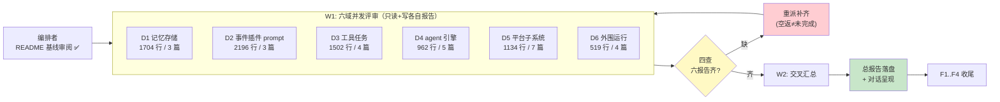
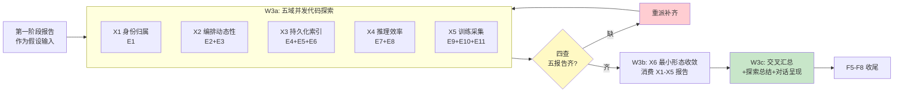
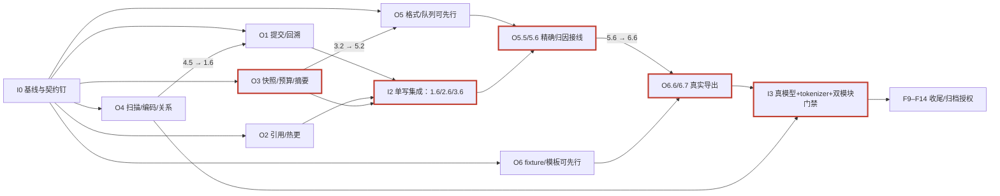

# Tasks: docs-objective-review

> 本文件为三阶段编排账：D1–D6文档评审、X1–X6代码探索为历史已执行记录；O1–O6第三阶段实施全部待执行，叶任务只在子变更tasks中维护。
> 当前启动门：用户后续apply才实施；当前仅修订计划。第三阶段以design.md D12–D20为准，旧P0/P1与“trace路线胜出”不构成实施决策。
> 波次仅为汇报分组；解锁以孙任务前置进入统一集成树并验证为准。历史W1/W2/W3不重编号，第三阶段使用I0–I3。

## 跟踪图

## 域清单（二级子变更，勾选框在编排者四查后更新）

- [x] 1. D1 记忆存储域评审 —— 验证：`test -f docs/.dev/20261007-wiki-review-D1-memory.md` 且六维锚点齐
  - [x] 1.1 通读 3 篇（memory-architecture / storage-durability-positioning / evaluation-suites），产出特性清单与架构评述章节
  - [x] 1.2 过度设计/缺陷设计/推理训练友好性分析章节
  - [x] 1.3 代码抽查 ≥2 断言（如 LSM L0-L3 分层、TTL 遗忘、票据召回零幻觉）+ 落盘完整报告
- [x] 2. D2 事件插件 prompt 域评审 —— 验证：`test -f docs/.dev/20261007-wiki-review-D2-event-plugin-prompt.md` 且六维锚点齐
  - [x] 2.1 通读 3 篇（event / plugin / prompt architecture），产出特性清单与架构评述章节
  - [x] 2.2 过度设计/缺陷设计/推理训练友好性分析章节
  - [x] 2.3 代码抽查 ≥2 断言（如事件元数据契约、时间线前缀单点、prompt 热重载）+ 落盘完整报告
- [x] 3. D3 工具任务域评审 —— 验证：`test -f docs/.dev/20261007-wiki-review-D3-tool-task.md` 且六维锚点齐
  - [x] 3.1 通读 4 篇（tool-architecture / tmux-action / task-lifecycle / compression-and-telemetry），产出特性清单与架构评述章节
  - [x] 3.2 过度设计/缺陷设计/推理训练友好性分析章节
  - [x] 3.3 代码抽查 ≥2 断言（如 tmux 会话重挂、任务看板重入、压缩前缀稳定）+ 落盘完整报告
- [x] 4. D4 agent 引擎域评审 —— 验证：`test -f docs/.dev/20261007-wiki-review-D4-agent-engine.md` 且六维锚点齐
  - [x] 4.1 通读 5 篇（agent-architecture / event-flow / execution-generations / governance-enforcement / prototype-skeleton），产出特性清单与架构评述章节
  - [x] 4.2 过度设计/缺陷设计/推理训练友好性分析章节
  - [x] 4.3 代码抽查 ≥2 断言（如 EventBus Pull 语义、turn 原语统一壳、冥想门控）+ 落盘完整报告
- [x] 5. D5 平台子系统域评审 —— 验证：`test -f docs/.dev/20261007-wiki-review-D5-platform.md` 且六维锚点齐
  - [x] 5.1 通读 7 篇（platform-subsystems / agent-behavior-matrix / org-hot-reload / resource-ownership / cognitive-asset-guard / reincarnation-notice / evolution-architecture）【P1 教训回写：自审补入】，产出特性清单与架构评述章节
  - [x] 5.2 过度设计/缺陷设计/推理训练友好性分析章节（重点：默认关闭子系统的维护成本账）
  - [x] 5.3 代码抽查 ≥2 断言（如候选事务热更、租约最后引用清理、漂移审计默认开）+ 落盘完整报告
- [x] 6. D6 外围运行域评审 —— 验证：`test -f docs/.dev/20261007-wiki-review-D6-runtime-periphery.md` 且六维锚点齐
  - [x] 6.1 通读 4 篇（rl-architecture / durable-delivery / wechat-bot-runtime / comment-gate-tooling），产出特性清单与架构评述章节
  - [x] 6.2 过度设计/缺陷设计/推理训练友好性分析章节（重点：RL 轨迹的 state/action/reward 完备性）
  - [x] 6.3 代码抽查 ≥2 断言（如 TrajectoryRecorder 字段、HTTPAPI fail-closed、端点 allowlist）+ 落盘完整报告

## 收尾（一级直管）

- [x] F1 契约零改动断言 —— 验证：`git status --porcelain -- '*.go' docs/wiki docs/api README.md README_EN.md openspec/specs examples` 输出为空
- [x] F2 总报告落盘 `docs/.dev/20261007-wiki-review-summary.md`，六域结论均被引用 —— 验证：`grep -c 'D[1-6]' 该文件 ≥ 6`
- [x] F3 对话呈现完整汇总（预期特性 / 架构 / 过度设计 / 缺陷设计 / 推理友好 / 训练友好）
- [x] F4 归档处置：**挂起不归档**——本 change 的 6 份 specs 为评审过程契约，非产品能力规格，`openspec archive` 会将其 delta 合入 `openspec/specs/` 污染主真源；且项目先例（LEDGER：tagent-deep-source-evaluation）评审产物不随 openspec 生命周期。保留本目录作为评审编排留档，产物在 docs/.dev/2026107-wiki-review-*.md（不随 git）。如需归档可手动清理 specs 后执行

---

# 第二阶段：代码探索（W3，2026-10-07 追加）

> 本节只编排；探索域契约见 `changes/X1..X6/` 四件套；权限与报告契约见一级 design.md D7-D11 与 orchestration spec。
> 启动门：无跨 change 依赖；上轮"暂不发起探索"约束解除时即可派发。
> 波次语义澄清：W3a/W3b 仅为汇报分组；X6 的解锁 = X1-X5 报告落盘且四查通过（孙任务级前置）。

## W3 跟踪图

## 探索域清单（勾选由编排者四查后更新）

- [x] 7. X1 身份与事实归属探索（E1）—— 验证：`test -f docs/.dev/20261007-code-exploration-X1-identity.md` 且假设核验表 ≥5 行
  - [x] 7.1 深读标识体系主路径（event/trace_id/turn/invocation/task_id/generation 在存储、路由、模型调用、训练记录中的贯穿），产出机制地图章节 —— 验证：报告含 ≥15 处 文件:符号 引用
  - [x] 7.2 核验第一阶段域内假设（trace_id 互链、轨迹无 event_key、到达序非确定、幽灵前驱）—— 验证：核验表 ≥5 行且每行有三元判定
  - [x] 7.3 运行现有只读验证命令（命令账入报告）并落盘完整报告 —— 验证：`test -f 报告 && grep -c '^## ' 报告 ≥ 7 && 命令账 ≥1 条`
- [x] 8. X2 编排动态性探索（E2+E3）—— 验证：`test -f docs/.dev/20261007-code-exploration-X2-orchestration.md` 且假设核验表 ≥5 行
  - [x] 8.1 深读 org 热更/候选事务/执行代际/任务域/结算路由主路径，产出机制地图章节 —— 验证：≥15 处 文件:符号 引用
  - [x] 8.2 核验假设（统一壳 loopSpec、共用候选事务）并补白队列背压/优先级/抢占现状（第一阶段未覆盖）—— 验证：核验表 ≥5 行
  - [x] 8.3 运行现有只读验证命令并落盘完整报告 —— 验证：同 7.3 形制
- [x] 9. X3 持久化与索引探索（E4+E5+E6）—— 验证：`test -f docs/.dev/20261007-code-exploration-X3-persistence-indexing.md` 且假设核验表 ≥5 行
  - [x] 9.1 深读写入路径/索引面/生命周期治理（含 tool-output 转储）主路径，产出机制地图章节 —— 验证：≥15 处 文件:符号 引用
  - [x] 9.2 核验假设（双生产者、锁内 marshal、QueryEvents 无 Metadata 过滤、转储无治理、TTL O(n)）—— 验证：核验表 ≥5 行
  - [x] 9.3 运行现有只读验证命令并落盘完整报告 —— 验证：同 7.3 形制
- [x] 10. X4 推理效率探索（E7+E8）—— 验证：`test -f docs/.dev/20261007-code-exploration-X4-inference-efficiency.md` 且假设核验表 ≥5 行
  - [x] 10.1 深读上下文装配链/预算模型/缓存稳定面/压缩-召回联合路径，产出机制地图章节 —— 验证：≥15 处 文件:符号 引用
  - [x] 10.2 核验假设（token 双常数与 ~15% 低估、schema 未入预算、面板缓存影响面、触发唯一性）—— 验证：核验表 ≥5 行
  - [x] 10.3 运行现有只读验证命令并落盘完整报告 —— 验证：同 7.3 形制
- [x] 11. X5 训练采集探索（E9+E10+E11）—— 验证：`test -f docs/.dev/20261007-code-exploration-X5-training-collection.md` 且假设核验表 ≥5 行
  - [x] 11.1 深读轨迹记录/反馈归因/转换器主路径，产出机制地图章节 —— 验证：≥15 处 文件:符号 引用
  - [x] 11.2 核验假设（TrajectoryRecord 字段、feedback 绑 event_key、三跳 join 中间键、无 chat template、ModelEndpoint 分布漂移）—— 验证：核验表 ≥5 行
  - [x] 11.3 运行现有只读验证命令并落盘完整报告 —— 验证：同 7.3 形制
- [x] 12. X6 最小形态与收敛探索（E12，前置：7-11 全部报告落盘且四查过）—— 验证：`test -f docs/.dev/20261007-code-exploration-X6-minimal-form.md`
  - [x] 12.1 深读全仓依赖图/config 默认值矩阵/消费者面，产出机制地图章节 —— 验证：≥15 处 文件:符号 引用
  - [x] 12.2 核验假设（五子系统量级与唯一消费者、wf.* 退役重力、stub/死枚举清单）并交叉消费 X1-X5 报告结论（冲突裁决候选登记）—— 验证：核验表 ≥5 行且引用 X1-X5 报告 ≥5 处
  - [x] 12.3 运行 go build/go vet 等只读验证（命令账入报告）并落盘完整报告 —— 验证：同 7.3 形制

## 收尾（第二阶段 F5-F8）

- [x] F5 契约零改动断言（同 F1 口径，含第二阶段）—— 验证：`git status --porcelain -- '*.go' docs/wiki docs/api README.md README_EN.md openspec/specs examples` 输出为空
- [x] F6 探索总结报告落盘 `docs/.dev/20261007-code-exploration-summary.md`（含：被推翻假设清单、E1-E12 逐项证据状态、下一步候选变更清单）—— 验证：`grep -c 'X[1-6]' 该文件 ≥ 6`
- [x] F7 对话呈现探索结论与下一步建议
- [x] F8 历史处置记录：前两阶段保留过程产物，未执行archive。归档纪律以第三阶段D20为准，不沿用F4中删除specs的错误建议。

---

## 13. 第三阶段启动门（I0，仅编排）

- [x] 13.1 核对实施授权、HEAD/用户diff、依赖版本、模型/tokenizer前置与资源等待表；不读取密钥内容 —— 验证：`git status --short`、`git rev-parse HEAD`、`go version`、`go mod verify`；资产检查结果记入run manifest。
- [x] 13.2 确認O1.1/O3.1/O4.1/O5.1/O6.1的证据计划和fixture一致，风险钉测先于相应实现；真实模型缺条件可先做独立域，不能放行F11 —— 验证：`openspec validate docs-objective-review --strict`；每个风险门有PASS/阻塞记录。

## 第三阶段依赖图

关键依赖链为O3快照→共享接线→O5归因→O6真实样本→F11。图中并行仅表示独占文件可并行，不允许同文件多写；资源独占见D15/D17。

## 14. 六域实施验收（每项8个叶任务）

- [x] 14.1 O1完成：`changes/O1-fact-consistency/`；集成前置O4.5；验收提交票据/因果域线性化/partial可见，不以一行改动代替全路径回归 —— 验证：O1 tasks八项及spec全部场景有真实退出码。
- [x] 14.2 O2完成：`changes/O2-runtime-coherence/`；配置驱动引用、在途/重入/回滚、restart_required到实际消费者 —— 验证：O2.1–O2.8；真实模型用例不可Skip。
- [x] 14.3 O3完成：`changes/O3-request-efficiency/`；3.2解锁O5.2，3.6解锁O5.5；完整请求输入及有界摘要，不新建第二裁剪层 —— 验证：O3.1–O3.8及请求基准。
- [x] 14.4 O4完成：`changes/O4-storage-efficiency/`；4.5解锁O1.6；定向扫描必交付，编码缓存按收益门保留/撤回 —— 验证：O4.1–O4.8、before/after各cell原始数据及语义对拍。
- [x] 14.5 O5完成：`changes/O5-capture-fidelity/`；5.5前置O1.6/O2.6/O3.6；5.6解锁O6.6 —— 验证：O5.1–O5.8、SDK保真/字节上界/缺失与封账。
- [ ] 14.6 O6完成：`changes/O6-training-export/`；纯转换可先行，6.6等待O5.6；交付离线SFT消费者而非训练权重 —— 验证：O6.1–O6.8、真实tokenizer/mask/会话分割/隐私与授权。

## 15. 共享集成（编排者唯一写）

- [x] 15.1 集成O1/O2/O3的root/config/context/metadata及对应测试、更新长期wiki锚点；禁止并行代理写共享文件 —— 验证：`go test -short -race . ./agent/... ./plugin ./event ./modelutil -count=1`。
- [x] 15.2 集成O5可选scope与O6只读导出，检查default-off/关闭/失败回退和独立bot模块 —— 验证：`go test -short ./rl ./tests -count=1`；bot模块`go test ./... -short -count=1`。
- [x] 15.3 核对每个源文件对应测试与下游消费方，逐场景重验并记录架构调整净减少的重复责任 —— 验证：`git diff --stat`、`go test . -short -run '^TestArch_' -count=1`；不以编译通过代替运行证据。

## 16. 第三阶段收尾（F9–F14）

- [x] F9 审核diff白名单与哲学护栏：其他仓库/磁盘格式/默认TTL/执行权限不变；架构新增无第二真源 —— 验证：`git diff --check`；`go test . -short -run '^TestArch_' -count=1`。
- [x] F10 双模块CI同口径门禁与race；保留历史失败并分类，不新增豁免 —— 验证：`go test ./... -short -count=1`、`GOMAXPROCS=1 go test . -short -count=1`、`bash scripts/lint.sh`；bot build/vet/short与D17隔离race全部完成。
- [ ] F11 本地真实模型四场景与真实tokenizer完整通过，不得SKIP/零调用/无样本 —— 验证：`TAGENT_REQUIRE_REAL_MODEL=1 go test ./tests -run '^TestRealModel_(RuntimeOverrides|RequestBudget|DecisionCapture|OfflineSFT)$' -count=1 -json`；`HF_HUB_OFFLINE=1 python3 scripts/verify_runtime_acceptance.py --run-dir "$TAGENT_ACCEPTANCE_DIR"`。
- [x] F12 汇总benchmark、失败回归、导出样本及接口兼容证据；README/wiki/API与配置、测试名称均一致 —— 验证：`bash scripts/lint.sh && bash scripts/check-openspec.sh`；O3/O4/O5基准结果能回到本次run原始数据。
- [x] F13 逐项核对E1–E12承载、六域DoD与用户收益，给出交付/未过/负结果，不写无依据总分 —— 验证：完成报告逐项链接实际命令、测试与run manifest；所有必需项通过才称第三阶段完成。
- [x] F14 用户批准后按D20无损提升O1–O6产品子变更并正常archive，更新父索引；未批准时明确待授权，不提前勾选 —— 验证：各产品change strict validate及归档前后`bash scripts/check-openspec.sh`；不使用skip-specs/no-validate。

> **D20 提升归档记录（2026-10-08 用户授权带警告归档）**：O1–O6 已 `mv` 无损提升为独立顶层 change，逐个 `openspec validate --strict` 通过后 `openspec archive --yes`（delta specs 正常 sync 进主 specs，未用 skip-specs/no-validate），映射：
> - O1-fact-consistency → `2026-10-08-optimize-committed-facts`（committed-event-attribution +3）
> - O2-runtime-coherence → `2026-10-08-align-runtime-overrides`（generation-bound-model-references +4）
> - O3-request-efficiency → `2026-10-08-budget-full-model-requests`（request-budget-accounting +4）
> - O4-storage-efficiency → `2026-10-08-optimize-partition-storage`（partition-local-storage-access +5）
> - O5-capture-fidelity → `2026-10-08-capture-decision-snapshots`（decision-capture +5）
> - O6-training-export → `2026-10-08-export-offline-sft`（offline-training-export +5；6.7 真实 tokenizer 消费验收保持未勾，随用户“资产后补”裁定）
>
> 本过程 change 保留 D*/X* 评审·探索审计记录后归档。F11 与 14.6 的 tokenizer 部分如实保留未勾——缺真实 tokenizer 资产不得伪勾/假通过。

> 编排者核销：13.1=HEAD 57ed0a8/go1.24.1 toolchain/mod verify ok/全量 short 绿/资产探测（ZAI key 在位、端点走仓库测试配置、tokenizer 缺失登记为 F11 阻塞）；等待表=W4 释放后消费 F10/F11/F12。13.2=O5.1 风险钉测 PASS、O1/O3/O6 证据计划与 fixture 核对一致，O4.1 bench 基线延 W4。

> 编排者核销（W4 终局）：14.1/14.2/14.4/14.5=各域 8/8 全绿（4.7 含撤回裁决）；15.x=共享面单写集成+全量复跑；F9=diff 白名单核对（52 文件，全部落于派发令白名单并集；TestArch_* 绿）；F10=go test ./... -short 0、GOMAXPROCS=1 root 0、bot 三门 0、race 全门 0 RACE 0 WAIVED（撤回后 memory 定向 race 复跑绿，全量 race 未再重复——撤回仅动单文件编码路径，无新并发面，如实注记）；F12=lint 0+check-openspec 0+bench/acceptance 原始数据在 /tmp/tagent-w4。未勾项：14.3（3.7 的 BenchmarkRequestAssembly 未建）、14.6（6.6/6.7 依赖真实 tokenizer 资产）、F11（dataset 三项待资产）、F13（随本报告完成）、F14（归档待用户授权）。

> 编排者核销：O3 域 8/8（3.7 经补测闭合）。
