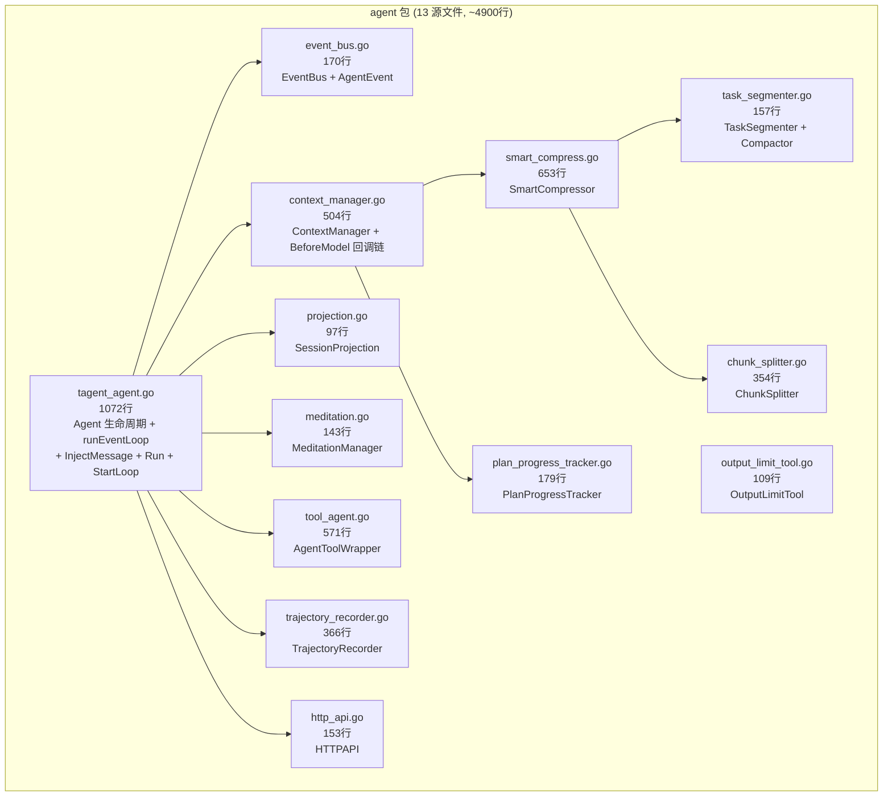
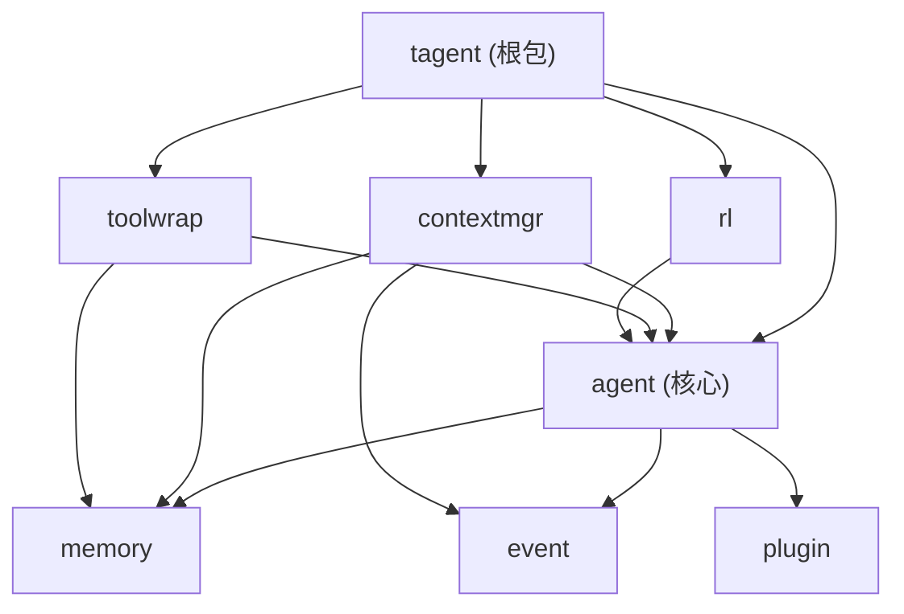

## Context

### 当前包结构概览

| 包 | 源文件数 | 代码行数 | 职责 |
|------|---------|---------|------|
| `.` (根包) | 5 | 1522 | 组合根：tagent.go + config + builtin + registry + testing |
| `agent` | 13 | 4528 | 核心：事件循环 + 上下文管理 + 工具包装 + RL + 冥想 |
| `memory` | 10 | 3871 | 存储：FileSegmentStore + InMemoryStore + compaction |
| `event` | 1 | 249 | 事件类型定义 |
| `plugin` | 2 | 310 | MemoryPlugin + SummaryPlugin |
| `prompt` | 1 | 288 | Prompt 加载 |
| `prototype` | 1 | 215 | 原型参考 |
| `testutil` | 1 | 93 | 测试辅助 |
| `tool` | 1 | 32 | SkillRepository 接口 |
| `tool/action` | 4 | 1501 | exec + tmux |
| `tool/*` (4个) | 7 | 2056 | file/knowledge/recall/draw/speak |

当前共 16 个包目录。agent 包 4528 行明显过大，但新增 3 个包会让总数到 19，过于碎片化。

### 拆分策略：最小化新增包数

只拆出职责最独立、行数最大的 `contextmgr`（上下文管理 ~1850 行），将 toolwrap（680 行）和 rl（520 行）留在 agent 包内。理由：

- `contextmgr` 与 agent 核心耦合度最低——它通过 `ContextManagerConfig` 接收依赖，不直接访问 `TagentAgent` 私有字段
- `toolwrap` 的 `AgentToolWrapper` 需要访问 `SessionProjection`（agent 包导出类型），留在 agent 包内更自然
- `rl` 的 `TrajectoryRecorder` 和 `HTTPAPI` 只被 example 和根包使用，且需要 `TagentAgent` 引用，留在 agent 包内避免循环依赖

拆分后 agent 包 ~2680 行，contextmgr 包 ~1850 行，新增仅 1 个包，总包数 17。

### agent 包内部分组

```
agent/
  tagent_agent.go     (1072行) — 核心：生命周期 + 事件循环 + 配置
  event_bus.go         (170行) — EventBus + AgentEvent
  projection.go         (97行) — SessionProjection
  meditation.go         (143行) — MeditationManager
  tool_agent.go         (571行) — AgentToolWrapper（工具包装）
  output_limit_tool.go  (109行) — OutputLimitTool（输出截断）
  trajectory_recorder.go(366行) — TrajectoryRecorder（RL 集成）
  http_api.go           (153行) — HTTPAPI（RL 集成）
```

### contextmgr 包内容

```
contextmgr/
  context_manager.go       (504行) — ContextManager + BeforeModel 回调链
  smart_compress.go        (653行) — SmartCompressor
  task_segmenter.go        (157行) — TaskSegmenter
  compactor.go              (新)  — Compactor（从 task_segmenter 拆出）
  chunk_splitter.go        (354行) — ChunkSplitter
  plan_progress_tracker.go (179行) — PlanProgressTracker
```

### 原型映射

```
prototype eventBus      → agent.EventBus
prototype DefaultRun    → agent.TagentAgent
prototype OnEvents      → contextmgr.ContextManager
prototype Compact       → contextmgr.SmartCompressor
prototype tools[...]    → agent.AgentToolWrapper（留在 agent 包）
```

## Goals / Non-Goals

**Goals:**
- 新增 1 个包 `contextmgr`，封装所有上下文管理组件（~1850 行）
- agent 包精简至 ~2680 行，保留核心 + 工具包装 + RL 集成
- 每个包可独立编译、独立测试

**Non-Goals:**
- 不拆分 toolwrap 或 rl 为独立包（避免包数量膨胀）
- 不改变任何运行时行为
- 不修改 memory / event / plugin / prompt 包
- 不修改 tool/ 子包结构

## Decisions

### Decision 1: 只新增 contextmgr 包，不新增 toolwrap 和 rl

**选择**: 只将上下文管理组件（ContextManager、SmartCompressor、TaskSegmenter、Compactor、ChunkSplitter、PlanProgressTracker）移到新 `contextmgr` 包。工具包装和 RL 集成留在 agent 包。

**理由**: 最小化包数量。contextmgr 是 agent 包中最大的独立职责块（~1850 行），且与 agent 核心的耦合度最低（通过 Config 注入）。toolwrap 和 rl 分别只有 680 和 520 行，留在 agent 包可接受。

### Decision 2: contextmgr 通过 ContextManagerConfig 注入依赖

**选择**: `contextmgr.ContextManager` 通过 `ContextManagerConfig` 接收 `EventBus`、`SessionProjection`、`MemStore` 等依赖。`newContextManagerFromConfig` 留在 agent 包（它组装 agent + contextmgr）。

**理由**: 避免导出 TagentAgent 的私有字段。ContextManager 已经通过 Config 接收依赖，保持现有模式。

### Decision 3: Compactor 从 task_segmenter.go 拆出

**选择**: 将 `Compactor` 类型和方法从 `task_segmenter.go` 移到独立的 `compactor.go`，两者都在 contextmgr 包。

**理由**: 职责清晰——TaskSegmenter 是分析工具，Compactor 是变换工具。

## Risks / Trade-offs

| 风险 | 缓解 |
|------|------|
| import 路径变更 | 逐文件修改，每步 `go build` 验证 |
| 漏导出符号 | contextmgr 中跨包引用的符号都已导出，编译错误会立即暴露 |
| 测试跨包访问 | 测试文件随源文件移动到 contextmgr 包 |
| agent 包仍偏大 | 可接受——内部组件各自独立，后续如有需要可进一步拆分 |
## Context

### 当前 agent 包的职责和依赖关系



### 跨文件私有字段访问分析

`TagentAgent` 的私有字段被其他文件直接访问的情况：

| 字段 | 访问者 | 当前可见性 | 拆分后方案 |
|------|--------|-----------|-----------|
| `persistentBus` | `InjectMessage`, `Run`, `StartLoop` | 同包私有 | 留在 agent 包，不跨包 |
| `activeBus` | `setActiveBus`, `restorePersistentBus` | 同包私有 | 留在 agent 包 |
| `contextManager` | `Run`, `StartLoop` | 同包私有 | 留在 agent 包 |
| `projection` | `SetToolParentProjection`, `makeOnEventCallback` | 同包私有 | 留在 agent 包 |
| `config` | `Run`, `newContextManagerFromConfig` | 同包私有 | 留在 agent 包 |

**关键发现**：`TagentAgent` 的私有字段只被 `tagent_agent.go` 自身和同包的 `context_manager.go` 访问。拆分后 `context_manager.go` 移到 `contextmgr` 包，需要通过参数传递而非直接访问。

### 原型映射

```
prototype eventBus          → agent.EventBus          (agent 包)
prototype DefaultRun        → agent.TagentAgent       (agent 包)
prototype OnEvents           → contextmgr.ContextManager  (contextmgr 包)
prototype Compact            → contextmgr.SmartCompressor (contextmgr 包)
prototype tools["model"]    → framework LLM             (外部)
prototype tools[...]         → toolwrap.AgentToolWrapper (toolwrap 包)
```

## Goals / Non-Goals

**Goals:**
- agent 包精简为核心事件循环（~1480 行：tagent_agent + event_bus + projection + meditation）
- contextmgr 包封装所有上下文管理（~1850 行：context_manager + smart_compress + task_segmenter + chunk_splitter + plan_progress_tracker）
- toolwrap 包封装工具包装（~680 行：tool_agent + output_limit_tool）
- rl 包封装 RL 集成（~520 行：trajectory_recorder + http_api）
- 每个包可独立编译、独立测试

**Non-Goals:**
- 不改变任何运行时行为（纯结构重构）
- 不修改 memory / event / plugin 包（它们已经职责清晰）
- 不引入新接口或抽象（只移动文件 + 导出符号）
- 不修改 openspec / docs 目录结构

## Decisions

### Decision 1: contextmgr 通过构造注入而非接口访问 TagentAgent

**选择**: `contextmgr.ContextManager` 不直接访问 `agent.TagentAgent` 的私有字段。通过 `ContextManagerConfig` 传入所需的 `EventBus`、`SessionProjection`、`MemStore` 等依赖。`newContextManagerFromConfig` 留在 `agent` 包中（它组装两者）。

**理由**: 避免导出 `TagentAgent` 的私有字段。`ContextManager` 已经通过 `ContextManagerConfig` 接收依赖，只需保持这个模式。

### Decision 2: toolwrap 通过 SessionProjection 接口访问投影

**选择**: `toolwrap.AgentToolWrapper` 当前直接访问 `agent.SessionProjection`（已导出）。拆分后 `SessionProjection` 留在 `agent` 包，`toolwrap` 包 import `agent` 包使用它。

**理由**: `SessionProjection` 已经全部导出（`Append`、`GetAll`、`Replace`、`Len`），无需修改。

### Decision 3: Compactor 从 task_segmenter.go 中拆出

**选择**: 当前 `task_segmenter.go` 包含 `TaskSegmenter`（分段）和 `Compactor`（折叠）两个独立组件。拆分时将 `Compactor` 移到独立的 `compactor.go` 文件，两者都在 `contextmgr` 包。

**理由**: 职责清晰——`TaskSegmenter` 是分析工具，`Compactor` 是变换工具。

### Decision 4: rl 包可选，通过 Option 注入

**选择**: `rl.TrajectoryRecorder` 和 `rl.HTTPAPI` 移到 `rl` 包。`tagent.go` 的 `New()` 通过 `agent.WithTrajectoryRecorder` option 注入。`HTTPAPI` 由 `examples/wechat-bot/main.go` 直接 import `rl` 包使用。

**理由**: RL 集成是可选功能，不应在 agent 核心包中。

### Decision 5: 依赖方向



**关键约束**: `contextmgr` import `agent`（使用 EventBus、SessionProjection、EventReference）。`toolwrap` import `agent`（使用 SessionProjection、TagentAgent）。`rl` import `agent`（使用 TagentAgent）。无循环依赖。

## Risks / Trade-offs

| 风险 | 缓解 |
|------|------|
| 大量 import 路径变更 | 使用 `goimports` 或 `sed` 批量替换 |
| 漏导出符号导致编译失败 | 逐步拆分，每个包拆出后立即 `go build` 验证 |
| 测试跨包访问私有函数 | 测试文件随源文件移动到对应包 |
| `newContextManagerFromConfig` 引用 `FrameworkPrompt` | `FrameworkPrompt` 留在 agent 包导出 |
