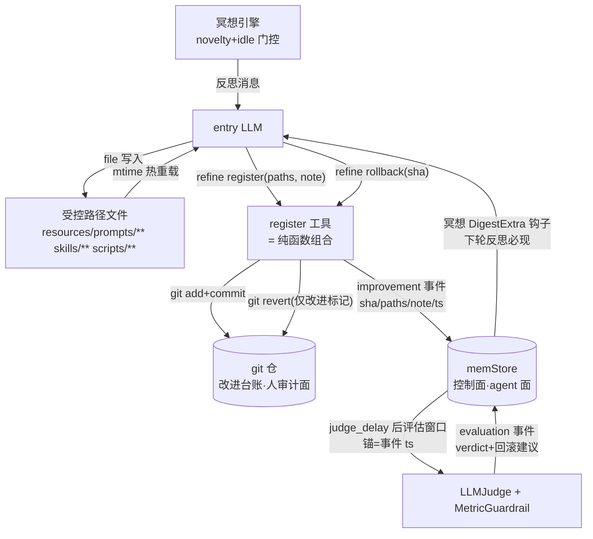

# Design: self-evolution-git-native

## 0. 哲学四原则(一切设计的裁判标准)

| # | 原则 | 推论 |
|---|---|---|
| P1 | 默认 agent 自迭代 | 治理门控全部可配置且默认宽松;无强制人工审批道 |
| P2 | 变更默认生效 | 文件即真源(mtime 热重载);无「提案→审批→激活」时序 |
| P3 | 版本管理复用 git | 不自建快照/版本库;commit/revert/log 即留痕/回滚/台账 |
| P4 | 信号建议式 | 框架出信号(guardrail/judge/触发 hint),执行权永远在 agent |

任何组件若同时违反两条以上,即冗余设计,删除(bundle 体系即按此裁决)。

## 1. 目标架构



要点(2026-09-07 优雅化修订,三处降维):
- **零新缝**:劣化结论与回滚建议写 evaluation 事件(而非消息注入)——渗透走既有事件消费面(冥想 DigestExtra 钩子/召回),evolution↛agent 依赖红线天然满足(K1 消解);
- **事件即窗口**:improvement 事件(Content={sha,ts,paths,note})就是窗口表——`Since(sha)`=事件时间戳查询,证据源本会查事件,无 WindowTracker 组件(K8 一并消解:事件=持久层);
- **纯函数而非组件**:git 操作是无状态纯包装(AddCommit/LogFiltered/RevertSafe,约 60 行),register 工具组合它们+写事件——能力=函数组合,无新子系统;
- **写入与登记解耦**:file 工具直接写(P2),`refine register` 是显式登记动作——登记不是生效前提,是**评估与回滚保护的前提**(未登记改进=无窗口、不可安全 rollback,status 可见);
- **框架不动手**:评估结论只落事件,P4 建议式——执行权永远在 agent;
- **双轨台账**:git log(人用审计)+ 事件(agent recall/join)——improvement/evaluation 事件是控制面。

## 2. 组件设计

### 2.1 evolution 包重构(文件级)

| 文件 | 处置 |
|---|---|
| `bundle.go`/`bundle_test.go` | **删除**(Bundle/BundleStore/InitBaseline) |
| `source.go` | **删除**(VersionedSource/BundleProvider——遮蔽层) |
| `release.go` | **删除状态机**(Lane/Stage/Submit/approve/ProtectedPrompts/预算 Gate)与 ActivationLog(窗口改由 improvement 事件承载,见 2.3) |
| `judge.go`/`eval.go`/`source(证据)` | **保留**;锚点改造(2.3) |
| `gitrefine.go`(新) | **纯函数集(无状态)**:AddCommit/LogFiltered/RevertSafe(git exec 包装+标记校验,约 60 行) |
| `refine.go` | **重写**:三操作工具面(2.2),组合纯函数+事件写入 |

### 2.2 refine 工具重定义

```go
// op 白名单:register / status / rollback(diff 删除——exec git diff 可达)
// register: paths(受控路径内)+ note(痛点→产物→预期收益)
//   → git add <paths> && git commit -m "[self-improve] <note>"   (结构化标记,可过滤)
//   → 写 improvement 事件 {sha, paths, note, ts}  ——事件即窗口(开评估锚点)
//   → 返回 {sha, 提示:评估窗口已开,劣化结论将在下轮反思 digest 呈现}
// status: 改进历史(git log --grep='^\[self-improve\]')+ 各窗口评估结论(事件 join)
// rollback: sha → 校验该 commit 带改进标记 → git revert --no-edit <sha>
//   (防误 revert 用户提交;冲突时返回冲突信息由 agent 处理,失败以 result 渗透)
```

- **受控路径校验**:`register` 的 paths 必须全部落在 `evolution.protected_paths`(默认 `resources/prompts/**`,`skills/**`,`scripts/**`)内;越界路径拒绝并列出受控清单(以 result 渗透)。
- **git 不可用降级**:运行目录非 git 仓(或 git 命令失败)→ register 返回明确错误「改进登记需 git 仓」+ 建议;evolution 启用时启动自检并 Warn 日志(闸不是墙:非 git 仓下冥想仍可改文件生效,只是无留痕/评估,如实呈现)。
- **nil 治理**:evolution 关时不注册工具(现状不变)。

### 2.3 评估锚点与建议式信号(优雅化后)

- **窗口=improvement 事件**:register 写事件(Content={sha, ts, paths, note})即开窗口;`Since(sha)`=查该事件时间戳——证据源(StoreEvidenceSource)本会查事件,零新组件;W4 语义(窗口从变更生效点起算)完整迁移,锚从 bundle 激活时刻→事件 ts(=commit 时刻)。
- **判定输出=evaluation 事件**:guardrail Breach/judge 劣化 → 写 governance evaluation 事件(Content={sha, verdict, reason, samples, 建议文案=`refine rollback <sha>`+「先 diff」引导})——**不注入消息、不执行 git**。渗透走既有面:冥想 DigestExtra 钩子(评估结论在下轮反思 digest 必现)+recall 可查。
- **评估触发**:register 后 `judge_delay` 到期执行一次(goroutine 定时,复用 canary_hold 语义);无窗口不评估;结论四态(健康/劣化/样本不足/未到期)。

### 2.4 feedback 章迁移(8.4 语义保持)

- `MetaKeyBundleID` 复用为「改进版本章」:persistBusEvent 盖章函数 `bundleIDFn` 的来源从 active bundle → **最新 improvement 事件的 sha**(无事件=不盖章,退化为时间窗 join——与现状无 active bundle 时一致)。
- `BindFeedback` 继承逻辑零改动(继承 parent 章的机制与键名不变)。

### 2.5 配置重构(`evolution:` 段)

```yaml
evolution:
  enabled: true
  protected_paths: ["resources/prompts/**", "skills/**"]   # register 受控清单(可扩)
  judge_min_samples / judge_pass_threshold / judge_timeout_seconds  # 保留
  guardrail: {max_denial_rate, max_critical_rate, max_neg_fb_rate}  # 保留(判据,输出改建议式)
  judge_delay: 30m                                            # 评估窗口延迟(原 canary_hold 语义)
```

## 3. 冥想 prompt 改写要点(resources/prompts/meditation.md)

- §3.3 「修改 prompt」路径**保留直改文件**(确认为正确机制),删除「记录 prompt 补丁建议留给后续」的旧话术(有登记通道了);
- 新增产物纪律(§3 末):「**每个产物落盘后立即调 `refine register`**(paths=产物路径,note=痛点→产物→预期收益)——未登记的改进没有评估保护,也无法安全回滚」;
- §4 验证闭环:adoption 核查改用 `refine status`(替代「下轮冥想人工翻产物」);
- 开头「优化产物的三种途径」补第四句:产物登记属于通道纪律(refine register),与三种途径正交。

## 4. 退役面与兼容

- **删除清单**:bundle.go/source.go/release.go 状态机+全部测试;refine propose/diff;tagent.go 的 VersionedSource 装配/InitBaseline/N1 seed/BindPosterior 接线(评估改由 register 后的 judge_delay 定时触发,窗口=improvement 事件);config 发布道字段。
- **既有 bundle 存档**:不做自动迁移(默认关的功能,无生产迁移压力);README 迁移注记一行(历史 bundle JSON 为只读存档)。
- **roadmap 联动**:D4 replay/shadow 门 → git worktree 双版本对照(设计挂 P2 重启时);D5 发布道条目 → 本变更替代;§5A 相关裁定行由本变更 proposal 引用修订。

## 5. 风险与对策

| 风险 | 对策 |
|---|---|
| LLM 漏 register → 无评估窗口 | 冥想 prompt 纪律+register 返回提示;status 可见「未登记产物」(受控路径 mtime > 最后登记 时间的文件列表)——软提醒不强制 |
| git revert 冲突(后续改进叠在其上) | rollback 返回冲突详情,由 agent 决定(跳过/手工处理)——建议式哲学一致 |
| 运行目录非 git 仓 | 启动自检 Warn;register 明确报错;改文件仍生效(如实降级) |
| judge 误判引发回滚风暴 | 全建议式(裁决已定)——agent 收到建议后自行判断;渗透消息含「如无把握可先 diff 再决定」引导 |
| commit 混入用户工作区改动 | register 只 add 显式传入的受控路径文件(不 `git add -A`);commit 仅含产物 |


## 7. 实现细节与坑预判(2026-09-07 细化会话)

### 7.1 依赖方向红线(最易踩)

| 约束 | 说明 | 实现要点 |
|---|---|---|
| evolution ↛ agent | agent→evolution 已存在(tagent.go 装配);反向 import 即环 | **优雅化后天然满足(零缝)**:劣化结论/回滚建议写 evaluation 事件,渗透走冥想 DigestExtra 既有钩子——无 injectFn 回调缝 |
| evolution ↛ governance | governance 是运行时闸,evolution 不依赖(现状 eval.go 已声明) | improvement/evaluation 事件**仿 memory/feedback.go 模式**:evolution 直接构造 FullEvent(TypeGovernance+Metadata subtype)+StoreEvent(Snowflake key 自生成),不经 GoalRegistry 私有通道 |

### 7.2 git 执行环境

- **身份**:AddCommit/RevertSafe 统一 `git -c user.email=tagent@local -c user.name=tagent`——不依赖全局 git config(CI/容器裸环境 commit 失败的第一坑,生产同样受益)。
- **开发仓污染**:examples/wechat-bot 运行 cwd=tagent 源码仓——register 会把产物 commit 进源码仓(污染开发者工作区/触发 pre-commit)。**边界声明而非机制**:README 注明「生产部署=独立 clone 的部署仓,运行目录即部署仓;开发仓内跑 bot 建议关 evolution」。
- **revert commit 误列**:revert 生成 `Revert "[self-improve] ..."`——改进过滤用行首锚定 `--grep='^\[self-improve\]'` 天然排除;status 需识别「已回滚」状态(Revert commit 的引用)。
- **路径三态归一**:LLM 传 paths 可能绝对/相对 cwd/相对 workspace——**统一相对运行 cwd 归一**(filepath.Rel+Clean)后做 glob 匹配与 git add;测试覆盖三态。

### 7.3 评估生命周期

- **goroutine 管理**:judge_delay 定时器挂 TagentAgent 生命周期(Stop 清理,waitgroup 收敛);多窗口并发评估→judge 并发调 model(trpc model 线程安全),评估中断=窗口无结论(如实降级,不重试)。
- **结论四态**:健康/劣化/**样本不足**/未到期——judge_delay=0 时窗口开启即评估、feedback 样本 0,必须显示「样本不足」而非冒充健康(W4 同族教训)。
- **结论持久化**:结论即 evaluation 事件(优雅化后本就落事件)——重启后 status 走事件 join;事件缺失降级为 git log 无结论列。**K8 已消解**。

### 7.4 迁移与流程

- **ActivationLog 删除(优雅化)**:不再改名——窗口由 improvement 事件承载,ActivationLog 与其 setter/mock 随状态机一并删除;EvidenceSource 锚点查询改为按事件 ts。
- **MetaKeyBundleID 键名保留、值域变更为 sha**——消费方 6 文件(feedback/context_manager/eval/metadata+2 测试);eval_bundle_join_test 改锚,InheritsBundleID 保持绿(8.4 机制不变)。
- **protected_paths 默认必含 `scripts/**`**:冥想产物途径一(脚本)不落默认受控清单则该途径断链。
- **执行顺序**:design-report-closeout 仍 in-progress——**先 archive 它,再 apply 本变更**(避免两变更 tasks 交叉;本变更对其交付面的改造属方向演进,非缺陷)。
- **执行纪律**(六轮 review 固化教训):python 批量替换必须 assert 锚点;新 Write 文件检查重复 package 行;修改后单独重跑 build(并行工具时序假错);GetEvents 用 SnowflakeEventKey;测试白盒不 import 子包。

### 7.5 坑风险总表

| # | 坑 | 级别 | 避坑动作 |
|---|---|---|---|
| ~~K1~~ | ~~evolution→agent 反向依赖成环~~ | **已消解** | 优雅化:建议信号事件化,零缝(7.1) |
| K2 | 开发仓被 bot 的改进 commit 污染 | 高 | 边界声明+README(7.2) |
| K3 | 裸环境 git 身份缺失 | 高 | 每命令 `-c user.*`(7.2) |
| K4 | 评估 goroutine 泄漏/并发 | 高 | 生命周期挂载+waitgroup(7.3) |
| K5 | revert commit 误列为改进 | 中 | 行首锚定 grep(7.2) |
| K6 | 路径三态匹配失败 | 中 | cwd 归一(7.2) |
| K7 | 样本不足冒充健康 | 中 | 结论四态(7.3) |
| ~~K8~~ | ~~窗口结论重启丢失~~ | **已消解** | 优雅化:事件即持久层(7.3) |
| K9 | improvement 事件依赖 governance 包 | 中 | feedback.go 模式直写(7.1) |
| K10 | join 测试改锚遗漏 | 中 | 7.4 测试清单 |
| K11 | ActivationLog 改名破 mock/调用点 | 低 | **优雅化后改名波及消失**(ActivationLog 直接删除,窗口=事件);仅 EvidenceSource 锚点查询改造 |
| K12 | classifier 规则动词过期 | 低 | 3.2 核对 |
| K13 | 两变更 tasks 交叉 | 低 | 先 archive 再 apply(7.4) |
| K14 | scripts/ 不在默认受控清单 | 低 | 默认三目录(7.4) |

### 7.6 优雅化二次细化(2026-09-07 复核,现状已验证)

**S1 · 渗透面 edge(诚实登记)**:DigestExtra 仅在冥想消息构建时渲染(meditation.go L284,已验)——**高交互期(无 idle)建议不呈现**,直到下一次冥想。缓解三层:① `refine status` 主动可查(工具面随时)② idle 终会到来(建议 eventual)③ 若未来需即时性,**装配层(root 包)天然可桥接 agent×evolution**(tagent.go 已 import 两者)——构造时把 agent 方法作为回调传入不违反依赖红线;记为 future option,当前按裁决走事件化。

**S2 · 版本章缓存的实现边界**(bundleIDFn,context_manager L67 已验签名不变):函数体来源=「最新 improvement 事件 sha」——**内存缓存+原子更新**(register 成功后写 atomic.Value;persistBusEvent 读缓存 O(1),不逐事件查询);**重启惰性恢复**:首次盖章前查一次(QueryOptions EventTypes=[governance]+时间倒序+Content 解码取最新 improvement,查不到=不盖章)。缓存是性能层非真源——真源=事件(优雅化原则不破)。竞态测试入 4.4(-race)。

**S3 · 装配时序与构造单元**:judge/guardrail/evSrc 从 BindPosterior(需 memStore 就绪,现状时序)迁移到 register 工具构造——**同一点位换接线**;建议单一构造单元 `NewGitEvolution(store, model, cfg) → (tool, lifecycle)`,装配层不散落三者;评估 goroutine 的 {sha, ts} 由 register 闭包快照携带(**零查询**——不必从事件反查锚点)。

**S4 · status 的 join 实现**:QueryOptions 无 Metadata/subtype 过滤(已验 L128-138)——评估结论 join=「拉最近 N 条 governance 事件(EventTypes 过滤)+Content 解码」;改进频率=冥想频率(量级低),可行;可选优化:EventSummary 编码 sha 前缀(`[eval:sha8]`)做粗筛。不为此扩 QueryOptions(避免查询面为单消费方加字段)。

## 6. 决策记录(探索会话已裁)

| 决策 | 裁定 | 时间 |
|---|---|---|
| bundle 处置 | c1 退役(不留双后端开关)——「大刀阔斧,不留冗余」 | 2026-09-07 |
| git 留痕责任 | LLM 显式登记(refine register) | 2026-09-07 |
| 回滚触发 | 全部建议式(含硬指标劣化) | 2026-09-07 |
| 改进台账双轨 | git log(人审计)+ improvement/evaluation 事件(agent recall/join,控制面) | 2026-09-07 |
| feedback 章 | 复用 MetaKeyBundleID,语义改为最新 improvement 事件 sha | 2026-09-07 |
| **优雅化三降维** | 建议信号事件化(消 injectFn 缝/K1)+ 窗口=improvement 事件(消 WindowTracker/K8)+ git 操作纯函数化(无新组件)——渗透走冥想 DigestExtra 既有钩子,建议延迟到反思点与建议式节奏自洽 | 2026-09-07 |

