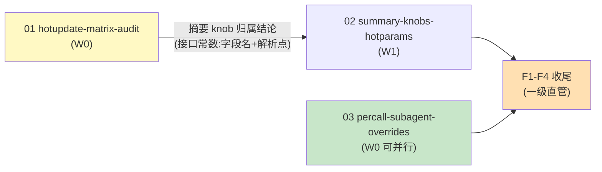

# Tasks（一级：只编排）

> 本文件只做编排与收尾；实现任务全部在二级 `changes/<NN-domain>/tasks.md`。
> **启动门**：域 02 实现类孙任务须等域 01 归属结论入 main（见 specs/orchestration）。
> **波次语义**：W 标签仅为汇报分组；解锁=依赖入 main，非整波等待——域 03 无依赖可立即开工。

## 二级子变更清单

- [ ] **01 hotupdate-matrix-audit**（W0，关键路径）：维度×通道×消费点×证据矩阵；假热更红线契约测；摘要 knob 归属实证 → 见 `changes/01-hotupdate-matrix-audit/tasks.md`
- [ ] **02 summary-knobs-hotparams**（W1，启动门=01 结论入 main）：OrgHotParams 扩摘要 knob + SmartCompressor 契约扩 + 消费点契约测 → 见 `changes/02-summary-knobs-hotparams/tasks.md`
- [ ] **03 percall-subagent-overrides**（W0 可并行）：三层解析覆盖栈 + 最大工具域 + Declarative 冻结 + 防泄漏 → 见 `changes/03-percall-subagent-overrides/tasks.md`

## F 收尾（一级直管）

- [ ] F1 三禁区零改动断言：`git diff <基线>..HEAD -- agent/org/fingerprint.go` 为空；恒装源与提交点零写入语义以代码检视+域内测试双证 —— 验证：`git diff $(git merge-base <基线> HEAD)..HEAD -- agent/org/fingerprint.go | wc -l` 输出 0
- [ ] F2 全量门禁：`bash scripts/lint.sh`；`go test ./... -short -count=1`；`go test -race . ./agent -count=1`；`openspec validate --specs --strict`；CI 四 job 绿 —— 验证：各命令 exit 0
- [ ] F3 DoD 逐项核验记入档（本文件勾选 + 各二级 tasks 勾选真实性四查：勾选/产物/数字/遗漏） —— 验证：grep 无 `- [ ]` 残留于三二级 tasks
- [ ] F4 openspec archive + 导览（域 → 证据链接矩阵入执行日志） —— 验证：`openspec list --json` 为空
