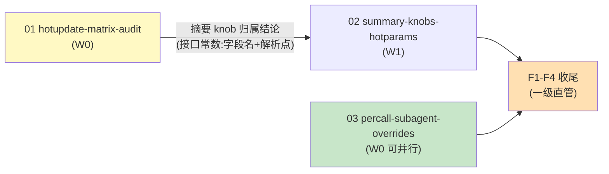

# Tasks（一级：只编排）

> 本文件只做编排与收尾；实现任务全部在二级 `changes/<NN-domain>/tasks.md`。
> **启动门**：域 02 实现类孙任务须等域 01 归属结论入 main（见 specs/orchestration）。
> **波次语义**：W 标签仅为汇报分组；解锁=依赖入 main，非整波等待——域 03 无依赖可立即开工。

## 二级子变更清单

- [x] **01 hotupdate-matrix-audit**（W0，关键路径）：6/6 完成 —— 矩阵 62 行（`changes/01-.../matrix.md`，每行带行号/测试名）；FP 面 9 顶层+30 子测、SRC 面 keepRecent 行为针补齐；**摘要改判 FP 面已热**（情报 C3 采纳，见一级 design D1b）；跨域情报 C1（FILE 第三通道）已回写 spec
- [ ] **02 summary-knobs-hotparams**（性质已变，**待用户裁决去留**）：域 01 实证摘要 knob 在 FP 面＝**已热（代际粒度）**，本域从"补真缺口"降级为"粒度下移可选增强"（下一次摘要动作即生效）；接口常数已备（矩阵：`SummaryMaxTokens`/`tagent.go:397-429`/`HotNumbers`+`liveNums`/消费点 `effectiveSummaryMaxTokens:408`，另须处置 C2 `recent_full_count`）→ 见 `changes/02-summary-knobs-hotparams/tasks.md`
- [x] **03 percall-subagent-overrides**（W0）：3.1–3.7 完成 —— fail-before 双红（行为红非编译红）转绿 8 测；四参数经真实委派路径；覆盖挂 invocation 结构性防泄漏；`Declarative.Overrides` 冻结+重放；3.7 系 R8/R9 情报回写（跨重启重投递透传，编排者越域修 `RedispatchAsync`/`SubagentRedispatcher`/`SubagentSpecFromDeclarative`）。注：域内 tasks 尾部曾被 IDE 写入缺陷截断，已按编排者复验证据重建

## 波次执行注记（W0）

- 并发纪律生效：两 agent 白名单零交集、git 权限归编排者；四查抓出域 03 tasks 尾部丢失与域 01 快照期 policy 快照失真（03 后续自修），编排者复跑定谳。
- 环境级发现（如实入档）：本工作区 IDE 写入工具对多个文件出现"保存失败实为已写入"/"延迟回写覆盖后改内容"，致体内注释复活与文件尾残段；全部以锚点计数复核 + `gofmt -e` 语法核查 + 全量复跑收敛。**教训：本仓并发期以磁盘真相为准，凡改必复核。**

## F 收尾（一级直管）

- [ ] F1 三禁区零改动断言：`git diff <基线>..HEAD -- agent/org/fingerprint.go` 为空；恒装源与提交点零写入语义以代码检视+域内测试双证 —— 验证：`git diff $(git merge-base <基线> HEAD)..HEAD -- agent/org/fingerprint.go | wc -l` 输出 0
- [ ] F2 全量门禁：`bash scripts/lint.sh`；`go test ./... -short -count=1`；`go test -race . ./agent -count=1`；`openspec validate --specs --strict`；CI 四 job 绿 —— 验证：各命令 exit 0
- [ ] F3 DoD 逐项核验记入档（本文件勾选 + 各二级 tasks 勾选真实性四查：勾选/产物/数字/遗漏） —— 验证：grep 无 `- [ ]` 残留于三二级 tasks
- [ ] F4 openspec archive + 导览（域 → 证据链接矩阵入执行日志） —— 验证：`openspec list --json` 为空
