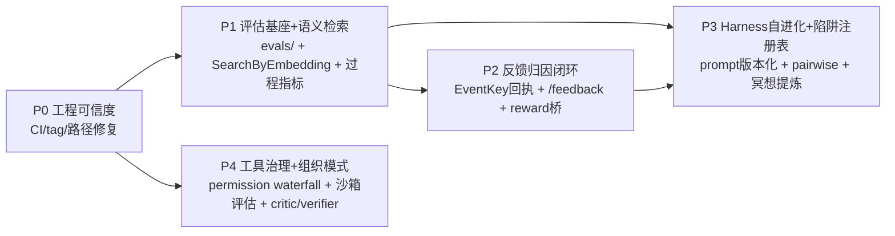
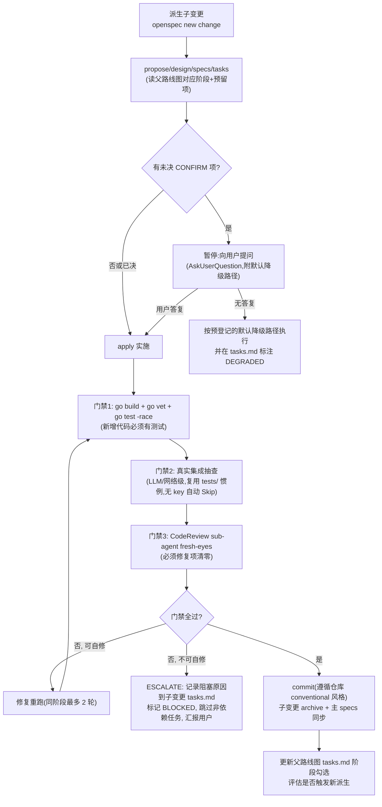

# Design: Tagent Evolution Roadmap

## Context

输入源四份,已经本机核查/调研验证:

1. 两篇评审文档(examples/wechat-bot/ 下):差距清单收敛于七项——反馈归因、评估体系、Harness 自进化、多 Agent 组织、语义检索、工具治理/沙箱、发布工程。其中"handoff 无结构化 schema"断言已被核查推翻(ExtraParams 已存在),"MCP 深度不足"已由 mcp-discovery-execution-loop(2026-09-04 归档)解决。
2. 今日探索沉淀:prefix-cache 稳定性是 tagent 的第一性设计约束(声明区恒定、动态内容渗透尾部/历史);Engine(有状态)/Policy(配置派生)分离;内容变更即时热载、结构变更走配置。
3. trpc/rustviking 调研:evaluation(AgentEvaluator/EvalSet/Metric/Criterion,直接 import,成本小)、team(ModeCoordinator/ModeSwarm,直接 import,成本小)、codeexecutor container(Docker 沙箱,NetworkMode=none,直接 import,成本小)、knowledge vectorstore(6 后端 + SearchModeHybrid)+embedder(openai/gemini/ollama/huggingface)、telemetry、rustviking VectorStore/EmbeddingProvider 插件 + tagent RustVikingClient 已预留 VectorSearch/Embed 方法。
4. 参考项目调研:crush permission(Go,allow-list + session 缓存 + auto-approve + 异步审批,直接借鉴)、nanobot skills(SKILL.md 与 trpc skill.FSRepository 格式兼容,技能库可直接复用)、AReaL reward 抽象(MathVerifyWorker/自定义 reward fn/workflow discount)、OpenSpace gdpval_bench(两阶段 cold→warm 评估 + TokenTracker + LLMEvaluator + payment cliff)、deer-flow guardrails(AgentMiddleware + AllowlistProvider)、letta sleeptime(设计参考)、pi-mono(低价值,排除)。

约束:单维护者项目,阶段必须可独立交付、可中断恢复;所有阶段不得违反 prefix-cache 不变量与 Engine/Policy 分离;真实 LLM/网络测试沿用 tests/ 惯例(无 key 自动 Skip、-short 跳过)。

## Goals / Non-Goals

**Goals:**

- 把七项差距分解为五个依赖有序的阶段(P0-P4),每阶段一个独立子变更、独立可交付。
- 最大化复用:同依赖(trpc-agent-go)> 同语言(crush/rustviking)> 格式兼容(nanobot skills)> 设计参考(AReaL/OpenSpace/deer-flow/letta)。
- 定义自驱执行所需的完整闭环:门禁、核对、分工、失败处置、归档义务——使后续阶段可在无人在环下推进,遇决策点暂停。
- 预留确认项显式化:所有待用户拍板的决策列入清单,标注核对时机与未决时的默认降级路径。

**Non-Goals:**

- 本变更不写任何运行时代码(治理工件 only)。
- 不做 Huabu 式可视化 UI、Browser/Computer Use 层(评审建议中的 P5 级,超出本路线图周期,留待未来独立提案)。
- 不承诺各阶段的具体 API 形态——由子变更的 design 决定,本文只锁定组件选型方向与门禁。

## Decisions

### D1 阶段划分与依赖

排序理由:P0 是外部可信度前提且成本最小(小时级);P1 的评估信号是 P2(反馈需要评分器)与 P3(自进化需要 pairwise 判据)的共同依赖;P3 依赖 P2 的反馈分数作为评估信号之一;P4 相对独立(治理与组织不依赖反馈闭环),但放最后因其改造面最大、且 crush 借鉴需要 P0 的 CI 保护。

### D2 复用组件选型(缺口 × 组件)

| 缺口 | 首选组件 | 备选 | 复用方式 | 阶段 |
|---|---|---|---|---|
| 发布工程 | GitHub Actions(仓库托管在 GitHub) | 本地脚本门禁 | 新增 workflow | P0 |
| 评估体系 | trpc-agent-go evaluation/(AgentEvaluator/EvalSet/Metric) | OpenSpace 两阶段设计(任务集组织参考) | 直接 import + evals/ 目录 | P1 |
| 语义检索 | rustviking CLI 向量命令(RustVikingClient 已预留 VectorSearch/Embed;与 file memory 同存储、零新增服务) | trpc vectorstore(inmemory/sqlitevec)+embedder 桥接 | 桥接适配 | P1 |
| 过程指标 | AReaL stats_tracker / OpenSpace TokenTracker 模式 | trpc telemetry | 设计参考自研埋点 | P1 |
| 反馈归因 | EventKey 作 record-id(Reef 模式)+ HTTPAPI /feedback | feedback 工具(LLM 自评) | 自研(本体贴合) | P2 |
| reward 消费 | AReaL reward fn 抽象对接 TrajectoryRecorder JSONL | — | 设计参考 | P2 |
| Harness 自进化 | prompt.Source 热载 + TrajectoryRecorder + RHI pairwise | OpenSpace skill_engine(技能演化参考) | 自研优化器 | P3 |
| 陷阱注册表 | MemoryStore 事件类型 + meditation 提炼 | Teamwork pitfall registry(概念) | 自研(组合现有件) | P3 |
| 工具治理 | crush permission(Go 直接借鉴:allow-list+session 缓存+异步审批) | deer-flow guardrails 中间件(概念) | 代码借鉴 | P4 |
| 沙箱 | trpc codeexecutor/container(Docker) 作为 exec 的可选后端 | 维持 tmux+runAsUser(现状) | 直接 import(可选路径) | P4 |
| 组织模式 | trpc team ModeCoordinator(critic/verifier 成员即工具) | tagent 自定义 tool agent(critic) | 直接 import 评估后定 | P4 |
| 技能生态 | nanobot skills/ 库直接并入 tagent skills(SKILL.md 兼容) | — | 内容复用 | P1 顺带 |
| 可观测 trace | trpc telemetry(框架层 span/metric 自动埋点已通电)+ telemetrytrace.Start(wechat-bot 已接线)+ GenAI semconv | langfuse exporter(评估) | tagent 自有层补 turn span/link/互链 | P1.5(observability-tracing,已立项) |

选型原则:语义检索首选 rustviking 路径的理由——tagent 的 file memory 已经以 rustviking 为后端(同进程外 CLI 模式),向量与事件同库可保证"语义发现→票据精确取回"两段式的一致性;trpc vectorstore 路径需要引入独立存储(inmemory 不持久/sqlitevec 新依赖),仅在 rustviking 向量命令面不满足时启用(预留确认项 C2)。

### D3 自驱闭环机制(本路线图的核心交付)

每个阶段子变更的执行循环与门禁:

规则细节:

- **准入**:上一依赖阶段的子变更已 archive;父路线图该阶段的 CONFIRM 项已核对(决议或降级)。
- **准出**:门禁 1-3 全过;子变更 tasks 完成率 100%(DEGRADED/BLOCKED 项须显式标注并经用户知悉);父路线图对应检查点更新。
- **sub-agent 分工惯例**(本日已验证有效):CodeReview=评审门禁、Search=事实核查/审计、Debug=失败定性(flaky vs 回归,三重证据:代码交集/漂移/git 历史);实施与测试执行由主 agent 承担;重活可并行分批(nohup+日志轮询模式,规避交互式终端阻塞)。
- **失败处置**:同阶段自修上限 2 轮;超限 ESCALATE(不硬闯、不静默降级未登记项);real-LLM 测试失败必须先经 Debug 定性,pre-existing flaky 不阻塞准出但须记录。
- **不可违反的不变量**(每阶段 design 必须显式声明遵守):prefix-cache 稳定性(声明区恒定)、Engine/Policy 分离、事件不可变(FullEvent 只增不改)、失败以 result 渗透(不 panic 不中断 loop)。

### D4 预留确认项(执行时重新核对,不阻塞本路线图批准)

| # | 决策点 | 阶段 | 默认降级路径(未决时) |
|---|---|---|---|
| C1 | CI 平台与范围:GitHub Actions 跑哪些门禁(race 全量 vs 分包) | P0 | 最小集:build+vet+短测试;race  nightly |
| C2 | 语义检索路径:rustviking CLI 向量命令是否满足(需实测其 embed/search 命令面) | P1 | 不满足→改走 trpc vectorstore(sqlitevec)+openai-compatible embedder(zhipu embedding API) |
| C3 | embedder 选型:zhipu embedding-3(openai 兼容端点)vs ollama 本地 | P1 | zhipu embedding-3(与现有 provider 体系一致,key 复用) |
| C4 | 评估任务集来源:微信 bot 真实场景任务 vs gdpval 风格合成任务;首批规模 | P1 | 从 tests/ 现有 real-LLM 契约测试提炼 10-20 个组件级 case 起步 |
| C5 | 反馈来源:HTTPAPI 外部写入 vs 微信回复语义识别 vs LLM 自评(可多选) | P2 | 仅 HTTPAPI(最小面);微信语义识别留待 P2 后评估 |
| C6 | RHI 优化器形态:独立离线脚本 vs 常驻子 agent(meditation 触发) | P3 | 离线脚本先行(可控性高),验证收益后再考虑常驻化 |
| C7 | 陷阱注册表事件类型命名与 TTL 策略(是否豁免遗忘) | P3 | 新事件类型 pitfall,TTL 豁免(参照 memory-curation 既有类型 TTL 表) |
| C8 | exec 沙箱:是否引入 Docker 依赖(部署环境是否有 docker;与 tmux 长任务语义如何共存) | P4 | 保持 tmux+runAsUser 现状,container 仅作 code-block 执行的新增可选工具,不替换 exec |
| C9 | permission 审批通道:微信场景下审批请求如何送达用户并等待(异步审批与 event loop 的衔接) | P4 | allow-list+auto-approve 先行(无交互审批),审批通道待微信交互设计确认后加 |
| C10 | 组织模式:trpc team 直接复用 vs tagent critic tool agent 自研(与 prefix-cache 约束的兼容性需验证) | P4 | 子变更 design 阶段做 spike 对比后定,倾向自研 tool agent(与现有 AgentToolWrapper 体系一致) |
| C11 | release 节奏:首个 tag 版本号(v0.1.0?)与 CHANGELOG 维护义务 | P0 | v0.1.0,CHANGELOG 由各子变更归档时追加 |

### D5 伞形变更的生命周期

本变更(tagent-evolution-roadmap)在全部阶段(P0-P4)子变更 archive 后才自身 archive;期间保持 in-progress,作为唯一事实源记录阶段状态。若中途用户叫停,已完成阶段的成果不受影响(各自独立 archive),本变更以"部分完成"归档并记录终止点。

### D6 交接须知(2026-09-05 追加;接手者从这里开始)

**背景脉络(决策链速读)**:
1. 起点:用户欲以 zhipu web-search-prime MCP 替代 web_search 工具 → 探索发现 tagent MCP 只有"发现"无"执行",且原生声明式接入会摧毁 prefix cache → 用户拍板"knowledge 发现、action 执行"的渗透式哲学(工具知识以消息渗透进上下文,声明区恒定)→ 落地为 mcp-discovery-execution-loop(2026-09-04 归档,含真实 LLM 验证:glm 路由 6/6 正确;实测工具名 web_search_prime 为下划线风格,官方文档的 webSearchPrime 是错的)。
2. 两篇外部评审(未入库,examples/wechat-bot/*.md)给出七项差距 → 本路线图立项 → 用户要求谨慎 → 收缩为"地图 + 疼点驱动" → 活跃变更大清账(见 LEDGER.md)→ 现状:1 地图 + 2 执行体(hybrid-semantic-recall、observability-tracing)。

**全局不变量(任何子变更 design 必须显式声明遵守,specs 有守卫场景)**:
- prefix-cache 稳定性:agent 工具声明区恒定;动态能力经注册表/内容渗透,不进声明;
- Engine(有状态:bus/task/memory/loop)与 Policy(配置派生:prompt/工具清单/参数)分离;内容变更即时热载,结构变更才需重建;
- 事件不可变:FullEvent 只增不改,向量/索引是旁路;
- 失败以 result 渗透:工具失败返回自纠材料(nil error + 结构化错误),不 panic 不中断 loop。

**环境事实(实测核验)**:
- ZAI_API_KEY:shell env 常缺,`testutil.LoadAPIKey()` 会从 ~/.zshrc 提取(tests/ real-LLM 测试与 probe 均依赖此路径);该 key 即 GLM Coding Plan key(zhipu provider 用 /api/coding/paas/v4 端点),web-search-prime MCP 直接复用。
- 终端坑:带风险标记的命令走真实终端时,zsh compinit 交互提示会截断/吞掉命令——对策:写临时 .sh 用 `nohup sh` 执行 + 日志轮询,或拆小命令;新 Go 包目录写文件时 harness 会自动注入重复 package 行,需检查文件头。
- 已知 pre-existing flaky(勿误判为回归):tests/ 的 TestContract_PlanWriteBoundary、TestPlanAgentCreateBehavior_RealPrompt、TestRealLLM_PlanReentry_ClarificationLoop——real-LLM 行为抖动(2026-09-04 Debug 定性,四重运行漂移证据);处理惯例:失败先定性再修,flaky 不阻塞准出但须记录。
- sub-agent 通道:CodeReview/Search/Debug 分工见 D3;注意 Agent 工具可能被用户侧禁用(2026-09-05 出现过),禁用时回退主线程自审,工作量翻倍需预留。

**文档地图**:
| 文档 | 角色 |
|---|---|
| openspec/changes/LEDGER.md | 活跃变更集账本:全部裁决+证据+清账原则 |
| 本变更 proposal/design/specs/tasks | 路线图与治理规格(roadmap-governance 是执行纪律的规范来源) |
| openspec/changes/hybrid-semantic-recall/ | P1 语义检索执行体(前身 risk-mitigation-semantic-recall 的重编,继承关系写在其 proposal 头) |
| openspec/changes/observability-tracing/ | P1.5 trace 执行体(spike-first;探索证据在其 design Context) |
| openspec/specs/(68+ 能力) | 已归档能力的主规格;mcp-* 三个是最新成员 |
| examples/wechat-bot/*.md 两篇评审 | 外部输入(未入库,修订处置见 tasks 6.2) |

**执行入口**:放行某变更 = `/opsx:apply <change-name>`;治理流程(门禁/CONFIRM/ESCALATE)= roadmap-governance spec + D3 流程图。当前待用户放行:hybrid-semantic-recall(首步 X1 实测 rustviking 向量命令面)、observability-tracing(首步 D0 spike)、P0 直做清单。

## Risks / Trade-offs

- [路线图过时:执行周期长,期间上游(trpc-agent-go v1.10+)或评审结论变化] → 每阶段准入时重读父路线图 + 快速核查所依赖组件仍存在(如 evaluation 模块 API 未 breaking);D2 选型标注备选路径。
- [自驱执行漂移:无人在环时子变更 scope 膨胀] → 准出定义绑定"父路线图该阶段的检查点清单",超出部分必须派生新变更而非塞入当前。
- [评估体系依赖真实 LLM,成本与抖动] → 沿用 tests/ 惯例(Skip 保护);评估指标设计为"多次运行取通过率"而非单次断言(参照 τ-bench 一致性教训)。
- [P1 语义检索两条路径的存储一致性风险(向量库与事件库分裂)] → 首选 rustviking 同库路径正是为此;若降级到 trpc vectorstore,须在子变更 design 中明确"向量库只存 key→embedding 映射,事实源仍是 MemoryStore"。
- [P4 治理链引入执行路径延迟与复杂度] → waterfall 各层可配置旁路(auto-approve/allow-list 命中即零开销);默认关闭审批通道(C9 降级路径)。
- [多阶段并行的诱惑:P4 与 P1 无依赖可并行] → 单维护者 + 自驱执行,串行更可控;仅允许同阶段内任务并行(sub-agent 分批)。

## Migration Plan

不适用(治理工件,无运行时迁移)。各阶段的代码迁移计划由子变更各自承载。

## Open Questions

- 全部 Open Questions 已转化为 D4 预留确认项(C1-C11),执行时按表核对。
- 新增开放问题在各阶段子变更的 design.md 中登记,不回写本文件(本文件仅在阶段结论推翻 D1/D2 结构性判断时修订)。
