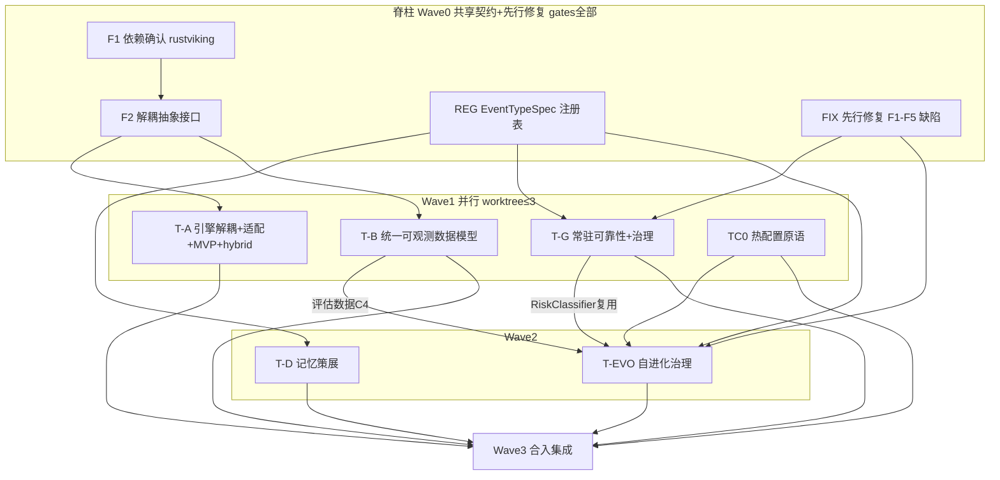

# tagent 并发自驱迭代 DAG（执行蓝图）

> **角色**：并发自驱迭代的 master 编排蓝图（DAG 形式）。每个节点 = 一个可独立交付的 track，执行时派生自己的 openspec 子变更（propose/design/specs/tasks）。主 agent 据本文：① 派发 sub-agent；② sub-agent 抛疑问时按 §4.2 **自决**；③ 回报完成时按 §4.3 **检查与编排下游**。
> **治理纪律**继承 [design.md](design.md) D3 自驱闭环（门禁/CONFIRM/ESCALATE）。**并存规划调和结论**（T-EVO 风险分级发布道、注册表上提脊柱、T-G 两子包、报告 D4「不做 OTel」Non-goal 被驳回）已并入本 DAG。
> **状态看板** §7 由主 agent 维护；**冻结契约** §2 为并行防漂移的硬约束。项目性质：学习项目、无稳定性/兼容性包袱、**先进性优先**。

## 1. DAG 总览

| 节点 | 名称 | 上游依赖 | worktree 分支 | 波次 |
|---|---|---|---|---|
| F1 | 依赖确认 rustviking | — | (脊柱, main) | 0 |
| F2 | 解耦抽象接口 IndexBuilder/Retriever/MemoryEngine | F1 | (脊柱) | 0 |
| REG | EventTypeSpec 注册表 | — | (脊柱) | 0 |
| FIX | 先行修复 F1-F5 缺陷 | — | (脊柱) | 0 |
| T-A | 记忆引擎解耦+适配+MVP+hybrid RRF | F2 | feat/memory-engine-decoupling | 1 |
| T-B | 统一可观测数据模型 | F2(松) | feat/unified-observability | 1 |
| T-G | 常驻可靠性+治理 | REG,FIX | feat/resident-reliability | 1 |
| TC0 | 热配置原语 bundle/VersionedSource | REG(松) | feat/hot-config | 1 |
| T-EVO | 自进化治理 refine+发布道+后验评估+回滚 | TC0,TG,TB,FIX,REG | feat/self-evolution | 2 |
| T-D | 记忆策展 consolidation+diagnostics | REG,(与T-A协调) | feat/memory-curation | 2 |
| MG | 合入集成+故障注入矩阵+openspec重构 | 全部 | (merge→main) | 3 |

## 2. 冻结共享契约 + 全局不变量（并行防漂移）

### 2.1 冻结契约（变更须走 §4.2 ESCALATE）

| # | 契约 | 主导节点 | 消费节点 |
|---|---|---|---|
| C1 | EventTypeSpec 注册表字段 `{name,极性,TTL,Role,embeddable,骨架级,摘要策略,recallable}` | REG | T-D,T-G,T-EVO |
| C2 | resolveMemoryStore 装饰器顺序 `ErrorTrackingStore(VectorStore(FileSegmentStore))` | T-A+T-G 协商 | T-A,T-G |
| C3 | cassette manifest schema | T-EVO | T-B,T-D |
| C4 | 统一可观测数据模型 schema（一套 turn 事实→trace/trajectory/eval 投影） | T-B | T-EVO |
| C5 | RiskClassifier 签名 `Classify(RiskContext)→(level,ruleID,reason)` 纯函数 | T-G | T-EVO |
| C6 | 抽象接口 IndexBuilder/Retriever/MemoryEngine | F2 | T-A,T-D |

### 2.2 全局不变量（每节点 design 必须显式声明遵守，specs 有守卫场景）

- prefix-cache 稳定性：工具声明区恒定；动态能力经注册表/内容渗透，不进声明。
- Engine（有状态:bus/task/memory/loop）/ Policy（配置派生:prompt/工具清单/参数）分离；内容变更即时热载，结构变更才重建。
- 事件不可变：FullEvent 只增不改；向量/索引是旁路。
- 失败以 result 渗透：工具失败返回自纠材料（nil error + 结构化错误），不 panic 不中断 loop。
- 6 条既有不变量：正负 key 语义 / Snowflake 单调 / token 预算唯一压缩触发 / StoreEvent 与 projection.Append 同一同步点 / 墓碑先行 / 事件内容不截断。

## 3. 节点规格（准入 / 交付物 / 准出门禁 / 自决点 / 完成检查）

> **通用准出门禁**（每节点）：门禁1 `go build ./... && go vet ./... && go test -race ./...`（新代码必须有测试）；门禁2 真实集成抽查（tests/ 惯例，无 key 自动 Skip）；门禁3 CodeReview sub-agent fresh-eyes（必须修复项清零）。
> **通用准入**：上游节点已 archive + 相关冻结契约已定稿。

### F1 依赖确认 rustviking
- **准入**：—（起点）
- **交付物**：rustviking 能力报告（实测 `find`/`index`/`kv` CLI 的 JSON 契约、`VectorStore` delete/hybrid 实际暴露面、fork 延迟、embed 维度）+ 强化清单（G-a hybrid RRF / G-b 契约对齐 / G-c 分区过滤 / G-d id 映射）。
- **自决点**：① rustviking 是否需先 build/发版 → 默认本机 `cargo build --release` 探测，不要求发版；② hybrid RRF 放 rustviking 还是 tagent 适配 → 默认放 rustviking（先进性+引擎内闭环），改动成本过高则降级 tagent 适配层并记录。
- **完成检查**：能力报告每项有实跑证据（命令+输出）；强化清单每项标注「rustviking 侧 / tagent 侧」归属。

### F2 解耦抽象接口
- **准入**：F1 done
- **交付物**：C6 接口定义（IndexBuilder 索引构建 / Retriever 检索 / MemoryEngine 生命周期）+ MVP 与适配器实现该接口的 design。
- **自决点**：接口粒度（是否含 consolidation/diagnostics 钩子）→ 默认最小「检索+索引」面，策展钩子留 T-D 经可选接口挂接。
- **完成检查**：接口冻结为 C6；T-A/T-D design 引用一致。

### REG EventTypeSpec 注册表
- **准入**：—
- **交付物**：`event/registry.go`（EventTypeSpec）+ 9 内置类型 init() 注册 + 既有函数（ExtractEventType/IsSpecialEventType/GenerateEventSummary/IsSkeletonMessage/TTL 表）委托注册表；**既有测试零修改通过 = 重构等价验收线**。
- **自决点**：字段名以本节点交付为准（C1）；系统事件（非 Role 派生）如何注册 → 默认显式构造 `FullEvent{EventType}`，注册表只声明元数据。
- **完成检查**：C1 字段冻结；「改 10 处」收敛验证（加一个测试类型只改注册表一处即全链路生效）。

### FIX 先行修复 F1-F5
- **准入**：—
- **交付物**：F1 `FullEvent.Metadata` 归因盖章修复（两条持久化路径）；F4 `DefaultConfig` id:action→exec + `TestDefaultConfigBuildable`；F5 API key env 名统一。（F2 outputCh / F3 replayWAL 归 T-G）
- **自决点**：F5 统一到哪个 key 名 → 默认 `ZAI_API_KEY`（config 现状 + 实测可用），tests/README 同步。
- **完成检查**：每缺陷有回归测试（fail before / pass after）。

### T-A 记忆引擎解耦+适配+MVP+hybrid
- **准入**：F2 done；C2/C6 冻结
- **交付物**：rustviking 适配器（实现 C6，引擎内闭环）+ tagent MVP 内存引擎（兜底）+ hybrid RRF（关键词∪向量）+ `SearchByEmbedding` 双实现落地 + 按 F1 清单强化 rustviking。
- **自决点**：① embedder 落 rustviking 内 vs tagent → 默认 rustviking 内（引擎闭环）；② MVP 与适配器切换 → 默认配置门控，无 rustviking 退 MVP；③ 维度 → 默认按 F1 实测 rustviking embed 维度。
- **完成检查**：无配置零行为变化；声明区逐字节不变；hybrid 召回集成测试（同义改写命中）；两段式（语义发现→票据取回）保持。

### T-B 统一可观测数据模型
- **准入**：F2(松)；C4 由本节点主导冻结
- **交付物**：一套数据模式（turn 事实）→ 三投影（OTel span 树 / trajectory JSONL / eval 特征）；turn root span；异步 spawn↔settle span link；轨迹↔trace 双向互链；noop 零开销。
- **自决点**：① OTel 与 trajectory 谁是事实源 → 默认单一 turn 事实源、两者皆投影（指令2「一套数据模式」）；② langfuse → 默认 spike 记录结论不接入。
- **完成检查**：C4 schema 冻结；noop 态既有测试零修改全过；声明区零变化；一致性（同一 turn 三投影同源）有测试。

### T-G 常驻可靠性+治理
- **准入**：REG,FIX done；C5 由本节点主导
- **交付物**：`agent/reliability/`（ReliableBus 两级 spill/durable、outputCh 背压修 F2、AnchorStore、DegradationManager 五依赖、mem_spill、replayWAL 修 F3）+ `agent/governance/`（RiskClassifier C5、DenialLedger、BudgetManager、GoalRegistry、ApprovalManager、GovernanceTool 装饰器）+ `governance` 事件类型（经 C1）+ 故障注入矩阵脚本。
- **自决点**：① durable 默认开关 → 默认 spill，durable 给 A2A/无人值守；② goal 强制 warn/strict → 默认 warn；③ critical 批准 → 默认异步（不阻塞 loop）；④ 装饰器顺序 → 遵 C2。
- **完成检查**：两处静默丢弃消除有测试；故障注入 SIGKILL 恢复一致；at-least-once 去重测试；治理装饰器不吞 settle 信号。

### TC0 热配置原语
- **准入**：REG(松)
- **交付物**：`prompt.Getter` 接口化 + BundleStore（不可变 bundle + active 指针原子切换）+ VersionedSource（回合边界生效）+ bundle_id 归因盖章钩子（依赖 FIX-F1）。
- **自决点**：① bundle 粒度 → 默认每 agent 一个、不含工具集；② 生效语义 → 默认回合边界（放弃立即生效，避免回合内半新半旧）。
- **完成检查**：激活在下一回合 BeforeModel 生效；回滚 = 原子切 active 指针，有测试；不改主循环。

### T-EVO 自进化治理（T-C+T-E+T-F 合并；矛盾调和已定）
- **准入**：TC0,TG(RiskClassifier),TB(C4 评估数据),FIX(归因),REG done
- **交付物**：refine 工具（propose/diff/status/rollback，**无 activate**）+ ReleaseManager **风险分级发布道**（快道 validate→canary→后验评估；慢道 validate→replay(cassette)→shadow→canary→approve）+ 后验评估（evals ProgramScorer/LLMScorer 分离 + held-out）+ **双回滚触发**（guardrail 确定性 + LLM-judge 模型决策）+ `feedback` 事件（经 C1）+ Attributor 归因。
- **自决点（核心矛盾调和）**：① 发布道路由 → 复用 T-G RiskClassifier，低风险+可逆走快道、高风险/protected 走慢道；② agent 直接生效？→ **永不**（refine 无 activate，状态机 mediates，保 D1 铁律）；③ 回滚裁决 → guardrail + LLM-judge 双触发；④ require_approval → 默认 true（慢道）。
- **完成检查**：agent 无法直接生效有守卫测试；快/慢两道各有 e2e；回滚原子性；归因盖章覆盖两条持久化路径；evals 为后验非生效门（指令4）。

### T-D 记忆策展
- **准入**：REG done；与 T-A 协调（同 memory 域）
- **交付物**：`consolidation` 事件（源事件收据 + 服务端 SHA1 指纹，经 C1）+ memory_consolidate/memory_health 工具 + 维度锚定诊断 Diagnostics + 建议式触发（冥想 hint）。
- **自决点**：① 触发 → 默认建议式（hint 注入冥想），执行权与质量门在 LLM+工具硬校验；② 价值触发阈值 → v1 先容量+冥想两路，价值触发留接口标「待验证」。
- **完成检查**：指纹服务端计算、LLM 不可伪造有测试；consolidation TTL 豁免；与 T-A 无 memory 域冲突（装饰器顺序遵 C2）。

### MG 合入集成
- **准入**：全部 track archived
- **交付物**：worktree 分支按序合并 main + 故障注入矩阵进 CI + openspec 三变更重构对齐（hybrid→T-A/T-D、observability→T-B、roadmap 重切）+ LEDGER 回写 + 集成回归。
- **自决点**：合并序 → 默认脊柱→Wave1→Wave2，冲突按 C1-C6 契约裁决。
- **完成检查**：main 全绿；集成测试过；openspec/LEDGER 一致；roadmap D6「并存规划」分歧标记全部落定。

## 4. 编排协议

### 4.1 派发
- 每 track 一个 git worktree（§5），隔离并行；同时推进 **≤3 track**（单维护者节奏）。
- sub-agent 分工（design.md D3）：CodeReview=门禁3评审；Search=事实核查/审计；Debug=失败定性（flaky vs 回归，三重证据：代码交集/漂移/git 历史）；实施与测试执行由主 agent 或实施型 sub-agent。
- 重活并行分批（nohup+日志轮询，规避交互式终端阻塞）；Agent 工具可能被禁用 → 回退主线程自审，工作量翻倍需预留。

### 4.2 自决规则（sub-agent 抛疑问时，我据此自决）
**决策优先级（高→低）**：
1. 全局不变量（§2.2）—— 不可逾越
2. 冻结契约 C1-C6（§2.1）
3. 节点 design 预登记默认（§3 各节点「自决点」）
4. roadmap D4 预留确认项默认降级路径
5. 报告 D1-D5 借鉴落点
6. 主 agent 即时工程判断（先进性优先，无兼容包袱）

**自决**（不询问用户）：疑问在节点 scope 内 + 不违反层 1/2 + 层 3-6 任一可推出默认 → 我即时裁决，**记入该节点 tasks.md 的 `DECIDED` 日志**（疑问 / 裁决 / 依据层级 / 时间），保证可审计。

**ESCALATE 给用户（仅这五种）**：① 需变更/违反冻结契约 C1-C6；② 需违反全局不变量；③ scope 膨胀超出节点（需派生新节点/新 track）；④ 不可逆外部动作（force push、删除、发布 tag、真实花钱的批量 API）；⑤ 真正歧义且层 1-6 均无默认可推。

### 4.3 完成检查协议（track 回报完成时，我据此检查与编排）
1. **门禁亲验**：亲自跑 `go build ./... && go vet ./... && go test -race ./...`（不信 sub-agent 报告的「通过」）。
2. **交付物对照 spec**：每条 ADDED/MODIFIED Requirement 有对应实现 + 测试。
3. **冻结契约核对**：是否触碰/破坏 C1-C6；触碰则 ESCALATE。
4. **不变量守卫**：prefix-cache 声明区逐字节零变化测试、noop 零行为变化测试通过。
5. **跨 track 影响扫描**：是否改了共享挂点（resolveMemoryStore / 注册表 / 投影 sink / 装饰器链）→ 通知受影响下游节点。
6. **CodeReview 必须修复项清零**。
7. **裁决**：达标 → 子变更 archive + 更新 §7 看板 + **释放下游节点**（检查其准入是否满足）；不达标 → 退回修复（同节点 ≤2 轮）→ 超限 ESCALATE 标 BLOCKED。

### 4.4 失败处置
- 同节点自修上限 2 轮；超限 ESCALATE（记录阻塞原因，跳过非依赖任务，汇报）。
- real-LLM 测试失败必先经 Debug 定性；pre-existing flaky（TestContract_PlanWriteBoundary / TestPlanAgentCreateBehavior_RealPrompt / TestRealLLM_PlanReentry_ClarificationLoop）不阻塞准出但须记录。
- 环境坑：带风险标记命令走真实终端时 zsh compinit 吞命令 → 写临时 .sh 用 nohup 执行+日志轮询；新 Go 包目录写文件 harness 注入重复 package 行 → 检查文件头。

## 5. worktree 布局 + 合并序

| 分支 | 节点 | worktree 路径 |
|---|---|---|
| (main) | 脊柱 F1/F2/REG/FIX | 主 worktree |
| feat/memory-engine-decoupling | T-A | ../tagent-wt/ta |
| feat/unified-observability | T-B | ../tagent-wt/tb |
| feat/resident-reliability | T-G | ../tagent-wt/tg |
| feat/hot-config | TC0 | ../tagent-wt/tc0 |
| feat/self-evolution | T-EVO | ../tagent-wt/tevo |
| feat/memory-curation | T-D | ../tagent-wt/td |

合并序：脊柱 → Wave1（T-A/T-B/T-G/TC0）→ Wave2（T-EVO/T-D）→ MG 集成。每合并前 rebase main，冲突按 C1-C6 裁决。

## 6. 波次调度

| Wave | 节点 | 并行度 | 准出标志 |
|---|---|---|---|
| 0 脊柱 | F1→F2, REG, FIX | F1/F2 串行；REG/FIX 可并行 | C1/C6 冻结 + 5 缺陷修复 |
| 1 | T-A, T-B, T-G, TC0 | ≤3 并行 | C2/C4/C5 冻结 + 各 track 门禁过 |
| 2 | T-EVO, T-D | 2 并行 | 自进化闭环 e2e + 策展落地 |
| 3 | MG | 收口 | main 全绿 + openspec 重构 + LEDGER 回写 |

## 7. 状态看板（主 agent 维护）

| 节点 | 状态 | 阻塞于 | DECIDED 日志 | 备注 |
|---|---|---|---|---|
| F1 | COMPLETE | — | F1-①②③ 见 f1-rustviking-capability-report.md | rustviking index 子系统 live 可用(dim768)；tagent 向量客户端三重虚构契约(T-A 重写)；裁决:适配器层做 hybrid/嵌入/分区,rustviking 作向量后端 |
| F2 | COMPLETE | F1(done) | 接口置 memory/engine.go，退化语义有测试 | C6 冻结：IndexBuilder/Retriever/MemoryEngine；返回排序票据两段式；build/vet/test 全绿 |
| REG | COMPLETE | — | 注册表置 event/registry.go，6 触点委托/派生 | C1 冻结：9 类精确复现；全量单测 19 包 rc=0 零回归（等价验收线）|
| FIX | COMPLETE | — | F1-fix(Metadata)重划归 TC0(使能器非独立bug,无当前误行为);F5 hy3 保留 TENCENT(混元专属) | F4 DefaultConfig action→exec + TestDefaultConfigBuildable 守漂移;F5 README 标准化 ZAI_API_KEY(GLM coding plan) |
| T-A | COMPLETE | F2(done) | 门禁3 CodeReview并发审出 M1/M2/M3+7S+12Nit,全部清零并有回归测试锁定 | 交付:解耦缝C6+Embedder+InMemoryEngine(hybrid RRF/分区/异步)+engineBridge+config+recall hybrid+KV持久化重建+rustviking契约修复;审查修复:Close排空ctx/遗忘→向量移除/模型指纹+维度守卫/topK生效/退化契约/二道分区/重建Ready;门禁1-2-3全绿 |
| T-B | COMPLETE | F2(done) | otel 提升直接依赖;agent包-race 3失败=pre-existing上游(Debug定性);trace锚点=一套数据模式三投影互链 | ✅turn root span(noop安全)+trace_id/span_id经attribution落事件Metadata+落trajectory LLMCallRecord(omitempty向后兼容)+**task span link轻量实现**(RunFlow 从turn span捕获trace锚点入task OriginSpawner.Origin→settle时经Origin→Metadata管道写task_settled事件,异步任务关联回触发turn trace,复用现有管道零task包侵入)=指令2「一套数据模式多场景保一致性」延伸异步链路;余(可选):memory/compress/recall轻量span |
| T-G | COMPLETE | REG,FIX(done) | F2/F3已缓解;门禁3揪出**Blocker(事件时序倒置→回复路由错误会话)**+Major(approval竞争/critical绕过/judge缺score误回滚/canary ctx假通过/eval Limit静默失效/reclaim瞬时删/无背压)全修+回归锁定 | ✅governance(RiskClassifier C5+Budget滑窗epoch持久+Approval异步digest绑定+DenialLedger治理事件+Goal+Gate管线+GovernanceTool装饰器LIVE+trigger source盖章goal-required+账本绑定memStore持久化)+reliability(**DegradationManager五依赖全LIVE**:ErrorTrackingStore C2最外层挂点[报告D3设计,此前缺失致零接线]+MemorySink依赖倒置+event_loop model上报+**mcp_call第5依赖DepMCP上报**(PlainToolFactoryConfig.Degradation传参链)+mem_spill退化兜底重放[at-least-once延伸存储层];5/5依赖接线memory/disk/rustviking/model/mcp+**ReliableBus全序磁盘溢出**:channel恒早于spill/pending背压上限/批量上限/瞬时错误重试不删/重启恢复+**AnchorStore冥想锚点持久化**anchorMu一致快照)+故障注入矩阵(多依赖独立退化/时钟回拨/并发压力/坏文件);配置门控默认关闭零行为变化 |
| TC0 | COMPLETE | REG(done) | Debug子agent三重证据定性:agent包3个-race失败=pre-existing上游trpc-agent-go@v1.10.0竞态(session.UpdatedAt/reflect clone/steer.Queue.Close),在c484d66/a88bf01同样复现,非本迭代回归→-race门禁对agent包豁免此3项(业务断言全过) | ✅归因地基(Attribution双路径盖章,修报告F1缺口)+prompt.Getter缝+evolution原语(BundleStore不可变/内容寻址/原子active切换/回滚/持久+VersionedSource实现Getter+BundleProvider)+消费方迁移(ContextManager系统提示源→Getter);全量20包-short绿+evolution-race绿 |
| T-EVO | COMPLETE | TC0,TG(C5),TB,FIX,REG(done) | 风险分级发布道调和T-E/T-F;门禁3揪出Blocker(评估器error假激活)+路径遍历已修+回归锁定;后验评估闭环=指令4落地 | ✅ReleaseManager(快道后验/慢道门后+双回滚+protected慢道+agent无直接激活权)+refine工具(无activate)+DiffRiskRouter(模型/参数→慢道,提示词→快道)+**后验评估闭环LIVE**(Evidence+StoreEvidenceSource从memStore收集canary证据+MetricGuardrail确定性闸+LLMJudgeEvaluator模型决策回滚,BindPosterior延迟绑定,judge复用主model)+运行时接线(VersionedSource/refine/posterior);保守原则:judge不可用/样本不足/解析失败均保守通过不误回滚 |
| T-D | COMPLETE | REG(done) | consolidation一处注册全链路(REG兑现);指纹服务端算防伪造;墓碑=诚实衰减;诊断读实时态非死计数器 | ✅证据门控巩固(ComputeReceiptFingerprint/VerifyConsolidation/BuildConsolidationEvent)+consolidation类型注册+维度诊断MemoryDiagnostics+agent工具(memory_consolidate/memory_health);全测试绿 |
| MG | COMPLETE(记账+gate-3二轮) | 全部done | 两轮gate-3 CodeReview(T-A + reliability/eval)揪出Blocker(评估器假激活/事件时序倒置)+多Major全修回归;execution-dag.md=plan of record;LEDGER记账 | ✅全10节点(脊柱F1/F2/REG/FIX+track T-A/T-B/T-G/TC0/T-EVO/T-D)交付;全量23包-short绿+新子系统(evolution/governance/reliability/memory/event/memoryx)-race绿;所有新功能配置门控默认关闭零行为变化;剩(可选):openspec roadmap proposal/design/tasks正式重编为per-track规格(当前execution-dag+LEDGER已充分记录交付与裁决) |

## 8. 交接前深度 Review(2026-09-06,主 agent 逐模块审计,接手者必读)

> 审计方式:四域并行 CodeReview sub-agent(memory T-A/T-D、T-G reliability+governance、T-EVO+TC0、T-B+横切不变量)+ 主线程门禁亲验(§4.3:不信看板报告)。范围 71d7347..HEAD(42 commits/106 文件/+11420)。

### 8.1 门禁亲验结果

| 批次 | 结果 |
|---|---|
| build + vet | ✅ |
| 全量 `go test ./...` | 22 包 ok;tests/ 2 失败 = D6 flaky 名单内(TestContract_PlanWriteBoundary、TestPlanAgentCreateBehavior_RealPrompt,跨运行漂移特征吻合,非本迭代回归) |
| 新子系统 `-race` | ✅ 9 包全绿(注意路径:治理包在 `./agent/governance/...`、可靠性在 `./agent/reliability/...`,非根目录) |

### 8.2 总裁定

- **设计思想脊柱未破**:prefix-cache/Engine-Policy/事件不可变/失败渗透 + 六条既有不变量(Snowflake 单源/压缩唯一触发/同步点未挪/墓碑先行/内容不截断)逐条 file:line 审计 **全 PASS**;所有新功能配置门控默认关闭、零行为变化有测试锁定;prompt.Source mtime 热载语义保留(TC0 只加 nil-receiver 守卫)。
- **接线裁定:6 处 Major 闭环缺口**(核心已交付、闭环/覆盖未接通型)+ 12 Minor。fe5ecfa 的 MCP 变更语义未破坏(DepMCP 上报为纯副作用)。

### 8.3 Major 清单(接手者按此修;每项均已 file:line 定位)

| # | 类 | 问题 | 位置 | 修复方向 |
|---|---|---|---|---|
| **E1** | 铁律偏离 | `refine rollback` 可直接 SetActive 任意在盘 bundle(含被拒 draft),违反"agent 永无直接激活权";tagent.go:507-508 注释自认绕过发布道 | evolution/refine.go:163-175→bundle.go:148 | rollback 目标限定 ReleaseManager.History 中 Stage=active 的 bundle,或经 rm 走审批道 |
| **E2** | 铁律偏离 | 慢道审批门空转:approveGate 接线为 nil→通过;保守默认 SkipApprovalGate=false 形同虚设,protected 提示词零审批零后验即激活;注释仅披露 replay/shadow 待交付,未披露 approve 同空转 | tagent.go:226-233 + evolution/release.go:264-268 | nil 门且未显式 Skip 时默认 **reject**(要求显式注入或显式跳过) |
| **W1** | 收敛缺陷 | mem_spill 重放不收敛:幂等假设与 FileSegmentStore "already exists 拒绝重写"守卫矛盾——假阴性失败(KV 已写但 CLI 响应解析失败,rustviking_client.go:93-94)重放必撞墙→spill 永久滞留、恢复每次失败;另 evt/idx 两段 KVPut 非原子 | memory/mem_spill.go:16-17 vs memory/segment_store.go:263-265 | 重放前逐条 `GetEvent(sp.Key)` 预检,命中即计成功移除;或识别 "already exists" 为幂等成功 |
| **W2** | 闭环未接 | 治理审批闭环断路:Approval.Check 只读构造时索引,运行中外部批准文件永不可见;Decide 全仓无调用方;Gate 不暴露 Approval 访问器→critical 恒 Hold,重试持续堆积 pending | agent/governance/approval.go:104-120,169;gate.go:184-190 | Check 未命中重扫 approvals 目录(或 fsnotify);Gate 暴露 Approval() 供消息/CLI 通道调 Decide |
| **W3** | 覆盖缺口 | 治理只包 entry 的 leaf 工具(tagent.go:517 `name==cfg.Entry`):action/knowledge 子 agent 的 exec/save_file/mcp_call(主风险面)全部绕闸 | tagent.go:517 + examples/wechat-bot/tagent.yaml | 所有 agent 的非 wrapper leaf 工具统一包裹(BindLedger 仍限 entry) |
| **W4** | 判别力缺陷 | 后验评估证据窗错位:固定回看 10m 且 Collect 忽略 bundleID 参数;CanaryHold 默认 0=激活即评估→judge 看的全是旧 bundle 数据,"劣化即回滚"对新 bundle 无判别力 | evolution/eval.go:68-72 + tagent.go:232 | 记录 bundle 激活时间戳,Collect 以激活时刻为窗口起点(bundleID→activationTs 查表) |

### 8.4 Minor 择要(12 项,批量一轮清)

测试:declaration_stable_test 未真构 engineBridge 形态(断言弱于宣称,tool/recall/declaration_stable_test.go:15-46);VectorInsert 显式 `-l 0` 偏离 rustviking 默认 level=1 且语义未验证(rustviking_client.go:266-273)。审计:judge 保守原因被固定文案覆盖(release.go:199);canary 卡死无重评机制(release.go:169-177)。并发:发布窄窗全序(event_bus.go:290-298);SetActive 磁盘写与内存缓存非互斥配对(bundle.go:133-145)。接线:DepMCP 不区分业务/传输错误(call.go:146-153,已自认 MVP);judge 参数硬编码不可配(tagent.go:420);persistBusEvent 路径缺 trace 锚(context_manager.go:407,归因盲区残留);turn span ctx 取消早退未 End(event_loop.go:97-107);gate.go:114 吞 approval Request 错误。宣称:bundle.Params/Model 无运行期应用点——"参数/模型热切换"仅为存储就绪,DiffLaneRouter 模型/参数分支对 refine 提案不可达。

### 8.5 行为变化记录(有意,非缺陷)

- OutputLimitTool 封顶从 `MaxTokens/2*4` 解耦为 `toolOutputCapChars`=60K(agent.go:305-308):128K 预算 agent(wechat-bot entry)的工具输出上限 256K→60K 字符,60K-256K 段改落盘+read_file 票据(修复原公式在此预算下 no-op)。

### 8.6 处置纪律(启用禁令)

- **W2/W3 修复前,禁止在任何真实部署启用 Governance**(critical 恒 Hold + 主风险面绕闸);
- **E1/E2/W4 修复前,Evolution 仅限实验环境**(默认关闭不伤现状);
- flaky 两例维持 D6 名单处置(失败先 Debug 三重证据定性,不阻塞准出但记录)。

### 8.7 复验(2026-09-06 第二轮:修复轮 audit,重要认知更正)

- **修复轮(a6b2de2..26c1e16,3 commits)实测为正交修复,非 §8 Major 的修复**:①四审 M-1——`type:file` 后端补 `namedRVStores` 共享注册(复验 PASS:裸实例入表、装饰仍在 buildAgent 侧 tagent.go:332/337,与 localfile 同构);②S-1 trajectory final Sync;③S-2 knowledge `query_error` 显式返回(信号不再倒置);④P0 直做(CI workflow 结构合理:tmux 预装/short+race 分流/3 上游竞态豁免有据;README 依赖表;CHANGELOG;plan desc 路径修复);⑤4 个 delta specs 升主规格。
- **§8.3 六项 Major 逐项复验:全部 NOT FIXED**——修复轮 19 文件中 refine.go / mem_spill.go / approval.go / eval.go / release.go **零命中**;E1/W1/W3 代码逐字符未变;W2 的 Decide 生产调用方与 Gate Approval 访问器仍双空(grep 复核);W4 仅新增"近似该 bundle 激活后的表现"注释——**以注释承认近似,而非修复**。`postmerge-review-fixes/` 原为空壳。
- 门禁亲验(修复轮后):build/vet ✅;全量 `-short` **33 包全 ok**;新子系统+tool/...+rl **11 包 `-race` 全绿**。
- 新卫生项:`.qoder-handover.sh` 临时脚本被误提交进 git(本记录随附 commit 中已 git rm)。
- **处置裁决(用户,2026-09-06)**:六项 Major 修复**交接接手者执行**,容器 = `postmerge-review-fixes/`(tasks.md 已填实为可勾选清单,引用 §8.3/§8.4,含 W2/W3 设计决策点);不另起变更;§8.6 启用禁令持续有效至对应项修复。
